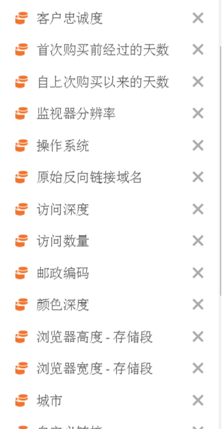
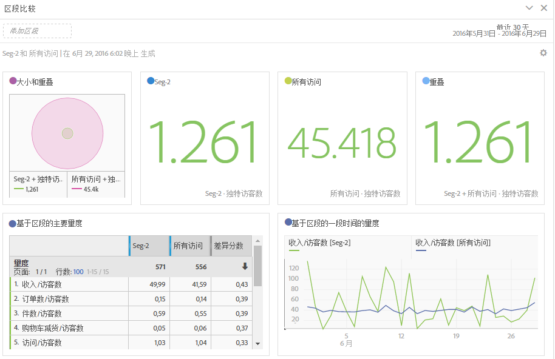

# 区段比较面板概述

区段比较面板是[区段 IQ](../../segment-iq.md) 中的一个工具，可以发现无限数量的区段中最具统计意义的差异。该功能通过自动分析您有权访问的所有维度和量度来进行迭代。它会自动找出受众区段中可提升公司 KPI 的关键特征，并让您了解任意区段的重叠程度。

以下是一段关于区段比较的视频：

>[!VIDEO](https://video.tv.adobe.com/v/23976/?quality=12)

## 创建区段比较面板

1. 使用您的 Adobe ID 凭据登录 [experiencecloud.adobe.com](https://experiencecloud.adobe.com)。
1. 单击右上角的 9 个正方形图标，然后单击彩色的 Analytics 徽标。
1. 在顶部导航栏中，单击“工作区”。
1. 单击“新建项目”按钮。
1. 在模态弹出窗口中，确保选择“空白项目”，然后单击“创建”。
1. 单击左侧的“面板”按钮，然后将“区段比较”面板拖动到自动创建的自由格式表面板的上方或下方。

   

1. 选择要比较的区段，然后将它们拖到面板中。

   

   将区段拖入面板中后，Analytics 会自动创建一个[!UICONTROL 其他各项]区段，该区段包含未在所选区段中的所有项。它是比较面板中常用的区段，但您也可以将其删除并比较所选的其他区段。

   

1. 确定要比较的两个区段后，单击[!UICONTROL 构建]。

   此操作将启动后端进程，该进程会查找选定的两个区段与所有维度、量度和其他区段之间的统计差异。面板顶部的进度栏指示完成所有量度和维度分析的剩余时间。最常用的量度、维度和区段按优先顺序排列，以便首先运行，从而及时返回最相关的结果。

## 从比较中排除组件

有时需要从区段比较中排除某些维度、量度或区段。例如，您要将区段“美国移动设备用户”与“德国移动设备用户”进行比较。包括地理相关维度是没有意义的，因为这些区段已经暗含了这些差异。

1. 在面板中出现所需的两个区段后，单击[!UICONTROL 显示高级选项]。
1. 把您需要排除的组件拖放到[!UICONTROL 排除的组件]面板。

   

单击[!UICONTROL 设置为默认]，以在所有将来的区段比较中自动排除当前组件。如果要编辑排除的组件，请单击“组件类型”，然后单击组件旁边的“X”以将其重新包含在您的分析中。单击“全部清除”会在区段比较中重新包含所有组件。

## 查看区段比较报告

Adobe 完成对两个所需区段的分析后，会通过若干可视化图表显示其结果：

### 大小和重叠

使用维恩图说明每个选定区段的比较大小以及它们彼此重叠的程度。您可以将光标悬停在该可视化图表上，查看每个重叠区域或非重叠区域有多少访客。此外，还可以右键单击重叠以创建全新的区段，以供将来分析之用。如果两个区段互斥，则两个圆之间不显示重叠（通常使用点击容器查看区段）。

### 人群概要

在“大小”和“重叠”可视化图表的右侧，将显示每个区段和重叠的独特访客总数。

### 热门量度

显示两个区段之间最具统计意义的量度。此表格中的每一行分别代表一个存在差异的量度，按量度在每个区段中的差异程度排名。1 的差异分数表示它具有统计意义，而 0 的差异分数表示它没有统计意义。

此可视化图表与 Analysis Workspace 中的自由格式表类似。如果需要对特定量度进行更深入的分析，请将指针悬停在行项目上，并单击“创建可视化”。将创建一个新表来分析该特定量度。如果某个量度与您的分析无关，请将指针悬停在行项目上并单击“X”以将其删除。

>[!NOTE]
>
>区段比较完成后添加到此表的量度不会收到“差异分数”。

### 基于区段的一段时间的量度

量度表的右侧是关联的可视化图表。您可以单击左侧表格中的行项目，此可视化图表会更新以显示一段时间内的量度趋势。

### 热门维度

显示所有维度中最具统计意义的维度项目。每一行通过每个区段的百分比来展示此维度项目。例如，此表可能显示，在“区段 A”中，100% 的访客具有维度项目“浏览器类型：Google”，而“区段 B”中只有 19.6% 有此维度项目。1 的差异分数表示它具有统计意义，而 0 的差异分数表示它没有统计意义。

此可视化图表与 Analysis Workspace 中的自由格式表类似。如果需要对特定维度项目进行更深入的分析，请将指针悬停在行项目上，并单击“创建可视化”。将创建一个新表来分析该特定维度项目。如果某个维度项目与您的分析无关，请将指针悬停在行项目上并单击“X”以将其删除。

>[!NOTE]
>
>区段比较完成后添加到此表的维度项目不会收到差异分数。

### 基于区段的维度项目

维度表的右侧是关联的条形图可视化图表。该可视化图表将所有显示的维度项目都显示在条形图中。单击左侧表中的行项目将更新右侧的可视化图表。

### 热门区段

显示其他哪些区段（除了选定的进行比较的两个区段外）存在具有统计意义的重叠。例如，此表可显示第三个区段“重复访客”与“区段 A”高度重叠，但与“区段 B”不重叠。1 的差异分数表示它具有统计意义，而 0 的差异分数表示它没有统计意义。

此可视化图表与 Analysis Workspace 中的自由格式表类似。如果需要对特定区段进行更深入的分析，请将指针悬停在行项目上，并单击“创建可视化”。将创建一个新表来分析该特定区段。如果某个区段与您的分析无关，请将鼠标悬停在行项目上并单击“X”以将其删除。

>[!NOTE]
>
>区段比较完成后添加到此表的区段不会收到差异分数。

### 区段重叠

区段表的右侧是关联的维恩图可视化图表。该可视化图表显示应用于您比较区段的最具统计意义的区段。例如，“区段 A”+“具有统计意义的区段”与“区段 B”+“具有统计意义的区段”。单击左侧表中的区段行项目可更新右侧的维恩图。

