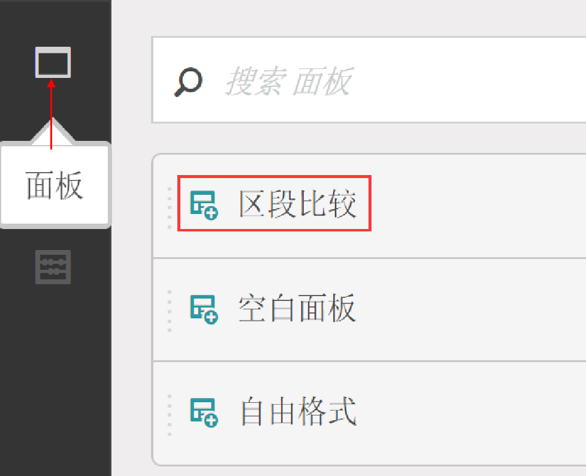
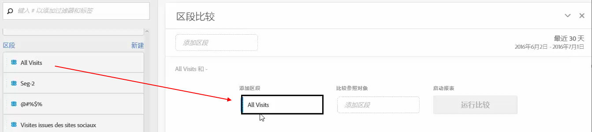
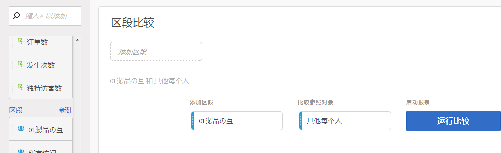

# 区段比较面板概述

区段比较面板是区段IQ的一个工具部分  ，可发现无限数量的区段之间最显着的差异。 该功能通过自动分析您有权访问的所有维度和指标来迭代。 它会自动发现受众细分的关键特征，这些特征会推动您公司的KPI，并让您了解任何细分的重叠程度。

## 创建区段比较面板

1. 使用Adobe ID凭 [据登录体验Adobe](https://experiencecloud.adobe.com) ID凭据。
1. 单击右上角的9方图标，然后单击彩色Analytics徽标。
1. 在顶部导航栏中，单击“工作区”。
1. 单击“创建新项目”按钮。
1. 在模态弹出窗口中，确保选中“空白项目”，然后单击“创建”。
1. 单击左侧的“面板”按钮，然后将“区段比较”面板拖动到自动创建的自由格式表面板的上方或下方。

   

1. 选择要比较的区段，然后将它们拖到面板中。

   

   将区段拖入面板后，Analytics会自动创建一个“其他所有人”区段  ，该区段包括您选择的区段中的所有人。 它是比较面板中常用的段，但您可以将其删除并比较所选的其他段。

   

1. 确定要比较的两个区段后，单击“ [!UICONTROL 构建”]。

   此操作启动后端进程，该进程会查找所选两个区段与所有维度、度量和其他区段之间的统计差异。 面板顶部的进度栏指示分析每个度量和维度之前的剩余时间。 最常用的指标、维度和细分按优先顺序排列，以便首先运行，从而及时返回最相关的结果。

## 从比较中排除组件

有时需要从细分比较中排除某些维度、指标或细分。 例如，您要将区段“美国移动用户”与“德国移动用户”进行比较。 包括地理相关维度是没有意义的，因为这些细分已经暗示了这些差异。

1. 在面板中出现所需的两个区段后，单击“ [!UICONTROL 显示高级选项”]。
1. Drag and drop components you want to exclude into the [!UICONTROL Excluded Components] panel.

   

单击 [!UICONTROL “设为默认值”] ，以在所有将来的区段比较中自动排除当前组件。 如果要编辑被排除的组件，请单击组件类型，然后单击组件旁边的“X”以将其重新包含在您的分析中。 单击“全部清除”以在区段比较中重新包含所有组件。

## 查看区段比较报告

Adobe完成对两个所需细分的分析后，会通过若干可视化显示其结果：

### 大小和重叠

使用活动图说明每个选定区段的比较大小以及它们彼此重叠的程度。 您可以将光标悬停在该可视化上，查看每个重叠区域或非重叠区域有多少访客。此外，还可以右键单击重叠以创建全新的区段，以供将来分析之用。如果两个段互斥，则两个圆之间不显示重叠（通常使用点击容器查看段）。

### 人口总结

在“大小”和“重叠”可视化的右侧，将显示每个区段和重叠的唯一访客总数。

### 热门指标

显示两个区段之间最具统计意义的指标。 此表格中的每一行分别代表一个存在差异的量度，按量度在每个区段中的差异程度排名。1的差分得分表示它具有统计显着性，而0的差分得分表示没有统计显着性。

此可视化与Analysis Workspace中的自由格式表类似。 如果需要对特定指标进行更深入的分析，请将指针悬停在行项目上并单击“创建可视化”。 将创建一个新表来分析该特定度量。 如果某个量度与您的分析无关，请将指针悬停在行项目上并单击“X”以将其删除。

> [!NOTE] 在区段比较完成后添加到此表的度量不会收到差异得分。

### 按细分的一段时间内指标

量度表的右侧是关联的可视化。您可以单击左侧表格中的行项目，此可视化会更新以显示一段时间内的度量趋势。

### 顶级尺寸

显示所有维中统计意义最显着的维值。 每行显示显示此维值的每个区段的百分比。 例如，此表可能显示，在“区段A”中，100%的访客具有维度项“浏览器类型：Google”，而“区段B”中只有19.6%有此维度项目。 1的差分得分表示它具有统计显着性，而0的差分得分表示没有统计显着性。

此可视化与Analysis Workspace中的自由格式表类似。 如果需要对特定维度值进行更深入的分析，请将指针悬停在行项目上并单击“创建可视”。 将创建一个新表来分析该特定维值。 如果某个维度值与您的分析无关，请将指针悬停在行项目上并单击“X”将其删除。

> [!NOTE] 区段比较完成后添加到此表的维值不会收到差异得分。

### 按区段划分的维项目

维表右侧有一个链接的条形图可视化。 它显示条形图中显示的所有维值。 单击左侧表格中的某行项目将更新右侧的可视化。

### 热门细分

显示哪些其他区段（除了选择进行比较的两个区段外）具有统计上显着的重叠。 例如，此表可显示第三个区段“重复访客”与“区段A”高度重叠，但与“区段B”不重叠。 1的差分得分表示它具有统计显着性，而0的差分得分表示没有统计显着性。

此可视化与Analysis Workspace中的自由格式表类似。 如果需要对特定区段进行更深入的分析，请将指针悬停在行项目上并单击“创建可视化”。 将创建一个新表来分析该特定区段。 如果区段与您的分析无关，请将鼠标悬停在行项目上并单击“X”以将其删除。

> [!NOTE] 在区段比较完成后添加到此表的区段不会收到差异得分。

### 段重叠

区段表右侧有一个链接的活动图可视化。 它显示应用于您比较的区段的统计上最显着的区段。 例如，“区段A”+“统计显着区段”与“区段B”+“统计显着区段”。 单击左侧表格中的区段行项目可更新右侧的活动图。

