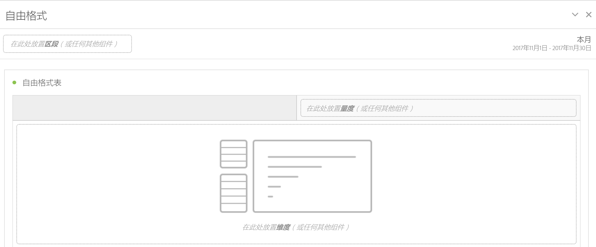

# “自由格式”面板

>[!BEGINSHADEBOX]

_本文记录了_  _&#x200B;**Adobe Analytics** 中的自由格式面板。_ _请参阅[自由格式面板](/help/analyze/analysis-workspace/c-panels/freeform-panel.md)以获取本文的_  _&#x200B;**Customer Journey Analytics** 版本。_

>[!ENDSHADEBOX]

**[!UICONTROL 自由格式面板]**&#x200B;是一个以[自由格式表](/help/analyze/analysis-workspace/visualizations/freeform-table/freeform-table.md)可视化图表为默认起始状态的空白面板。

## 使用

要使用&#x200B;**[!UICONTROL 自由格式面板]**：

1. 创建一个&#x200B;**[!UICONTROL 自由格式面板]**。有关如何创建面板的信息，请参阅[创建面板](panels.md#create-a-panel)。

   

1. 请参阅 [Analytics 组件指南](/help/components/home.md)，了解如何将组件添加到自由格式面板和[自由格式表](/help/analyze/analysis-workspace/visualizations/freeform-table/freeform-table.md)可视化图表。

>[!MORELIKETHIS]
>
>[创建面板](/help/analyze/analysis-workspace/c-panels/panels.md#create-a-panel)
>&#x200B;>[Analytics 组件指南](/help/components/home.md)
>&#x200B;>[自由格式表可视化图表](/help/analyze/analysis-workspace/visualizations/freeform-table/freeform-table.md)
>
