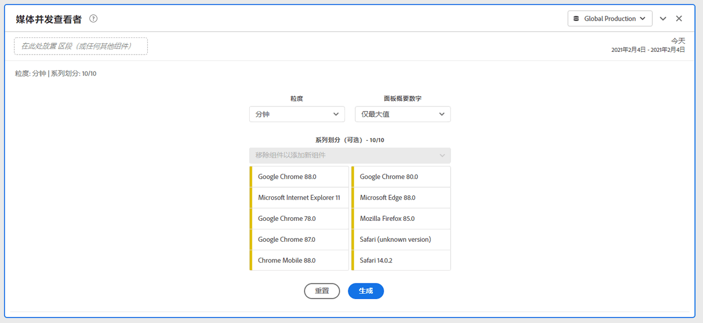
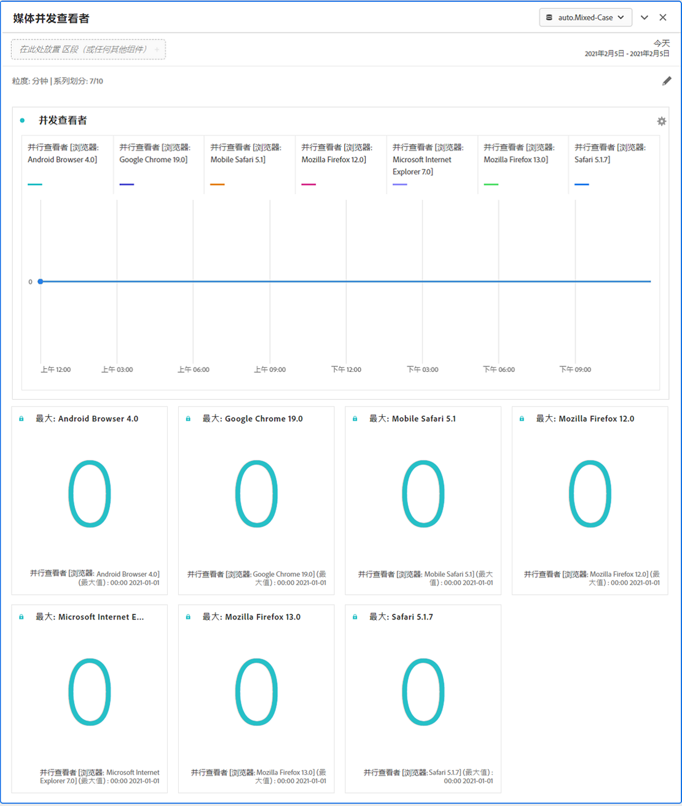
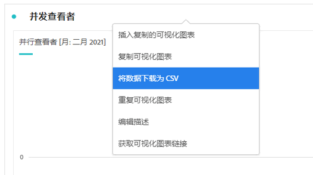
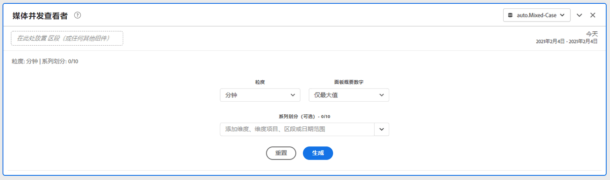

# 媒体并行查看者面板 {#media-concurrent-viewers-panel}

<!-- markdownlint-disable MD034 -->

>[!CONTEXTUALHELP]
>id="workspace_mediaconcurrentviewers_button"
>title="媒体并行查看者"
>abstract="创建面板来分析特定内容或特定时间段内的平均受众访问分钟数。"

<!-- markdownlint-enable MD034 -->

<!-- markdownlint-disable MD034 -->

>[!CONTEXTUALHELP]
>id="workspace_mediaconcurrentviewers_panel"
>title="媒体并行查看者"
>abstract="分析一段时间内的并发查看者，查看并发峰值，或进行细分和比较。  **粒度**：选择查看并发查看者的时间段。 **面板摘要数字**： 选择显示每行带有日期或时间详细信息的摘要数字。最大值显示并发峰值的详细信息。最小值显示低谷期的详细信息。 **系列细分（可选）**：按区段、维度、维度项或日期范围细分可视化图表。一次最多查看 10 行。细分仅限一个级别。"

<!-- markdownlint-enable MD034 -->

>[!BEGINSHADEBOX]

_本文记录了_  _**Adobe Analytics** 中的媒体并发查看者面板。_ _请参阅[媒体并发查看者面板](/help/analyze/analysis-workspace/c-panels/media-concurrent-viewers.md)以获取本文的_  _**Customer Journey Analytics** 版本。_

>[!ENDSHADEBOX]

>[!NOTE]
>
>“媒体平均受众访问分钟数”面板仅适用于已购买Adobe Analytics for Streaming Media加载项的客户。
>
>请联系您的 Adobe 销售代表或 Adobe 帐户团队以获取更多信息。
>

**[!UICONTROL 媒体并行查看者]**&#x200B;面板可以分析一段时间内的并发查看者，了解有关并发峰值的详细信息，并且可以进行细分和比较。

您可以分析并发查看者以了解在哪里出现了并发峰值或者在哪里出现流失，从而针对内容质量和查看者参与情况提供宝贵的洞察。并帮助进行故障排除或者容量或规模的规划。

在 Analysis Workspace 中，“并发查看者”量度是指在特定时间点查看媒体流的独特人员数量，与会话数无关。

>[!BEGINSHADEBOX]

请参阅  [媒体并行查看者面板](https://video.tv.adobe.com/v/330177?quality=12&learn=on){target="_blank"}以观看演示视频。

>[!ENDSHADEBOX]

## 使用

要使用&#x200B;**[!UICONTROL 媒体并行查看者]**&#x200B;面板：

1. 创建&#x200B;**[!UICONTROL 媒体并行查看者]**&#x200B;面板。有关如何创建面板的信息，请参阅[创建面板](panels.md#create-a-panel)。

1. 确保为面板选择具有从Adobe Analytics for Streaming Media加载项配置的组件的报表包。

1. 指定面板的[输入](#panel-input)。

1. 观察面板的[输出](#panel-output)。

### 面板输入

您可以使用以下输入设置来配置媒体并行查看者面板：

| 设置 | 描述 |
|---|---|
| **[!UICONTROL 面板日期范围]** | 面板日期范围的默认值为“今天”。您可以对其进行编辑以一次查看一天或几个月的数据。   这个可视化图表限制为 1440 行数据（例如，以分钟作为粒度级别来表示 24 小时）。如果日期范围和粒度的组合产生的行数超过了 1440 行，则将自动更新粒度以适应完整的日期范围。 |
| **[!UICONTROL 粒度]** | 粒度的默认值为“分钟”。 这个可视化图表限制为 1440 行数据（例如，以分钟作为粒度级别来表示 24 小时）。如果日期范围和粒度的组合产生的行数超过了 1440 行，则将自动更新粒度以适应完整的日期范围。 |
| **[!UICONTROL 面板概要数字]** | 要查看并发查看者的日期或时间详细信息，可以使用摘要数字。“最大值”显示并发峰值的详细信息。**[!UICONTROL 最小值]**&#x200B;显示低谷期的详细信息。面板默认值仅显示“最大值”，不过您可以将其更改为显示“最小值”或同时显示“最大值”和“最小值”。  如果您使用细分，则会为每一项显示摘要数字。 |
| **[!UICONTROL 系列细分]** | （可选）您可以按过滤器、维度、维度项或日期范围细分可视化图表。 一次最多可以查看 10 行。细分仅限一个级别。 在拖动一个维度时，将根据所选面板日期范围，自动选择顶部维度项。 要比较日期范围，请将 2 个或更多日期范围拖入系列细分过滤器中。 |

下面是一个按&#x200B;**[!UICONTROL 分钟]**&#x200B;粒度配置面板的示例，**[!UICONTROL 最大值仅为]**&#x200B;摘要数字。并按&#x200B;**[!UICONTROL 其他]**、**[!UICONTROL 表]**、**[!UICONTROL 手机]**、**[!UICONTROL 游戏机]**、**[!UICONTROL 媒体播放器]**、**[!UICONTROL 机顶盒]**、**[!UICONTROL 电视]**&#x200B;进行细分。

### 面板输出

“媒体并发查看者”面板可以返回一个线形图和摘要数字，以包括最大和/或最小并发查看者的详细信息。在该面板顶部，提供了一个摘要行，用于提醒您选择的面板设置。

随时选择，编辑并重建面板。

如果您选择了系列细分，则会为每一项在线形图上显示一条线以及摘要数字：

### 数据源

可在此面板中使用的唯一量度是&#x200B;**[!UICONTROL 并发查看者]**：

| 量度 | 描述 |
|---|---|
| **[!UICONTROL 并发查看者]** | 在特定时间点查看媒体流的独特人员数量，与会话数无关。 |

自由格式表在此视图中不可用。要查看数据源，您可以从线形图可视化图表上下文菜单中下载数据源，然后选择&#x200B;**[!UICONTROL 将数据下载为 CSV]**。其中包括系列细分。

## 常见问题解答

| 问题 | 回答 |
|---|---|
| 自由格式表在什么位置？如何查看数据源？ | 自由格式表在此视图中不可用。您可以从线形图上下文菜单下载数据源，然后选择&#x200B;**[!UICONTROL 将数据下载为 CSV]**。 |
| 为什么我的粒度发生了变化？ | 这个可视化图表限制为 1440 行数据（例如，以分钟作为粒度级别来表示 24 小时）。如果日期范围和粒度的组合产生 1440 行以上，则将自动更新粒度以容纳这个完整的日期范围。  如果从较大的日期范围更改到较小的日期范围，粒度在日期范围更改后自动更新为允许的最低明细级别。要查看较高的粒度，请编辑面板并重建。 |
| 如何比较视频名称、过滤器、内容类型等？ | 要在单个可视化图表中比较这些项，请将过滤器、维度或特定维度项拖至系列细分过滤器中。  视图限制为 10 个细分。要查看 10 个以上的细分，您必须使用多个面板。 |
| 如何比较日期范围？ | 要在单个可视化图表中比较日期范围，请通过拖动 2 个或更多日期范围来使用系列细分。这些日期范围覆盖面板日期范围。 |
| 如何更改可视化图表类型？ | 此面板仅允许时间系列的线形图可视化图表。 |
| 能否运行异常检测？ | 否。异常检测对此面板不可用。 |
| 为什么使用独特人员而不是活动会话？ | 使用独特人员可以消除在节目边界处（即同时结束和开始会话时）不需要的峰值。 |
| 比分钟更高的粒度下的并发查看者是什么意思？ | 使用比分钟更高的粒度，并发查看者是该时间范围内所有分钟下的独特并发查看者的总和。例如，在小时级别的粒度上，并发查看者是该小时内所有分钟下的独特并发查看者的总和。 |
| 工作区面板是否会显示与并行查看者报告相同的信息？ | 否。在 Analysis Workspace 中，“并发查看者量度”定义为在特定时间点查看媒体流的独特人员数量。与会话数无关。  此量度不同于报告部分中的并发查看者报告，该报告使用的是“并发活动会话”。使用独特人员帐户以消除在节目边界处（即同时结束和开始会话时）不需要的峰值。 |

<!-- For more information about Media Concurrent Viewers, visit [MA doc page]( https://url). -->

>[!MORELIKETHIS]
>
>[Create a panel](/help/analyze/analysis-workspace/c-panels/panels.md#create-a-panel)
>[媒体播放耗时面板](media-playback-time-spent.md)
>[“媒体平均受众访问分钟数”面板](average-minute-audience-panel.md)
>
<!--
# Media Concurrent Viewers panel

Customers who have purchased the Streaming Media Collection Add-on can analyze concurrent viewers to understand where peak concurrency occurred or where drop-offs happened to provide valuable insight into the quality of content and viewer engagement, and to help with troubleshooting or planning for volume or scale.

In Analysis Workspace, Concurrent Viewers is the number of unique visitors viewing your media stream(s) at a specific point in time, regardless of the number of sessions.

The Media Concurrent Viewers panel enables analysis of concurrent viewers over time, with details on peak concurrency and the ability to break down and compare.  To access the Media Concurrent Viewers panel, navigate to a report suite with streaming media components enabled. Then, click the panel icon on the far-left and drag the panel into your Analysis Workspace project.

Here is a video overview of this panel:

>[!VIDEO](https://video.tv.adobe.com/v/330177/?quality=12)

## Panel Inputs {#Input}

You can configure the Media Concurrent Viewers panel using these input settings:

|Setting|Description|
|---|---|
|Panel date range|The panel date range default is Today.  You may edit it to view a single day or many months at a time.    This visualization is limited to 1440 rows of data (for example, 24-hours at minute-level granularity).  If a date range and granularity combination results in more than 1440 rows, the granularity is automatically updated to accommodate the full date range.|
|Granularity|The granularity default is Minute.    This visualization is limited to 1440 rows of data (for example, 24-hours at minute-level granularity).  If a date range and granularity combination results in more than 1440 rows, the granularity is automatically updated to accommodate the full date range.|
|Panel summary numbers| To see date or time details for concurrent viewers, a summary number is available. The Maximum shows details for peak concurrency. The Minimum shows details for the trough.  The panel default shows Maximum only, but you can change it to show Minimum or both Maximum and Minimum.  If you are using breakdowns, a summary number is displayed for each.|
|Series breakdown| Optionally, you can break down your visualization by segments, dimensions, dimension items, or date ranges.   - You may view up to 10 lines at a time. Breakdowns are limited to a single level.  - When dragging a dimension, the top dimension items will be automatically selected based on the selected panel date range.  - To compare date ranges, drag 2 or more date ranges into the series breakdown filter.|

### Default view

### Series breakdown view

## Panel Output {#Output}

The Media Concurrent Viewers panel returns a line chart and summary numbers to include details for the maximum and/or minimum concurrent viewers.  At the top of the panel, a summary line is provided to remind you of the panel settings you selected.

At any time, you can edit and rebuild the panel by clicking the edit pencil on the top right.

If you selected series breakdown, a line on the line chart and a summary number is displayed for each:

### Data Source

The only metric that can be used in this panel is Concurrent Viewers:

|Metric|Description|
|---|---|
|Concurrent Viewers| Number of unique visitors viewing your media stream(s) at a specific point in time, regardless of the number of sessions.  This is different than Concurrent Viewer reporting in the Reports section, which uses Concurrent Active Sessions.  Using unique visitors accounts for removal of unwanted 'spikes' at show boundaries (where sessions are ending and starting at the same time).|

A Freeform table is not available in this view.  In order to view the data source, you may right-click on the line chart and download as a .csv file.  Series breakdowns will be included.

## FAQs {#FAQ}

|Question|Answer|
|---|---|
|Where is the Freeform table? How can I see the data source?| The Freeform table is not available in this view.  You can download the data source by right-clicking on the line chart and downloading the CSV file.|
|Why did my granularity change?|This visualization is limited to 1440 rows of data (for example, 24-hours at minute-level granularity).  If a date range and granularity combination results in more than 1440 rows, the granularity will be automatically updated to accommodate the full date range.  When changing from a larger date range to a smaller one, the granularity will be updated to the lowest detail allowable once the date range is changed. To view a higher granularity, edit the panel and rebuild.|
|How do I compare video names, segments, content types, etc?|To compare these in a single visualization, drag segments, dimensions, or specific dimension items in the series breakdown filter.  The view is limited to 10 breakdowns.  To view more than 10, you must use multiple panels.|
|How do I compare date ranges?|To compare date ranges in a single visualization, use the series breakdowns by dragging 2 or more date ranges.  These date ranges will override the panel date range.|
|How do I change the visualization type?|This panel only allows for the line visualization for the time series.|
|Can I run anomaly detection?|No.  Anomaly detection is not available for this panel.|
|Why use unique visitors instead of active sessions?|Using unique visitors enables removal of unwanted spikes at show boundaries (where sessions are ending and starting at the same time).|
|What does it mean to have concurrent viewers at higher granularity than minute?|With a granularity larger than a minute, concurrent viewers is the sum of unique concurrent viewers for all minutes within that time range.  For example, at hour-level granularity concurrent viewers is the sum of unique concurrent viewers for all minutes within the hour.|
|Does the workspace panel show the same information as the Concurrent Viewers Report?|No.  In Analysis Workspace, Concurrent viewers is defined as the number of unique visitors viewing your media stream at a specific point in time, regardless of the number of sessions.  This is different than Concurrent Viewer reporting in the Reports section, which uses Concurrent Active Sessions.  Using unique visitors accounts for removal of unwanted spikes at show boundaries—where sessions are ending and starting at the same time.|

-->
