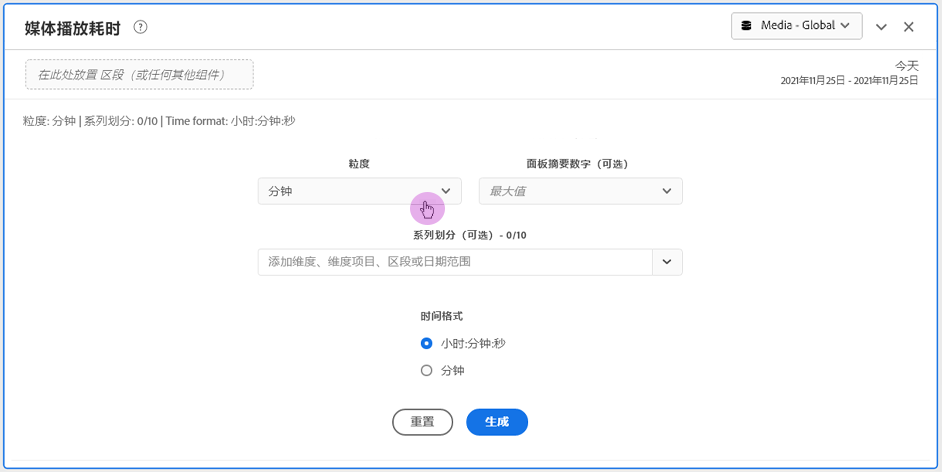
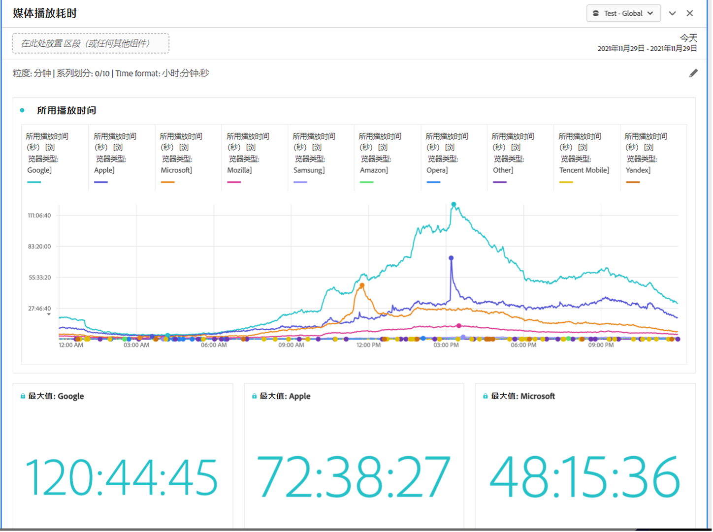

# “媒体播放耗时”面板 {#media-playback-time-spent-panel}

<!-- markdownlint-disable MD034 -->

>[!CONTEXTUALHELP]
>id="workspace_mediaplaybacktimespent_button"
>title="媒体播放耗时"
>abstract="创建面板来分析一段时间内的视频消耗情况，其中具有不同级别的粒度，以及细分和比较的能力。"

<!-- markdownlint-enable MD034 -->

<!-- markdownlint-disable MD034 -->

>[!CONTEXTUALHELP]
>id="workspace_mediaplaybacktimespent_panel"
>title="媒体播放耗时"
>abstract="分析一段时间内的视频使用情况，选择各种粒度，并进行细分和比较。  **粒度**：选择查看并发查看者的时间段。 **面板摘要数字（可选）**：选择显示每行带有日期或时间详细信息的摘要数字。“最大值”将会显示播放耗时峰值的详细信息。“最小值”显示低谷期的详细信息。总和显示播放耗时总和的详细信息。 **系列细分（可选）**：按区段、维度、维度项或日期范围细分可视化图表。一次最多查看 10 行。细分仅限一个级别。 **时间格式**：以小时或分钟显示可视化图表时间格式的选项。"

<!-- markdownlint-enable MD034 -->

>[!BEGINSHADEBOX]

_本文记录了_  _**Adobe Analytics** 中的媒体播放耗时面板。_ _请参阅[媒体播放耗时面板](https://experienceleague.adobe.com/zh-hans/docs/analytics/analyze/analysis-workspace/panels/media-playback-time-spent)以获取本文的_  _**Customer Journey Analytics** 版本。_

>[!ENDSHADEBOX]

>[!NOTE]
>
>只有购买了 Adobe Analytics 流媒体集合附加组件的客户才能使用媒体平均受众访问分钟数面板。
>>请联系您的 Adobe 销售代表或 Adobe 帐户团队以获取更多信息。
>

**[!UICONTROL 媒体播放耗时]**&#x200B;面板支持长期分析播放，其中提供关于并发高峰的详细信息，并可进行细分和比较。

在 Analysis Workspace 中，播放耗时是指在特定时间点查看媒体流的耗时。它包括暂停、缓冲和开始时间。

已购买流媒体收藏附加组件的客户可以分析播放耗时，从而深入了解内容质量和查看者参与度。并在故障排除或规划容量或规模时提供帮助。

播放耗时可以帮助您了解：

* 发生并发峰值的地方。

* 发生流失的地方。

>[!BEGINSHADEBOX]

请参阅  [媒体播放耗时面板](https://video.tv.adobe.com/v/338699?quality=12&learn=on){target="_blank"}以获取演示视频。

>[!ENDSHADEBOX]

## 使用

要使用&#x200B;**[!UICONTROL 媒体播放耗时]**&#x200B;面板：

1. 创建&#x200B;**[!UICONTROL 媒体播放耗时]**&#x200B;面板。有关如何创建面板的信息，请参阅[创建面板](panels.md#create-a-panel)。

1. 确保为面板选择的数据视图已从流媒体集合中配置了组件。

1. 指定面板的[输入](#panel-input)。

1. 观察面板的[输出](#panel-output)。

### 面板输入

您可以使用以下输入设置来配置“媒体播放耗时”面板：

| 设置 | 描述 |
|---|---|
| 面板日期范围 | 面板日期范围的默认值为“今天”。您可以对其进行编辑以一次查看一天或几个月的数据。 这个可视化图表限制为 1440 行数据（例如，以分钟作为粒度级别来表示 24 小时）。如果日期范围和粒度的组合产生的行数超过了 1440 行，则将自动更新粒度以适应完整的日期范围。 |
| 粒度 | 粒度的默认值为“分钟”。 这个可视化图表限制为 1440 行数据（例如，以分钟作为粒度级别来表示 24 小时）。如果日期范围和粒度的组合产生的行数超过了 1440 行，则将自动更新粒度以适应完整的日期范围。 |
| 面板摘要数字 | 要查看播放耗时的日期或时间详细信息，可以使用摘要数字。“最大值”显示并发峰值的详细信息。“最小值”显示低谷期的详细信息。“总和”将计算用于选择的播放耗时的总和。面板默认值仅显示“最大值”，不过您可以将其更改为显示“最小值”、“总和”或这三个值的任意组合。 如果您使用细分，则会为每一项显示摘要数字。 |
| 系列细分 | （可选）您可以按过滤器、维度、维度项或日期范围细分可视化图表。
– 一次最多可以查看 10 行。细分仅限一个级别。

- 在拖动一个维度时，将根据所选面板日期范围，自动选择顶部维度项。
– 要比较日期范围，请将 2 个或更多日期范围拖入系列细分过滤器中。 |
| 时间格式 | 您可以按 `Hours:Minutes:Seconds`（默认）或 `Minutes`（以整数显示，四舍五入到 0.5）格式查看播放耗时。 |
| 日期序列显示 | 如果您已放置至少两个日期范围过滤器作为系列细分，您将看到用于选择叠加（默认）或顺序的选项。“叠加”显示具有公共 x 轴起点的线，以便它们并行运行，而“顺序”显示具有特定 x 轴起点的线。如果数据对齐（例如，过滤器 1 于晚上 8:44 结束，过滤器 2 于晚上 8:45 开始），则这些线按顺序显示。 |

### 面板输出

“媒体播放耗时”面板可以返回一个线形图和摘要数字，以包括播放耗时的最大值、最小值和/或总和。在该面板顶部，提供了一个摘要行，用于提醒您选择的面板设置。

随时选择以编辑并重建面板。

如果您选择系列细分，则会为每一项在线形图上显示一条线以及摘要数字：

### 数据源

可在此面板中使用的唯一量度是“播放耗时”。

| 量度 | 描述 |
|---|---|
| 播放耗时 | 所选粒度期间查看内容所耗的总时间（`hours:minutes:seconds` 或 `minutes`），其中包括暂停、缓冲和开始时间。 |

## 常见问题解答

| 问题 | 回答 |
|---|---|
| 自由格式表在什么位置？如何查看数据源？ | 

自由格式表在此视图中不可用。要下载数据源，请从线形图的上下文菜单中选择下载 CSV 文件选项。
 |
| 
为什么我的粒度发生了变化？
 | 
这个可视化图表限制为 1440 行数据（例如，以分钟作为粒度级别来表示 24 小时）。如果日期范围和粒度的组合产生 1440 行以上，则将自动更新粒度以容纳这个完整的日期范围。

如果从较大的日期范围更改到较小的日期范围，粒度在日期范围更改后自动更新为允许的最低明细级别。要查看较高的粒度，请编辑面板并重建。
 |
| 

如何比较视频名称、过滤器、内容类型等？
 | 
要在单个可视化图表中比较这些内容，请将过滤器、维度或特定维度项拖至系列细分过滤器中。

视图限制为 10 个细分。要查看 10 个以上的细分，您必须使用多个面板。
 |
| 如何比较日期范围？ | 要在单个可视化图表中比较日期范围，请通过拖动 2 个或更多日期范围来使用系列细分。这些日期范围覆盖面板日期范围。 |
| 如何更改可视化图表类型？ | 

此面板仅允许时间系列的线形图可视化图表。
 |
| 能否运行异常检测？ | 

否。异常检测对此面板不可用。
 |

>[!MORELIKETHIS]
>
>[Create a panel](/help//analyze/analysis-workspace/c-panels/panels.md#create-a-panel)
>>[“媒体平均受众访问分钟数”面板](average-minute-audience-panel.md)
>>[媒体并行查看者面板](media-concurrent-viewers.md)
>

<!--
# Media Playback Time Spent panel

In Analysis Workspace, Playback Time Spent is the amount of time spent viewing your media streams at a specific point in time. It includes pause, buffer, and time to start.

The Media Playback Time Spent panel enables analysis of playback over time, with details on peak concurrency and the ability to break down and compare. 

Customers who have purchased the Streaming Media Collection Add-on can analyze playback time spent to gain valuable insight into the quality of content and viewer engagement, and to help when troubleshooting or planning for volume or scale.

Playback Time Spent can help you understand:

* Where peak concurrency occurred

* Where drop-offs occurred 

Following is a video overview of this panel:

>[!VIDEO](https://video.tv.adobe.com/v/338699)

## Use the Media Playback Time Spent panel

1. Go to a report suite with streaming media components enabled. 
1. Select the panel icon on the far-left, then drag the panel into your Analysis Workspace project.
1. Continue with the following sections to customize the Media Playback Time Spent panel

   * [Panel Inputs](#panel-inputs)
   * [Panel Output](#panel-output)

## Panel Inputs {#Input}

You can configure the Media Playback Time Spent panel using these input settings:

|Setting|Description|
|---|---|
|Panel date range|The panel date range default is Today. You may edit it to view a single day or many months at a time. This visualization is limited to 1440 rows of data (for example, 24-hours at minute-level granularity). If a date range and granularity combination results in more than 1440 rows, the granularity is automatically updated to accommodate the full date range.|
|Granularity|The granularity default is Minute. This visualization is limited to 1440 rows of data (for example, 24-hours at minute-level granularity). If a date range and granularity combination results in more than 1440 rows, the granularity is automatically updated to accommodate the full date range.|
|Panel summary numbers|To see date or time details for playback time spent, a summary number is available. The Maximum shows details for peak concurrency. The Minimum shows details for the trough. Sum adds up the total playback time spent for the selection. The panel default shows Maximum only, but you can change it to show Minimum, Sum, or any combination of the three. If you are using breakdowns, a summary number is displayed for each.|
|Series breakdown|Optionally, you can break down your visualization by segments, dimensions, dimension items, or date ranges.
- You may view up to 10 lines at a time. Breakdowns are limited to a single level.

- When dragging a dimension, the top dimension items will be automatically selected based on the selected panel date range.
- To compare date ranges, drag 2 or more date ranges into the series breakdown filter.|
|Time format|You can view the playback time spent in either `Hours:Minutes:Seconds` (default) or in `Minutes` (which is displayed in whole numbers, rounded up at .5). |
|Date sequence display|If you've placed at least two date range segments as series breakdowns you'll see the option to select either overlay (default) or sequential. Overlay will display the lines with a common x-axis start so that they run in parallel, while sequential will display the lines with their specific x-axis start. If the data lines up (for example, segment 1 ends at 8:44 pm and segment 2 starts at 8:45 pm), then the lines will show in sequence. |

## Default view

## Panel Output {#Output}

The Media Playback Time Spent panel returns a line chart and summary numbers to include details for the maximum, minimum, and/or sum of playback time spent. At the top of the panel, a summary line is provided to remind you of the panel settings you selected.

At any time, you can edit and rebuild the panel by clicking the edit pencil on the top right.

If you selected series breakdown, a line on the line chart and a summary number is displayed for each:

### Data Source

The only metric that can be used in this panel is Playback Time Spent.

|Metric|Description|
|---|---|
|Playback Time Spent|Total `hours:minutes:seconds` (or `minutes`) of content viewed during the selected granularity including pause, buffer, and time to start.|

## FAQs

|Question|Answer|
|---|---|
|Where is the Freeform table? How can I see the data source?|The Freeform table is not available in this view. You can download the data source by right-clicking on the line chart and downloading the CSV file.|
|Why did my granularity change?|This visualization is limited to 1440 rows of data (for example, 24-hours at minute-level granularity). If a date range and granularity combination results in more than 1440 rows, the granularity will be automatically updated to accommodate the full date range. 
When changing from a larger date range to a smaller one, the granularity will be updated to the lowest detail allowable once the date range is changed. To view a higher granularity, edit the panel and rebuild.
|
| How do I compare video names, segments, content types, etc?| To compare these in a single visualization, drag segments, dimensions, or specific dimension items in the series breakdown filter.The view is limited to 10 breakdowns. To view more than 10, you must use multiple panels.|
|How do I compare date ranges?|To compare date ranges in a single visualization, use the series breakdowns by dragging 2 or more date ranges. These date ranges will override the panel date range.|
|How do I change the visualization type?|This panel only allows for the line visualization for the time series.|
|Can I run anomaly detection?|No. Anomaly detection is not available for this panel.|

-->
