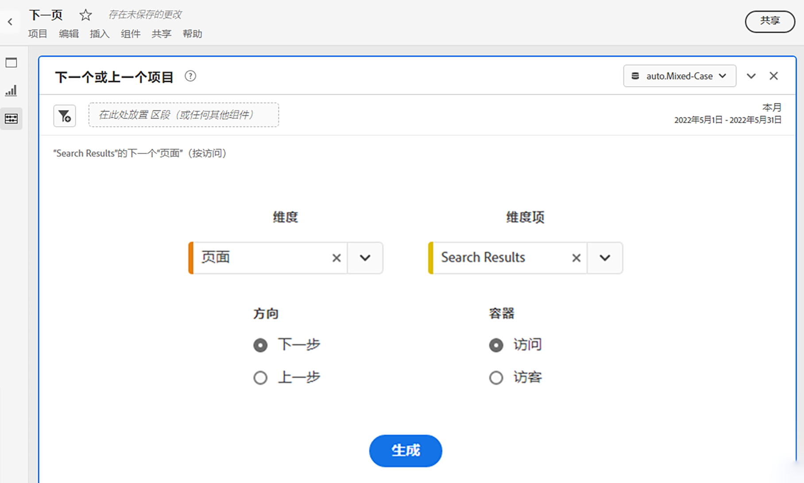
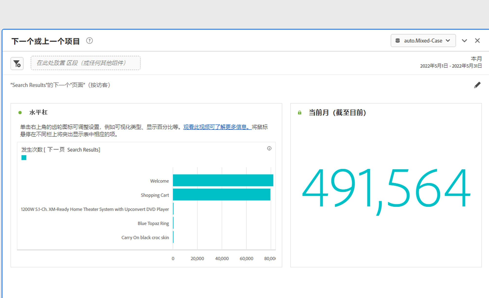
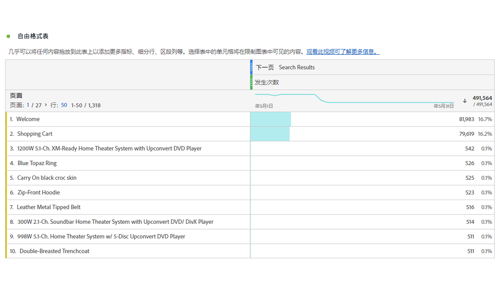

# “下一项或上一项”面板 {#next-or-previous-item-panel}

>[!CONTEXTUALHELP]
>id="workspace_nextorpreviousitem_button"
>title="下一项或上一项"
>abstract="创建面板来了解人们来自的上一项维度或人们要去的下一项维度。"

>[!CONTEXTUALHELP]
>id="workspace_nextorpreviousitem_panel"
>title="下一项或上一项"
>abstract="分析访客之前最常来自何处或后续最常访问的地方是什么。  **维度**：选择一个维度。例如&#x200B;**页面**。 **维度项**：选择具体的维度项。例如&#x200B;**主页**。 **方向**：选择&#x200B;**下一项**&#x200B;以查看所选维度项后的下一个维度项。选择&#x200B;**上一项**&#x200B;来查看您所选的维度项之前的维度项。 **容器**：选择&#x200B;**会话**&#x200B;来查看同一会话中的下一项/上一项维度，或选择&#x200B;**人员**&#x200B;来查看同一个人的上一项/下一项维度。"

>[!BEGINSHADEBOX]

_本文记录了_  _**Adobe Analytics** 中的下一项或上一项面板。_ _查看本文的CustomerJourneyAnalytics_ 版本的&#x200B;_**下一个或上一个项目面板**。_

>[!ENDSHADEBOX]

**[!UICONTROL 下一项或上一项]**&#x200B;面板包含许多表格和可视化图表，用于识别特定维度的下一项或上一项维度。例如，您可能想要浏览客户访问主页后最常访问哪些页面。

## 使用

要使用&#x200B;**[!UICONTROL 下一项或上一项]**&#x200B;面板：

1. 创建&#x200B;**[!UICONTROL 下一项或上一项]**&#x200B;面板。有关如何创建面板的信息，请参阅[创建面板](panels.md#create-a-panel)。

1. 指定面板的[输入](#panel-input)。

1. 观察面板的[输出](#panel-output)。

### 面板输入

您可以使用以下输入设置配置[!UICONTROL 下一项或上一项]面板：

| 输入 | 描述 |
| --- | --- |
| **[!UICONTROL 维度]** | 选择您想要浏览下一项或上一项的维度。 |
| **[!UICONTROL 维度项]** | 选择位于下一项/上一项查询中心的特定维度项。 |
| **[!UICONTROL 方向]** | 请指定您是否正在寻找[!UICONTROL 下一项]或[!UICONTROL 上一项]维度。 |
| **[!UICONTROL 容器]** | 选择容器&#x200B;**[!UICONTROL 访问]**&#x200B;或&#x200B;**[!UICONTROL 访客]**（默认），以确定查询的范围。 |

{style="table-layout:auto"}

选择&#x200B;**[!UICONTROL 生成]**&#x200B;以生成面板。

### 面板输出

[!UICONTROL 下一项或上一项]面板返回一组丰富的数据和可视化图表，帮助您更好地了解特定维度项之后或之前的发生次数。

| 可视化图表 | 描述 |
| --- | --- |
| **[!UICONTROL 水平条]** | 根据您选择的维度项列出下一项（或上一项）维度。将光标悬停在单个条形图上可突出显示自由格式表中相应的项。 |
| **[!UICONTROL 摘要数字]** | 当前月份（迄今为止）所有下一项或上一项维度发生次数的高级摘要数字。 |
| **[!UICONTROL 自由格式表]** | 根据您选择的维度项以表的格式列出下一项（或上一项）维度。例如，人们在主页或工作区页面之后（或之前）访问的最受欢迎的页面是哪些（按发生次数计算）。 |

{style="table-layout:auto"}

>[!MORELIKETHIS]
>
>[创建一个面板](/help//analyze/analysis-workspace/c-panels/panels.md#create-a-panel)
>

<!--
# Next or previous item panel

This panel contains a number of tables and visualizations to easily identify the next or previous dimension item for a specific dimension. For example, you might want to explore which pages customers went to most often after they visited the Home page.

## Access the panel

You can access the panel from within [!UICONTROL Reports] or within [!UICONTROL Workspace].

| Access point | Description |
| --- | --- |
| [!UICONTROL Reports] | <ul><li>The panel is already dropped into a project.</li><li>The left rail is collapsed.</li><li>If you selected [!UICONTROL Next page], default settings have already been applied, such as [!UICONTROL Page] for [!UICONTROL Dimension], and the top page as the [!UICONTROL Dimension Item], [!UICONTROL Next] for [!UICONTROL Direction] and [!UICONTROL Visit] for [!UICONTROL Container]. You can modify all these settings.</li></ul>|
| Workspace | Create a new project and select the Panel icon in the left rail. Then drag the [!UICONTROL Next or previous item] panel above the Freeform table. Notice that the [!UICONTROL Dimension] and [!UICONTROL Dimension Item] fields are left blank. Select a dimension from the drop-down list. [!UICONTROL Dimension items] are populated based on the [!UICONTROL dimension] you chose. The top dimension item gets added, but you can select a different item. The defaults are Next and Visitor. Again, you can modify these as well.
 |

{style="table-layout:auto"}

## Panel Inputs {#Input}

You can configure the [!UICONTROL Next or previous item] panel panel using these input settings:

| Setting | Description |
| --- | --- |
| Segment (or other component) drop zone | You can drag and drop segments or other components to further filter your panel results. |
| Dimension | The dimension for which you want to explore next or previous items. |
| Dimension Item | The specific item at the center of your next/previous inquiry. |
| Direction | Specify whether you are looking for the [!UICONTROL Next] or the [!UICONTROL Previous] dimension item. |
| Container | [!UICONTROL Visit] or [!UICONTROL Visitor] (default) determine the scope of your inquiry. |

{style="table-layout:auto"}

Click **[!UICONTROL Build]** to build the panel.

## Panel output {#output}

The [!UICONTROL Next or previous item] panel returns a rich set of data and visualizations to help you better understand what occurrences follow or precede specific dimension items.

| Visualization | Description |
| --- | --- |
| Horizontal bar | Lists the next (or previous) items based on the dimension item you chose. Hovering over an individual bar highlights the corresponding item in the Freeform table. |
| Summary number | High-level summary number of all next or previous dimension item occurrences for the current month (so far.) |
| Freeform table | Lists the next (or previous) items based on the dimension item you chose, in a table format. For example, which were the most popular pages (by occurrences) that people went to after (or before) the home page or the workspace page. |

{style="table-layout:auto"}

-->