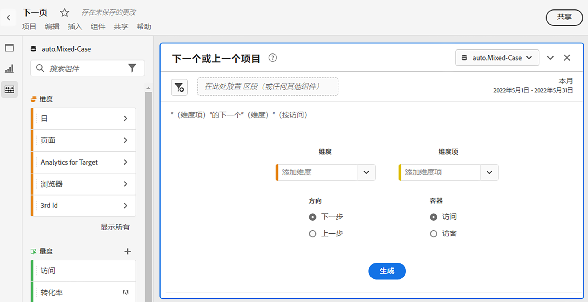

# 下一项或上一项面板

的 [!UICONTROL 下一个或上一个项目] 面板最初是作为Reports &amp; Analytics中的报表创建，位于 [!UICONTROL 报表] > [!UICONTROL 最受欢迎] > [!UICONTROL 下一页/上一页]. 此工作区面板包含许多表格和可视化图表，可轻松识别特定维度的下一个或上一个维度项目。 例如，您可能希望了解客户访问主页后最常访问的页面。

## 访问面板

您可以从中访问面板 [!UICONTROL 报表] 或 [!UICONTROL 工作区].

| 接入点 | 描述 |
| --- | --- |
| [!UICONTROL 报告] | <ul><li>该面板已放入项目中。</li><li>左边栏已折叠。</li><li>如果已选择 [!UICONTROL 下一页]，则已应用默认设置，例如 [!UICONTROL 页面] 表示 [!UICONTROL Dimension]，顶部页面作为 [!UICONTROL Dimension项], [!UICONTROL 下一个] 表示 [!UICONTROL 方向] 和 [!UICONTROL 访问] 表示 [!UICONTROL 容器]. 您可以修改所有这些设置。</li></ul> |
| 工作区 | 创建新项目，然后选择左边栏中的面板图标。 然后，将 [!UICONTROL 下一个或上一个项目] 面板。 请注意， [!UICONTROL Dimension] 和 [!UICONTROL Dimension项] 字段留空。 从下拉列表中选择一个维度。 [!UICONTROL Dimension项目] 是根据 [!UICONTROL 维度] 你选择了。 将添加热门维度项目，但您可以选择其他项目。 默认值为“下一个”和“访客”。 同样，您也可以修改这些变量。
 |

{style=&quot;table-layout:auto&quot;}

## 面板输入 {#Input}

您可以配置 [!UICONTROL 下一个或上一个项目] 面板面板：使用以下输入设置：

| 设置 | 描述 |
| --- | --- |
| 区段（或其他组件）拖放区域 | 您可以拖放区段或其他组件以进一步过滤面板结果。 |
| 维度 | 要浏览下一个项目或上一个项目的维度。 |
| Dimension项 | 下次/上次查询中心的特定项目。 |
| 方向 | 指定您是否要查找 [!UICONTROL 下一个] 或 [!UICONTROL 上一个] 维度项目。 |
| 容器 | [!UICONTROL 访问] 或 [!UICONTROL 访客] （默认）确定查询的范围。 |

{style=&quot;table-layout:auto&quot;}

单击 **[!UICONTROL 生成]** 来构建面板。

## 面板输出 {#output}

的 [!UICONTROL 下一个或上一个项目] 面板会返回一组丰富的数据和可视化图表，以帮助您更好地了解特定维度项目之后或之前发生的事件。

| 可视化图表 | 描述 |
| --- | --- |
| 水平条 | 根据您选择的维度项目列出下一个（或上一个）项目。 将鼠标悬停在单个栏上会突出显示自由格式表中的相应项目。 |
| 摘要数字 | 当月（迄今为止）所有下一个或上一个维度项目发生次数的概要概要数字。 |
| 自由格式表 | 以表格式根据您选择的维度项目列出下一个（或上一个）项目。 例如，最受欢迎的页面（按发生次数）是用户在主页或工作区页面之后（或之前）转到的页面。 |

{style=&quot;table-layout:auto&quot;}
