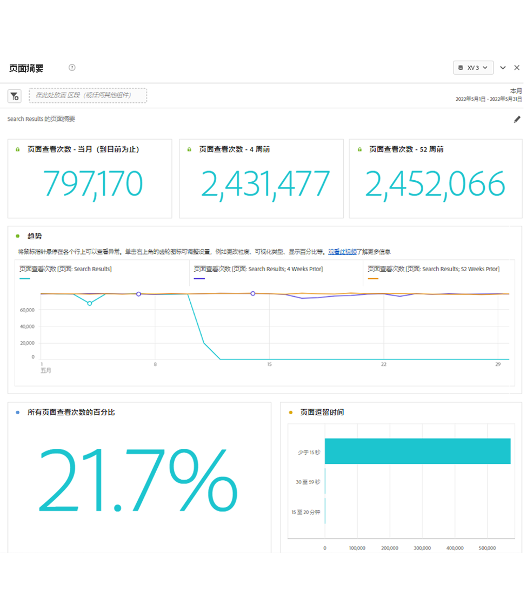
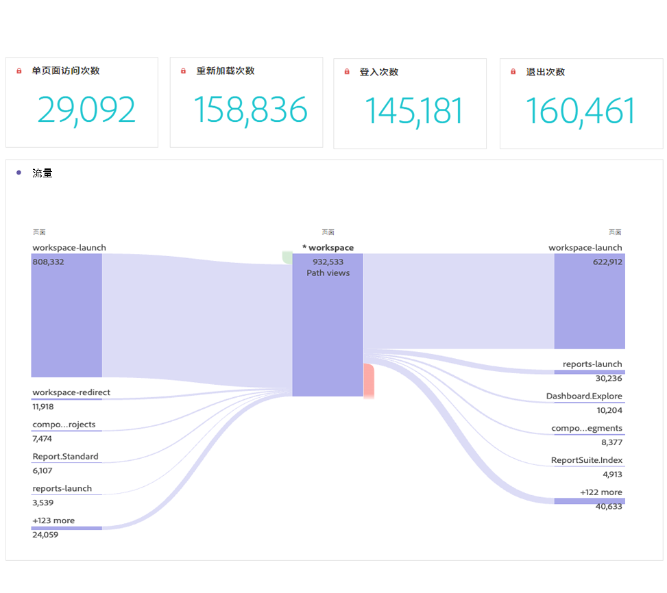

# 页面摘要面板

利用此面板，可轻松浏览有关特定页面的关键统计信息。

## 访问面板

您可以从中访问面板 [!UICONTROL 报表] 或范围 [!UICONTROL 工作区].

| 接入点 | 描述 |
| --- | --- |
| [!UICONTROL 报告] | <ul><li>该面板已放入项目中。</li><li>左侧边栏折叠。</li><li>仅支持页面维度。</li><li>已应用默认设置，在这种情况下，访问次数最多的页面[!UICONTROL 页面] 维度。 您可以修改此设置。</li></ul> |
| 工作区 | 创建新项目并选择左边栏中的面板图标。 拖动 [!UICONTROL 页面摘要] 自由格式表上方的面板。 请注意，页面 [!UICONTROL Dimension项目] 字段留空。 从下拉列表中选择一个维度项。 |

## 面板输入 {#Input}

您可以配置 [!UICONTROL 页面摘要] 使用这些输入设置的面板：

| 设置 | 描述 |
| --- | --- |
| 区段（或其他组件）放置区 | 您可以拖放区段或其他组件以进一步筛选面板结果。 |
| 页面维度项目 | 从下拉列表中，选择要浏览其关键统计信息的页面维度项。 |

{style="table-layout:auto"}

单击 **[!UICONTROL 生成]** 以构建面板。

## 面板输出 {#output}

此 [!UICONTROL 页面摘要] 面板可返回一组丰富的量度数据和可视化图表，以帮助您更好地了解有关特定页面的统计信息。

| 量度/可视化图表 | 描述 |
| --- | --- |
| [!UICONTROL 页面查看次数]  — 当前月份，到目前为止 | 当月此页面的页面查看次数。 |
| [!UICONTROL 页面查看次数] - 4周前 | 上个月查看此页面的页数。 |
| [!UICONTROL 页面查看次数] - 52周前 | 去年此页面的页面查看次数。 |
| [!UICONTROL 趋势] | 本月、4周前和52周前的趋势页面查看图表。 |
| [!UICONTROL 所有页面查看的百分比] | 访问此页的所有页面查看次数的百分比的概要数字。 |
| [!UICONTROL 页面逗留时间] | 列出此页面逗留时间的水平条形图。 |
| [!UICONTROL 单页面访问量] | 一个摘要数字，其中列出了仅访问过此页面的页面查看次数。 |
| [!UICONTROL 重新载入] | 此 [!UICONTROL 重新载入] 量度显示重新加载期间维度项存在的次数。 访客刷新其浏览器是触发重新载入的最常见方式。 |
| [!UICONTROL 登录] | 此 [!UICONTROL 登入次数] 量度显示作为访问中第一个值所捕获到的给定维度项目的次数。 |
| [!UICONTROL 退出] | 此 [!UICONTROL 退出点] 量度显示给定维度项目被捕获为访问中的最后一个值的次数。 |
| [!UICONTROL 流] | 以选定页面为焦点的流程图。 您可以像在任意 [流程图](/help/analyze/analysis-workspace/visualizations/c-flow/create-flow.md). |

{style="table-layout:auto"}

面板

