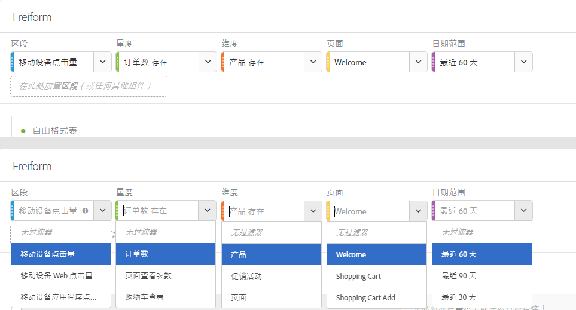
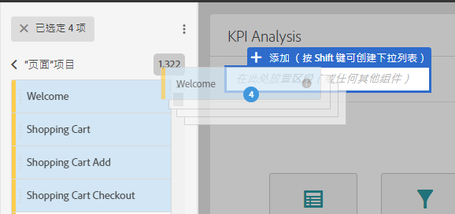
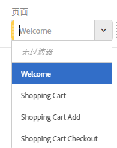
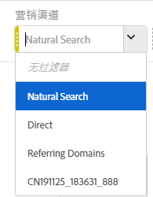

# 面板概述

面板是表格和可视化图表的集合。您可以通过工作区左上角的图标访问面板。当您需要根据时间段、业务单位、地理位置等来组织项目时，这些面板将会非常有帮助。Analysis Workspace 提供了六种类型的面板：

* [空白面板](blank-panel.md)
* [快速分析面板](quickinsight.md)
* [Analytics for Target 面板](a4t-panel.md)（即将推出）
* [归因面板](attribution.md)
* [自由格式面板](freeform-panel.md)
* [区段比较面板](c-segment-comparison/segment-comparison.md)

“快速分析”、“空白”和“自由格式”面板是开始分析的绝佳选择，而“Analytics for Target”、“归因 IQ”和“区段比较”面板则适合进行更高级的分析。项目中有一个 `"+"` 按钮，通过该按钮，您可以随时添加空白面板。

默认的开始面板是自由格式面板，但也可以将[空白面板](/help/analyze/analysis-workspace/c-panels/blank-panel.md)设置为默认的开始面板。

## 面板中的下拉过滤器 {#section_D2828EEDD52944528E87F470EAB581CF}

面板拖放区域具备下拉过滤器功能。通过这些过滤器，您能够以可控方式与项目数据进行交互，以便您可以进行深入分析、简化项目，和/或与他人共享分析。

以下是一个简化项目的示例：假设您的某个项目/面板有多个版本，以提供针对特定国家/地区的报告。您可以将这些不同版本的项目/面板整合到单个面板中，并添加一个国家/地区下拉列表，以便在不同的数据集中进行过滤。

请牢记这一点：

* 您可以放入多个组件（或维度项目），然后通过下拉列表，在这些组件之间进行切换，以过滤面板内容。
* 您还可以在同一个面板中创建多个下拉列表。
* 您可以通过单击标题并对其进行修改来自定义下拉列表的标题，也可以通过单击标题旁边的 x 将标题全部移除。
* 您可以使用任意组件类型创建下拉过滤器：维度、日期范围、区段和量度。请注意，下拉日期范围将始终覆盖面板日期范围。
* 我们保持了左边栏中的组件颜色：黄色代表维度项目下拉列表，绿色代表量度，蓝色代表区段，紫色代表日期范围。
* 拖放区域仍会为以区段形式拖入的项目创建点击级别的区段。您可以照常修改这些区段，方法是单击区段旁边的信息图标 (i)，然后单击铅笔形状的编辑图标，并在“区段生成器”中对其进行编辑。

**要创建并使用下拉过滤器，请执行以下操作：**

1. 从左边栏中选择任意项目，**并在按住键的同时**，将这些项目放入面板拖放区域。

   

   此操作可将组件转换为下拉列表，而不是区段。（还可以通过不按住键来添加区段。）

   

1. 从下拉列表中选择一个选项，以更改下面面板中的数据。（您还可以通过选择&#x200B;**[!UICONTROL 无过滤器]**，不对任何面板数据进行过滤。）
1. 例如，如果您还希望按营销渠道对数据进行切片，则可以添加另外一个名为“营销渠道”的下拉列表：

   

