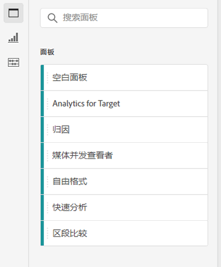
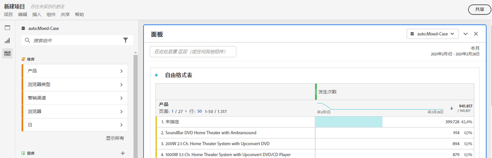
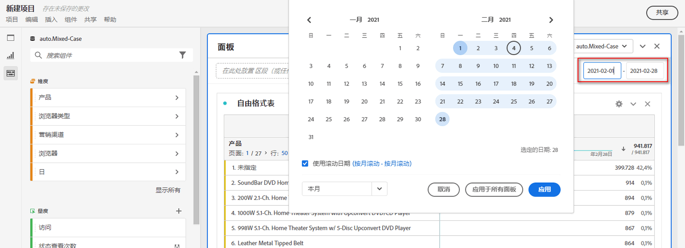
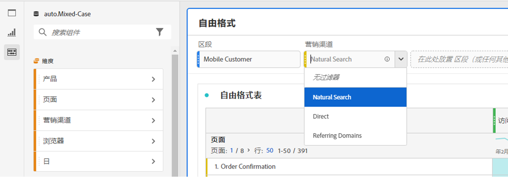
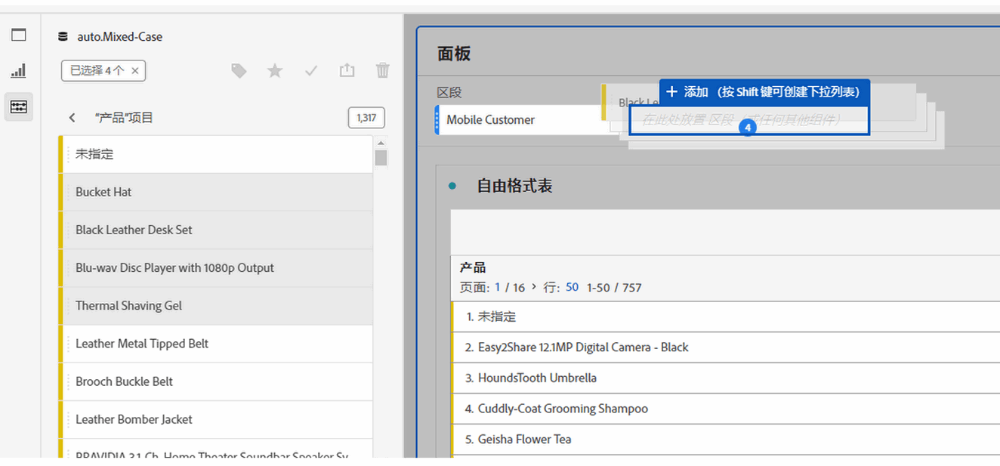
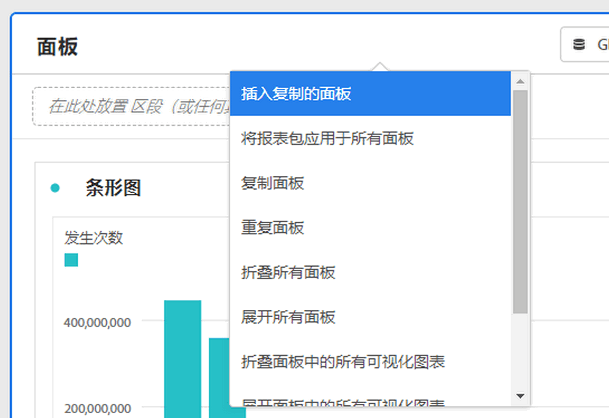

# 面板概述

[!UICONTROL 面板]是表格和可视化图表的集合您可以从Workspace左上角的图标或 [空白面板](blank-panel.md). 当您要根据时段、报表包或分析用例组织您的项目时，面板非常有用。

## 面板类型

Analysis Workspace 中提供了以下面板类型：

| 面板名称 | 描述 |
| --- | --- |
| [空白面板](blank-panel.md) | 从可用的面板和可视化图表中选择以开始分析。 |
| [“快速分析”面板](quickinsight.md) | 快速构建自由格式表和随附的可视化图表，以便更快地分析和发现见解。 |
| [“Analytics for Target”面板](a4t-panel.md) | 在 Analysis Workspace 中分析 Target 的活动和体验。 |
| [归因面板](attribution.md) | 使用任意维度和转化指标，快速比较和可视化任意数量的归因模型。 |
| [自由格式面板](freeform-panel.md) | 不受限制地执行比较和细分，然后添加可视化图表来讲述丰富的数据案例。 |
| [“媒体平均受众访问分钟数”面板](average-minute-audience-panel.md) | 分析一段时间内的平均受众访问分钟数，其中包括有关尖峰查看量的详细信息，并可细分和比较。 |
| [“媒体并行查看者”面板](media-concurrent-viewers.md) | 分析一段时间内的并发查看者，了解有关并发峰值的详细信息，并且可以进行细分和比较。 |
| [“媒体播放逗留时间”面板](/help/analyze/analysis-workspace/c-panels/media-playback-time-spent.md) | 分析一段时间内的并发查看者，了解有关并发峰值的详细信息，并且可以进行细分和比较。 |
| [区段比较面板](c-segment-comparison/segment-comparison.md) | 对所有数据点快速比较两个区段，以自动查找相关差异。 |

[!UICONTROL 快速见解]、[!UICONTROL 空白]和[!UICONTROL 自由格式]面板非常适合开始您的分析，而 [!UICONTROL Analytics for Target]、[!UICONTROL 归因 ]、[!UICONTROL 媒体并行查看者]和[!UICONTROL 区段比较]有助于进行更深入的分析。项目中有一个 `"+"` 按钮，通过该按钮，您可以随时添加空白面板。

默认开始面板是[!UICONTROL 自由格式]面板，但您也可以将[空白面板](/help/analyze/analysis-workspace/c-panels/blank-panel.md)设置为默认值。

## 报表包 {#report-suite}

面板中的表格和可视化图表从在面板的右上角选中的[!UICONTROL 报表包]中派生数据。报表包还确定在左边栏中有哪些组件可用。在项目中，您可以根据分析用例，使用一个或[多个报表包](https://experienceleague.adobe.com/docs/analytics/analyze/analysis-workspace/build-workspace-project/multiple-report-suites.html?lang=zh-Hans)。要将一个报表包应用到项目中的所有面板，请&#x200B;**“右键单击面板标题”>“将报表包应用于所有面板”**。

报表包的列表按照相关性排序，Adobe 根据当前用户在近期使用该包的频率以及该包在组织中的使用频率来定义相关性。

## 日历 {#calendar}

面板日历控制面板中表格和可视化报表的报告范围。

>[!NOTE]
>如果在表格、可视化报表或面板拖放区域中使用了某个（紫色）日期范围组件，则该组件会覆盖面板日历。

您可以在面板日历的高级设置下应用分钟级日期范围。如果报告的日期范围跨越许多天，则开始时间适用于范围内的第一天，结束时间适用于最后一天。

## 拖放区域 {#dropzone}

使用面板拖放区域，您可以将区段和下拉过滤器应用到面板中的所有表格和可视化报表。 您可以将一个或多个过滤器应用到面板。各个过滤器上方的标题可以通过单击铅笔图标进行修改，您也可以右键单击以将其全部删除。

### 区段过滤器

将任意区段从左边栏拖放到面板拖放区域以开始过滤面板。

### 临时区段过滤器

还可将非区段组件直接拖入放置区域以创建临时区段，从而为您节省转到区段生成器的时间和精力。 通过这种方式创建的区段自动定义为点击级别区段。通过单击区段旁的信息图标 (i)、单击铅笔形状编辑图标并在区段生成器中进行编辑，可以修改此定义。

临时区段是一种快速区段，在项目本地。 除非将其公开，否则它们不会显示在左边栏中。

有关更多信息，请参阅 [快速区段](/help/analyze/analysis-workspace/components/segments/quick-segments.md).

### 静态下拉过滤器

利用下拉过滤器，您可以采用可控方式与数据交互。 例如，您可以为移动设备类型添加下拉过滤器，这样您就可以按照平板电脑、手机或台式机来细分面板。

下拉过滤器也可用于将多个项目合并在一起。例如，如果您有一个项目的多个版本，每个版本具有不同的“国家/地区”区段，您可以将所有版本合并为一个项目并添加“国家/地区”下拉过滤器。

要创建静态下拉过滤器，请执行以下操作：

* 对于使用维度项目的下拉过滤器，在左边栏中单击所需维度旁边的右箭头图标。 此操作公开所有可用的维度项目。 使用以下方式从此列表中选择多个维度项 `[Shift + Click]` 或 `[Ctrl + Click]`，然后将它们拖放到面板拖放区域中 **同时保持`[Shift]`**.
* 对于使用其他组件（如量度、区段或日期范围）的下拉过滤器，请使用以下方式选择多个组件 `[Shift + Click]` 或 `[Ctrl + Click]`. 将选定内容拖放到面板拖放区域中 **同时保持`[Shift]`**. 在此上下文中，所有组件类型都被视为区段。
* 单个下拉过滤器只能包含单个组件类型。 如果在选择中包含多个组件类型，则会为每个组件类型创建一个单独的下拉过滤器。 例如，如果在选定范围中同时包含量度和维度项目，则会创建两个单独的下拉过滤器。 一个下拉过滤器包含维度项目，另一个包含量度。

从下拉列表中选择一个选项，以更改面板中的数据。 您还可以通过选择不对面板数据中的任何数据进行过滤 **[!UICONTROL 无筛选器]**.

右键单击下拉过滤器可提供以下选项：

* **[!UICONTROL 添加标签]**：将下拉过滤器添加到项目时，会自动为组件名称设置标签。 如果删除标签，则可以使用此选项再次添加它。
* **[!UICONTROL 删除标签]**：删除下拉过滤器上方的文本。
* **[!UICONTROL 删除下拉过滤器]**：从面板中删除下拉过滤器。

[观看视频](https://experienceleague.adobe.com/docs/analytics-learn/tutorials/analysis-workspace/using-panels/using-panels-to-organize-your-analysis-workspace-projects.html?lang=zh-Hans)以详细了解如何将下拉过滤器添加到项目中。

### 动态下拉筛选器

通过动态下拉过滤器，可根据面板报表范围内的数据以及其他下拉过滤器中的值来确定可用值。 例如，您可以使用以下内容创建两个动态下拉列表： [国家/地区](/help/components/dimensions/countries.md) 维度和 [城市](/help/components/dimensions/cities.md) 维度。 当您从以下选择国家/地区时 [!UICONTROL 国家/地区] 下拉列表， [!UICONTROL 城市] 下拉列表会动态调整以仅显示该国家/地区的城市。

此同一概念适用于所有维度；只有出现在面板日期范围内的维度项和选定的过滤器才可见。 在静态下拉过滤器中选择的Dimension项目会影响动态下拉过滤器中的可用值。 但是，反之亦然；在动态下拉筛选器中选择的Dimension项目不会影响静态下拉筛选器中的可用值。

如果您预计将来会收集特定维度项目，则可以手动选择维度项目。 您还可以清除动态下拉过滤器，使其不包含值，从而允许其他动态下拉过滤器包含更多值。 选择 **[!UICONTROL 全部重置]** 以清除该面板的所有下拉过滤器中的选定内容。

要创建动态下拉过滤器，请执行以下操作：

* 将单个维度拖放到面板拖放区域中 **同时保持`[Shift]`**.
* 动态下拉过滤器不适用于量度、区段或日期范围。
* 右键单击下拉筛选器并选择 **[!UICONTROL 删除筛选器]** 以删除它。

右键单击动态下拉过滤器提供的选项与静态下拉过滤器提供的选项相同。

## 右键单击菜单 {#right-click}

面板的其他功能可通过在面板的标题上右键单击来使用。

其中提供了以下设置：

| 设置 | 描述 |
| --- | --- |
| 插入复制的面板/可视化图表 | 此设置允许您将复制的面板或可视化图表粘贴（“插入”）到项目中的其他位置或其他项目中。 |
| 复制面板 | 此设置允许您右键单击并复制面板，以便将其插入到项目中的其他位置或其他项目中。 |
| 将报表包应用于所有面板 | 此设置允许您将活动的面板报表包应用到项目中的所有面板。 |
| 复制面板 | 生成一个与当前面板完全相同的副本，然后可对其进行修改。 |
| 折叠/展开所有面板 | 折叠和展开所有项目面板。 |
| 折叠/展开面板中的所有可视化图表 | 折叠和展开当前面板中的所有可视化图表。 |
| 编辑描述 | 添加（或编辑）面板的文本描述。 |
| 获取面板链接 | 此设置允许您将人员引导至项目中的特定面板。单击该链接时，收件人需要先登录，然后才能转至所链接到的那个面板。 |
