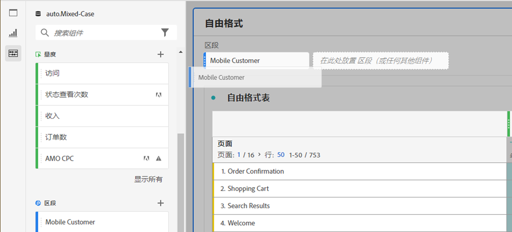
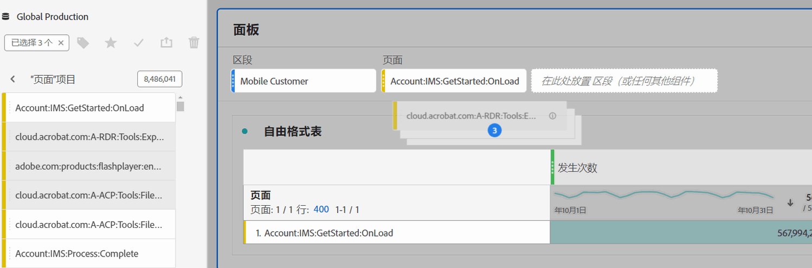

# 面板概述

[!UICONTROL 面板]是表格和可视化图表的集合可从 Workspace 左上角的图标或[空白面板](/help/analyze/analysis-workspace/c-panels/blank-panel.md)访问面板。当您要根据时间段、报告包或分析用例组织您的项目时，面板非常有用。

## 面板类型

Analysis Workspace 中为 [!UICONTROL Adobe Analytics] 提供了以下面板类型：

| 面板名称 | 描述 |
| --- | --- |
| [空白面板](/help/analyze/analysis-workspace/c-panels/blank-panel.md) | 从可用的面板和可视化图表中选择以开始分析。 |
| [归因](attribution.md) | 使用任意维度和转化量度，快速比较并可视化任意数量的归因模型。 |
| [Analytics for Target](a4t-panel.md) | 在 Analysis Workspace 中分析 Target 的活动和体验。 |
| [自由格式表](freeform-panel.md) | 执行无限制的比较和细分，然后通过添加可视化图表来讲述丰富的数据故事。 |
| [媒体平均分钟观众数](average-minute-audience-panel.md) | 分析一条特定内容或自定义时间段的平均分钟观众数。 |
| [媒体并行观众](media-concurrent-viewers.md) | 分析一段时间内的并发查看者，了解有关并发峰值的详细信息，并且可以进行细分和比较。 |
| [媒体播放耗时](/help/analyze/analysis-workspace/c-panels/media-playback-time-spent.md) | 分析播放耗时以了解发生并发高峰或发生播放量下降的位置。 |
| [下一项或上一项](next-previous.md) | 显示人们访问的下一个或上一个页面。 |
| [快速洞察](quickinsight.md) | 快速构建自由格式表和随附的可视化图表，以便更快地分析和发现洞察。 |
| [页面摘要](page-summary.md) | 探索特定页面的关键统计数据。 |
| [区段比较](/help/analyze/analysis-workspace/c-panels/c-segment-comparison/segment-comparison.md) | 对所有数据点快速比较两个区段，以自动查找相关差异。 |

[!UICONTROL 快速洞察]、[!UICONTROL 空白]和[!UICONTROL 自由格式]面板非常适合用于开始进行分析，而[!UICONTROL 归因]本身则有助于进行更深入的分析。画布底部有一个 ，因此您可以随时添加空白面板。

默认的开始面板是[!UICONTROL 自由格式]面板，但您也可以将[空白面板](/help/analyze/analysis-workspace/c-panels/blank-panel.md)或[快速洞察](/help/analyze/analysis-workspace/c-panels/quickinsight.md)设置为默认选择。请参阅[项目和分析偏好设置](/help/analyze/analysis-workspace/user-preferences.md#projects--analyses-preferences)。

## 创建面板

要创建面板：

* 将 **[!UICONTROL 面板]** 左侧面板中的面板拖放到画布上。
* 从[空白面板](blank-panel.md)中选择一个面板。
* 使用 Workspace 中的&#x200B;**[!UICONTROL 插入]**&#x200B;菜单，并选择您的面板。或者，您可以使用任何[快捷方式](../build-workspace-project/fa-shortcut-keys.md)来插入面板。

  

您可以：

* 在任何面板&#x200B;**内**&#x200B;选择 ，以添加另一项可视化图表。弹出的窗口可供选择可视化图表。

  

  | 选择… | 要创建… |
  |---|---|
  |  | [自由格式表](/help/analyze/analysis-workspace/visualizations/freeform-table/freeform-table.md) |
  |  | [线形图](/help/analyze/analysis-workspace/visualizations/line.md) |
  |  | [条形图](/help//analyze/analysis-workspace/visualizations/bar.md) |
  |  | [摘要数字](/help/analyze/analysis-workspace/visualizations/summary-number-change.md) |
  |  | [文本](/help/analyze/analysis-workspace/visualizations/text.md) |
  |  | [流失](/help/analyze/analysis-workspace/visualizations/fallout/fallout-flow.md) |
  |  | [流](/help/analyze/analysis-workspace/visualizations/c-flow/flow.md) |
  |  | [堆叠的面积图](/help/analyze/analysis-workspace/visualizations/area.md) |
  |  | [同类群组表](/help/analyze/analysis-workspace/visualizations/cohort-table/t-cohort.md) |
  |  | [项目符号](/help/analyze/analysis-workspace/visualizations/bullet-graph.md) |
  |  | [圆环图](/help/analyze/analysis-workspace/visualizations/donut.md) |
  |  | [摘要变化](/help/analyze/analysis-workspace/visualizations/summary-number-change.md) |
  |  | [直方图](/help/analyze/analysis-workspace/visualizations/histogram.md) |
  |  | [散点图](/help/analyze/analysis-workspace/visualizations/scatterplot.md) |
  |  | [维恩图](/help/analyze/analysis-workspace/visualizations/venn.md) |
  |  | [树状图](/help/analyze/analysis-workspace/visualizations/treemap.md) |

* 选择 Workspace 最后一个面板&#x200B;**外**&#x200B;的  以添加另一个[空白面板](blank-panel.md)。

## 管理面板

您可以通过以下方式管理面板：

* 要折叠面板，请选择 。
* 要显示折叠起来的面板，请选择 。
* 要删除面板，请选择 。要撤消操作，请选择&#x200B;**[!UICONTROL 编辑]** > **[!UICONTROL 撤消]** (**[!UICONTROL *cmd+z *]**|**[!UICONTROL * ctrl+z *]**)。
* 要移动面板，请在可见时（通常是将鼠标悬停在标题上时）拖放面板。

## 报告包

每个面板都与一个[报告包](/help/admin/tools/manage-rs/report-suites-admin.md)相关联，通过面板右上角下拉菜单中&#x200B;**[!UICONTROL *报告包&#x200B;*]**的名称进行标识。

当您创建新面板时，默认报告包基于您上次在 Analysis Workspace 项目中处理的面板报告包。

在项目中，您可以根据分析用例，使用一个或[多个报告包](/help/analyze/analysis-workspace/build-workspace-project/multiple-report-suites.md)。

报告包的列表按照相关性排序，Adobe 根据当前用户在近期使用该包的频率以及该包在组织中的使用频率来定义相关性。

>[!IMPORTANT]
>
>选定的报告包决定了可用于在面板中生成可视化图表的维度、量度和区段。
>
>
>切换面板的报告包时，某些组件可能在新的报告包中不可用。此更改可能会导致您的可视化图表无法正确呈现。您可能会看到类似以下警告：
>
>* 此面板包含在所选报告包中未启用的组件。请更改报告包或在报告包中启用所需的组件。
>* 无法呈现可视化图表：请检查您的列和行，以确保它们包含有效的组件。
>

## 日程表

面板日程表可以控制面板中表格和可视化图表的报告日期范围。

>[!NOTE]
>
>如果可视化图表或面板中使用了日期范围组件（例如，作为区段），则日期范围组件会覆盖面板日程表。
>

1. 通过先选择开始日期，然后选择结束日期来选择日期范围。
或者，您也可以从[!UICONTROL *选择预设*]&#x200B;下拉菜单中选择一个&#x200B;**[!UICONTROL 预设]**。

1. 或者，选择&#x200B;**[!UICONTROL 显示高级设置]**&#x200B;以：

   * 指定&#x200B;**[!UICONTROL 开始时间]**&#x200B;和&#x200B;**[!UICONTROL 结束时间]**，而不是默认的 `12:00 AM` (`0:00`) 和 `11:59 PM` (`23:59`)。结束时间始终包括 59 秒。如果日期范围跨越许多天，则开始时间适用于该日期范围的第一天，结束时间适用于日期范围内的最后一天。使用&#x200B;**[!UICONTROL （重置时间值）]**&#x200B;将开始和结束时间重置为默认值。
   * **[!UICONTROL 使日期范围组件相对于面板日程表]**。如果禁用，面板中使用的日期范围组件与当前时间相关。如果启用，面板中使用的日期范围组件与面板日程表相关。
   * **[!UICONTROL 使用滚动日期]**。如果启用，预设日期范围（如&#x200B;**[!UICONTROL 过去 7 个整天]**）会随着当前日期和时间的进展而动态更新。如果禁用，则此类预设在应用后便不会更新。

     

     您可以选择括号内的文本（例如&#x200B;**[!UICONTROL 固定开始 - 每日滚动]**）来扩展面板并指定&#x200B;**[!UICONTROL 开始]**&#x200B;和&#x200B;**[!UICONTROL 结束]**&#x200B;的详细信息。

      1. 选择&#x200B;**[!UICONTROL 开始]**、**[!UICONTROL 结束]**&#x200B;或&#x200B;**[!UICONTROL 固定日期]**。
      1. 当选择了&#x200B;**[!UICONTROL 开始]**&#x200B;或&#x200B;**[!UICONTROL 结束]**&#x200B;时，您可以生成一个完整的表达式。例如：**** **[!UICONTROL 当前年份的结束]****[!UICONTROL 加上]**`1`**[!UICONTROL 天]**。为表达式的每个部分选择适当的值。
         * 选择当前时间的值。例如&#x200B;**[!UICONTROL 当前年份]**。
         * 选择一个值进行额外的计算。例如，**[!UICONTROL 加上]**。
         * 当您指定了额外的计算时，请指定一个值。例如：`1`。
         * 当您指定了额外的计算时，请选择用于该计算的时间段。例如&#x200B;**[!UICONTROL 天]**。

     选择&#x200B;**[!UICONTROL 隐藏详细信息]**，以隐藏计算滚动日期的详细信息。

1. 选择&#x200B;**[!UICONTROL 应用]**以将日期范围应用到您调用日程表的面板。
选择**[!UICONTROL 应用于所有面板]**&#x200B;以将日期范围应用于 Workspace 项目中的所有面板。

## 拖放区域 {#dropzone}

使用面板拖放区域，您可以将区段和下拉区段应用到面板中的所有表格和可视化图表。您可以将一个或多个区段应用到面板。

### 区段

将任意区段从左侧面板拖放到面板拖放区域，以开始对面板进行分段。重复此操作可向面板添加其他区段。区段并排显示在面板顶部。

#### 快速区段

还可将非区段组件直接拖入放置区域以创建快速区段，从而为您节省转到[区段生成器](/help/components/segmentation/segmentation-workflow/seg-build.md)的时间和精力。通过这种方式创建的区段自动定义为事件级别区段。通过选择区段名称旁边的可以快速修改此定义。

<!-- For more information, see [Quick segments](/help/components/segmentation/). -->

### 下拉区段

>[!BEGINSHADEBOX]

请参阅  [下拉区段](https://video.tv.adobe.com/v/327489?captions=chi_hans&quality=12&learn=on){target="_blank"}以获取演示视频。

>[!ENDSHADEBOX]

#### 静态下拉区段

您还可通过静态下拉区段以可控方式与数据交互。例如，您可以为移动设备类型添加下拉区段，这样您就可以按照平板电脑、手机或台式机来分段面板。

静态下拉区段也可用于将多个项目合并在一起。例如，如果您有一个项目的多个版本，每个版本具有不同的“国家/地区”区段，您可以将所有版本合并为一个项目并添加“国家/地区”下拉区段。

##### 创建静态下拉区段

* 对于使用维度项的下拉区段，请从左侧面板中选择一个维度，然后在按住 ⇧ (*shift*) 的同时，将该维度拖放到面板的放置区域。此操作会创建一个下拉区段，其中包含与该维度关联的所有维度项。

  或者，如果您希望下拉区段仅包含与某个维度相关联的特定维度项，请选择左侧边栏中所需维度旁边的右箭头图标。此操作会公开所有可用的维度项。使用 ⇧+（*shift* + *选择*）或 ^+（*control* + *选择*）从此列表中选择多个维度项，**然后在按住**⇧ 的同时将它们放入面板放置区。

* 对于使用单一组件类型（例如，仅维度、仅区段或仅量度）的下拉区段，请使用 ⇧+或 ^+在左侧面板中选择多个相同类型的项目。然后&#x200B;**在按住** ⇧ 的同时将这些项目拖放到面板放置区域。

  使用您选择的组件创建单个下拉区段。

* 对于使用混合组件类型（如 2 个量度和 3 个区段）的下拉区段，请使用 ⇧+或 ^+。**按住** ⇧ 的同时将所选内容拖放到面板放置区域。在此上下文中，所有组件类型均被视为单独的下拉区段。例如，如果同时选择了量度和维度项，则会创建两个单独的下拉区段：一个下拉区段包含维度项，另一个包含量度。

下拉区段可提供以下上下文菜单选项：

* **[!UICONTROL 删除下拉菜单]**：从面板中移除下拉区段。
* **[!UICONTROL 删除标签]**：移除下拉区段上方显示的文本。要修改该标签，请将光标悬停在该标签上，并选择。
* **[!UICONTROL 添加标签]**：当您向一个项目添加下拉区段时，标签会自动设置为组件名称。如果删除标签，可以使用此选项重新添加该标签。
* **[!UICONTROL 要求选择]**：要求必须在面板上设置区段。

##### 使用静态下拉区段

用户可以通过以下任何一种方式使用下拉区段菜单来分段面板：

* 从下拉区段中选择区段，将单个区段应用于面板。

* 从下拉区段中选择多个区段，将多个区段应用于面板。面板经过分段，可包含任何选定的区段。

#### 动态下拉区段

动态下拉区段允许您根据面板报告范围内的数据和其他下拉区段中的值来确定可用值。例如，您可以使用“国家/地区”维度和“城市”维度创建两个动态下拉列表。当您从&#x200B;**[!UICONTROL 国家/地区]**&#x200B;下拉列表中选择一个国家/地区时，**[!UICONTROL 城市]**&#x200B;下拉列表会动态调整以仅显示该国家/地区内的城市。

同样的概念适用于所有维度；仅出现在面板日期范围内的维度项和选定的区段可见。在静态下拉区段中选择的维度项会影响动态下拉区段中的可用值。但是，反之则不然。在动态下拉区段中选择的维度项不会影响静态下拉区段中的可用值。

如果您预计将来会收集某个维度项，则可以手动选择维度项。您还可以清除动态下拉区段，使其不包含值，从而允许其他动态下拉区段包含更多值。选择&#x200B;**[!UICONTROL 全部重置]**&#x200B;以清除该面板所有下拉区段中的选择。

若要创建动态下拉区段：

* 在按住 **⇧ 的同时，将单个维度拖放到面板放置区**。

请注意，动态下拉区段不适用于量度、区段或日期范围。

动态下拉区段可提供与静态下拉区段相同的上下文菜单选项。

## 上下文菜单

面板的其他功能可以通过面板标题上的上下文菜单（右键单击）获得。

可以使用以下选项：

| 选项 | 描述 |
| --- | --- |
| **[!UICONTROL 插入复制的面板]** | 使用此功能，您可以将复制的面板粘贴到项目中的其他位置或不同的项目中。 |
| **[!UICONTROL 插入复制的可视化图表]** | 将复制的可视化图表粘贴到面板、项目中的其他位置或不同的项目中。 |
| **[!UICONTROL 将报告包应用于所有面板]** | 将此面板的报告包应用于项目中的所有其他面板。 |
| **[!UICONTROL 复制面板]** | 复制面板，以将其插入到项目中的其他位置或不同的项目中。 |
| **[!UICONTROL 重复面板]** | 生成一个与当前面板完全相同的副本，然后可对其进行修改。 |
| **[!UICONTROL 折叠所有面板]** | 折叠所有项目面板。 |
| **[!UICONTROL 展开所有面板]** | 展开所有项目面板。 |
| **[!UICONTROL 折叠面板中的所有可视化图表]** | 折叠当前面板中的所有可视化图表。 |
| **[!UICONTROL 展开面板中的所有可视化图表]** | 展开当前面板中的所有可视化图表。 |
| **[!UICONTROL 编辑描述]** | 添加（或编辑）面板的文本描述。 |
| **[!UICONTROL 获取面板链接]** | 将相关人员引导至项目中的特定面板。选择该链接后，收件人需要先登录，然后才能转至所链接到的那个面板。 |

## 配置

某些面板（例如[!UICONTROL 归因]、[!UICONTROL 试验]、[!UICONTROL 媒体平均分钟观众数]等）具有配置对话框，以帮助您生成可视化图表。使用面板顶部的来访问和更改配置。

<!--
## Panel types

The following panel types are available in Analysis Workspace:

| Panel name | Description |
| --- | --- |
| [Blank panel](blank-panel.md) | Choose from available panels and visualizations to start your analysis. |
| [Quick Insights panel](quickinsight.md) | Quickly build a freeform table and an accompanying visualization in order to analyze and uncover insights faster. |
| [Analytics for Target panel](a4t-panel.md) | Analyze Target activities and experiences in Analysis Workspace. |
| [Attribution panel](attribution.md) | Quickly compare and visualize any number of attribution models using any dimension and conversion metric. |
| [Freeform panel](freeform-panel.md) | Perform unlimited comparisons and breakdowns, then add visualizations to tell a rich data story. |
| [Media Average Minute Audience panel](average-minute-audience-panel.md) | Analyze average minute audience over time, with details on peak views and the ability to break down and compare. |
| [Media Concurrent Viewers panel](media-concurrent-viewers.md) | Analyze concurrent viewers over time, with details on peak concurrency and the ability to break down and compare. |
| [Media Playback Timespent panel](/help/analyze/analysis-workspace/c-panels/media-playback-time-spent.md) | Analyze concurrent viewers over time, with details on peak concurrency and the ability to break down and compare. |
| [Segment Comparison panel](c-segment-comparison/segment-comparison.md) | Quickly compare two segments across all data points to automatically find relevant differences. |

[!UICONTROL Quick Insights], [!UICONTROL Blank] and [!UICONTROL Freeform] panels are great places to start your analysis, while [!UICONTROL Analytics for Target], [!UICONTROL Attribution], [!UICONTROL Media Concurrent Viewers] and [!UICONTROL Segment Comparison] lend themselves to more advanced analyses. A `"+"` button is available in projects so you can add blank panels at any time.

The default starting panel is the [!UICONTROL Freeform] panel, but you can make the [blank panel](/help/analyze/analysis-workspace/c-panels/blank-panel.md) your default as well.

## Report suite {#report-suite}

Tables and visualizations within a panel derive data from the [!UICONTROL report suite] selected in the top right of the panel. The report suite also determines what components are available in the left rail. Within a project, you can use one or [many report suites](/help/analyze/analysis-workspace/build-workspace-project/multiple-report-suites.md) depending on your analysis use cases. To apply a single report suite to all panels in a project, **right-click panel header > Apply report suite to all panels**.

The list of report suites is sorted on relevancy, which Adobe defines based on how recently and frequently the suite has been used by the current user, and how frequently the suite is used within the organization.

## Calendar {#calendar}

The panel calendar controls the reporting range for tables and visualizations within a panel.

>[!NOTE]
>If a (purple) date range component is used within a table, visualization or panel drop zone, it overrides the panel calendar.

You can apply a minute-level date range under the advanced settings of your panel calendar. If you are reporting on a date range that spans many days, start time applies to the first day and end time applies to the last day in your range.

## Drop zone {#dropzone}

The panel drop zone enables you to apply segment and drop-down filters to all tables and visualizations within a panel. You can apply one or many filters to a panel. 

### Segment filters

Drag and drop any segments from the left rail into the panel drop zone to begin filtering your panel. Repeat this process to add additional filters to the panel. Filters appear side by side at the top of the panel.

### Ad hoc segment filters

Non-segment components can also be dragged directly into the drop zone to create ad hoc segments, saving you the time and effort of going to the Segment Builder. Segments created in this way are automatically defined as hit-level segments. This definition can be modified by clicking the information icon (i) next to the segment, then the pencil-shaped edit icon and editing it in the Segment Builder.

Ad hoc segments are a type of quick segment, and are local to the project. They do not show up in the left rail unless you make them public.

For more information, see [Quick segments](/help/analyze/analysis-workspace/components/segments/quick-segments.md).

### Static drop-down segments

Static drop-down segments enable you to interact with the data in a controlled way. For example, you can add a drop-down segment for Mobile Device Types so that you can segment the panel by Tablet, Mobile Phone, or Desktop.

Static drop-down segments can also be used to consolidate many projects into one. For example, if you have many versions of the same project with different Country segments applied, you can consolidate all versions into a single project and add a Country drop-down segment.

#### Create static drop-down segments

* For drop-down segments using dimension items, select a single dimension from the left rail and drop it into the panel dropzone **while holding `[Shift]`**. This creates a drop-down segment with all the dimension items that are associated with that dimension. 

  Or, if you want the drop-down segment to include only specific dimension items that are associated with a dimension, click the right arrow icon next to the desired dimension in the left rail. This action exposes all available dimension items. Select multiple dimension items from this list using `[Shift + Click]` or `[Ctrl + Click]`, then drop them into the panel dropzone **while holding** `[Shift]`.

* For drop-down segments using a single component type (for example, only dimensions, or only segments, or only metrics), select multiple items of the same type in the left rail using `[Shift + Click]` or `[Ctrl + Click]`, then drop them into the panel dropzone **while holding `[Shift]`**.

  A single drop-down segment is created with components that you selected.

* For drop-down segments using a mix of component types (such as 2 metrics and 3 filters), select multiple components using `[Shift + Click]` or `[Ctrl + Click]`. Drop the selection into the panel dropzone **while holding `[Shift]`**. In this context, all component types are treated as separate drop-down segments. For example, if you include both metrics and dimension items in your selection, two separate drop-down segments are created: one drop-down segments includes dimension items, and the other includes metrics.

  

Right-clicking a drop-down segment provides the following options:

* **[!UICONTROL Delete drop-down]**: Removes the drop-down segment from the panel. 
* **[!UICONTROL Delete label]**: Remove the text above a drop-down segment. To modify the label, select the pencil icon.
* **[!UICONTROL Add label]**: When you add a drop-down segment to a project, a label is automatically set to the component name. If you delete the label, you can add it again with this option.
* **[!UICONTROL Require selection]**: Requires that a segment is set on the panel. 

[Watch the video](https://experienceleague.adobe.com/docs/analytics-learn/tutorials/analysis-workspace/using-panels/using-panels-to-organize-your-analysis-workspace-projects.html?lang=zh-Hans) to learn more about how to add drop-down filters to your project.

#### Use static drop-down segments

Use the drop-down segments menu in any of the following ways in order to filter the panel:
     
* Apply a single segment to the panel by selecting the segment from the drop-down menu.

* Apply multiple segments to the panel by selecting more than one segment from the drop-down menu. The panel is filtered to include any of the selected segments. 

  To remove a segment from the list, select it again in the drop-down menu.

  

### Dynamic drop-down segments

Dynamic drop-down segments allow you to determine available values based on data within the panel's reporting range and values in other drop-down segments. For example, you can create two dynamic drop-downs using the [Countries](/help/components/dimensions/countries.md) dimension and [Cities](/help/components/dimensions/cities.md) dimension. When you select a country from the [!UICONTROL Countries] drop-down list, the [!UICONTROL Cities] drop-down list dynamically adjusts to only show cities within that country.

This same concept applies to all dimensions; only dimension items that appear within the panel's date range and selected segments are visible. Dimension items selected in static drop-down segments affect available values in dynamic drop-down segments. However, the inverse is not true; Dimension items selected in dynamic drop-down segments do not affect available values in static drop-down segments.

Manual selection of dimension items is available if you anticipate a certain dimension item to be collected in the future. You can also clear a dynamic drop-down segment so that it does not contain a value, allowing other dynamic drop-down segments to contain more values. Select **[!UICONTROL Reset all]** to clear the selection from all drop-down segments for that panel.

To create a dynamic drop-down segment:

* Drag and drop a single dimension into the panel dropzone **while holding `[Shift]`**.
* Dynamic drop-down segments are not available for metrics, segments, or date ranges.
* Right-click a drop-down segment and select **[!UICONTROL Delete dropdown]** to delete it.

Right-clicking a dynamic drop-down filter provides the same options as static drop-down filters.

## Right-click menu {#right-click}

Additional functionality for a panel is available by right-clicking on the panel header.

The following settings are available:

| Setting | Description |
| --- | --- |
| Insert Copied Panel/Visualization|Lets you paste ("insert") a copied panel or visualization to another place within the project, or into a different project.|
| Copy Panel | Lets you right-click and copy a panel, so that you can insert it to another place within the project, or into a different project.|
| Apply Report Suite to all panels | Lets you apply the active panel report suite to all panels in the project.|
| Duplicate Panel | Makes an exact duplicate of the current panel, which you can then modify. |
| Collapse/Expand all Panels | Collapses and expands all project panels. |
| Collapse/Expand all Visualizations in Panel | Collapses and expands all visualizations in the current panel. |
| Edit Description | Add (or edit) a text description for the panel. |
| Get Panel Link | Lets you direct someone to a specific panel within a project. When the link is clicked, the recipient will be required to login before being directed to the exact panel linked to. |

-->
