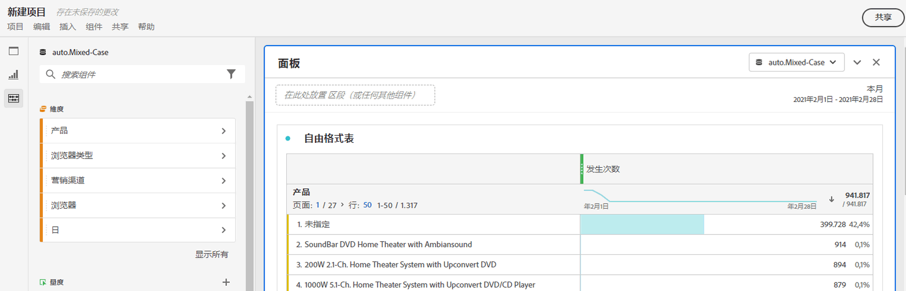
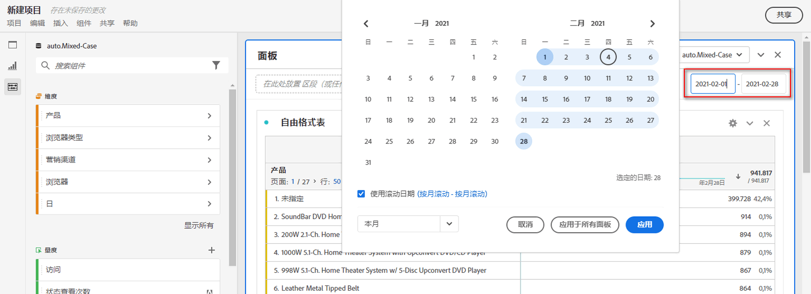
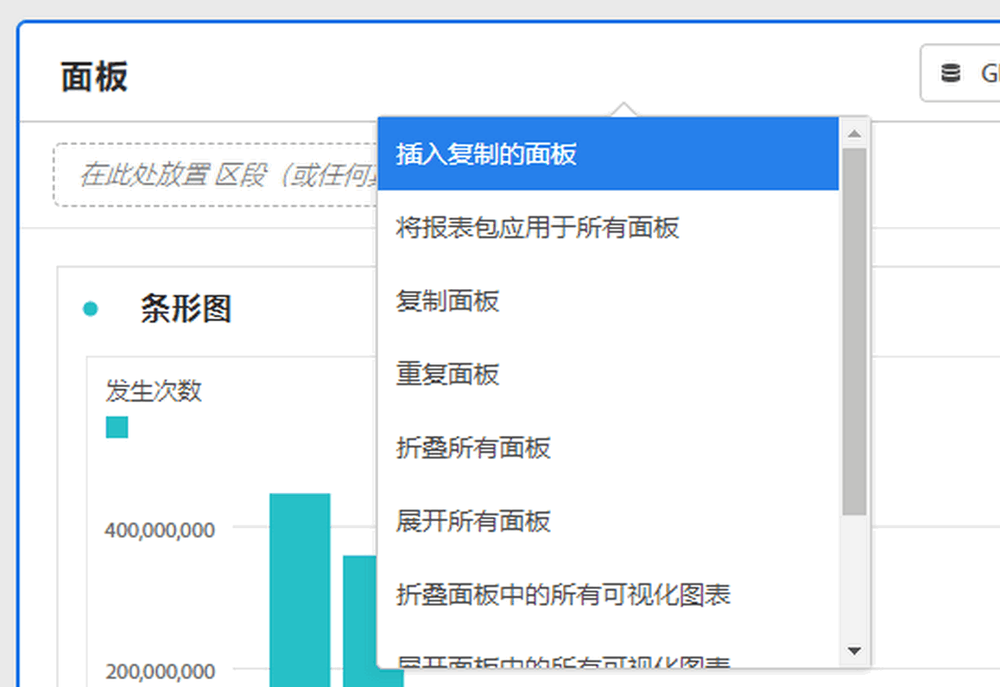

# 面板概述

[!UICONTROL 面板]是表格和可视化图表的集合可从 Workspace 左上角的图标或[空白面板](/help/analyze/analysis-workspace/c-panels/blank-panel.md)访问面板。当您要根据时间段、报告包或分析用例组织您的项目时，面板非常有用。

## 面板类型

Analysis Workspace 中为 [!UICONTROL Adobe Analytics] 提供了以下面板类型：

| 面板名称 | 描述 |
| --- | --- |
| [空白面板](/help/analyze/analysis-workspace/c-panels/blank-panel.md) | 从可用的面板和可视化图表中选择以开始分析。 |
| [归因](attribution.md) | 使用任意维度和转化量度，快速比较并可视化任意数量的归因模型。 |
| [Analytics for Target](a4t-panel.md) | 在 Analysis Workspace 中分析 Target 的活动和体验。 |
| [自由格式表](freeform-panel.md) | 执行无限制的比较和细分，然后通过添加可视化图表来讲述丰富的数据故事。 |
| [媒体平均分钟观众数](average-minute-audience-panel.md) | 分析一条特定内容或自定义时间段的平均分钟观众数。 |
| [媒体并行观众](media-concurrent-viewers.md) | 分析一段时间内的并发查看者，了解有关并发峰值的详细信息，并且可以进行细分和比较。 |
| [媒体播放耗时](/help/analyze/analysis-workspace/c-panels/media-playback-time-spent.md) | 分析播放耗时以了解发生并发高峰或发生播放量下降的位置。 |
| [下一项或上一项](next-previous.md) | 显示人们访问的下一个或上一个页面。 |
| [快速洞察](quickinsight.md) | 快速构建自由格式表和随附的可视化图表，以便更快地分析和发现洞察。 |
| [页面摘要](page-summary.md) | 探索特定页面的关键统计数据。 |
| [区段比较](/help/analyze/analysis-workspace/c-panels/c-segment-comparison/segment-comparison.md) | 对所有数据点快速比较两个区段，以自动查找相关差异。 |

[!UICONTROL 快速洞察]、[!UICONTROL 空白]和[!UICONTROL 自由格式]面板非常适合用于开始进行分析，而[!UICONTROL 归因]本身则有助于进行更深入的分析。画布底部有一个 ，因此您可以随时添加空白面板。

默认的开始面板是[!UICONTROL 自由格式]面板，但您也可以将[空白面板](/help/analyze/analysis-workspace/c-panels/blank-panel.md)或[快速洞察](/help/analyze/analysis-workspace/c-panels/quickinsight.md)设置为默认选择。请参阅[项目和分析偏好设置](/help/analyze/analysis-workspace/user-preferences.md#projects--analyses-preferences)。

## 创建面板

要创建面板，请执行以下操作：

* 将 **[!UICONTROL 面板]** 左侧面板中的面板拖放到画布上。
* 从[空白面板](blank-panel.md)中选择一个面板。
* 使用 Workspace 中的&#x200B;**[!UICONTROL 插入]**&#x200B;菜单，并选择您的面板。或者，您可以使用任何[快捷方式](../build-workspace-project/fa-shortcut-keys.md)来插入面板。

  

您可以：

* 在任何面板&#x200B;**内**&#x200B;选择 ，以添加另一项可视化图表。弹出的窗口可供选择可视化图表。

  

  | 选择... | 要创建… |
  |---|---|
  |  | [自由格式表](/help/analyze/analysis-workspace/visualizations/freeform-table/freeform-table.md) |
  |  | [折线图](/help/analyze/analysis-workspace/visualizations/line.md) |
  |  | [条形图](/help/analyze/analysis-workspace/visualizations/bar.md) |
  |  | [摘要数字](/help/analyze/analysis-workspace/visualizations/summary-number-change.md) |
  |  | [文本](/help/analyze/analysis-workspace/visualizations/text.md) |
  |  | [流失](/help/analyze/analysis-workspace/visualizations/fallout/fallout-flow.md) |
  |  | [流](/help/analyze/analysis-workspace/visualizations/c-flow/flow.md) |
  |  | [堆叠的面积图](/help/analyze/analysis-workspace/visualizations/area.md) |
  |  | [同类群组表](/help/analyze/analysis-workspace/visualizations/cohort-table/t-cohort.md) |
  |  | [项目符号](/help/analyze/analysis-workspace/visualizations/bullet-graph.md) |
  |  | [圆环图](/help/analyze/analysis-workspace/visualizations/donut.md) |
  |  | [摘要变化](/help/analyze/analysis-workspace/visualizations/summary-number-change.md) |
  |  | [直方图](/help/analyze/analysis-workspace/visualizations/histogram.md) |
  |  | [散点图](/help/analyze/analysis-workspace/visualizations/scatterplot.md) |
  |  | [维恩图](/help/analyze/analysis-workspace/visualizations/venn.md) |
  |  | [树状图](/help/analyze/analysis-workspace/visualizations/treemap.md) |

* 选择 Workspace 最后一个面板&#x200B;**外**&#x200B;的  以添加另一个[空白面板](blank-panel.md)。

## 管理面板

您可以通过以下方式管理面板：

* 要折叠面板，请选择 。
* 要显示折叠起来的面板，请选择 。
* 要删除面板，请选择。 若要撤消，请选择&#x200B;**[!UICONTROL 编辑]** > **[!UICONTROL 撤消]** (**[!UICONTROL *cmd *+*z *]**|**[!UICONTROL * ctrl *+* z *]**)。
* 若要移动面板，请每当可见时拖放该面板（通常是将鼠标悬停在标题上时）。

## 报告包

每个面板都与一个[报告包](/help/admin/tools/manage-rs/report-suites-admin.md)相关联，通过面板右上角下拉菜单中&#x200B;**[!UICONTROL *报告包&#x200B;*]**&#x200B;的名称进行标识。

当您创建新面板时，默认报告包基于您上次在 Analysis Workspace 项目中处理的面板报告包。

在项目中，您可以根据分析用例，使用一个或[多个报告包](/help/analyze/analysis-workspace/build-workspace-project/multiple-report-suites.md)。

报表包列表按相关性排序，Adobe根据当前用户最近使用报表包的情况和频繁程度来定义相关性。 以及在组织内使用该包的频率。

面板中的

>[!IMPORTANT]
>
>选定的报告包决定了可用于在面板中生成可视化图表的维度、量度和区段。
>
>
>切换面板的报告包时，某些组件可能在新的报告包中不可用。此更改可能会导致您的可视化图表无法正确呈现。您可能会看到类似以下警告：
>
>* 此面板包含在所选报告包中未启用的组件。请更改报告包或在报告包中启用所需的组件。
>* 无法呈现可视化图表：请检查您的列和行，以确保它们包含有效的组件。
>

## 日程表

面板日程表可以控制面板中表格和可视化图表的报告日期范围。

>[!NOTE]
>
>如果可视化图表或面板中使用了日期范围组件（例如，作为区段），则日期范围组件会覆盖面板日程表。
>

1. 通过先选择开始日期，然后选择结束日期来选择日期范围。
或者，您也可以从[!UICONTROL *选择预设*]&#x200B;下拉菜单中选择一个&#x200B;**[!UICONTROL 预设]**。

1. 或者，选择&#x200B;**[!UICONTROL 显示高级设置]**&#x200B;以：

   * 指定&#x200B;**[!UICONTROL 开始时间]**&#x200B;和&#x200B;**[!UICONTROL 结束时间]**，而不是默认的 `12:00 AM` (`0:00`) 和 `11:59 PM` (`23:59`)。结束时间始终包括 59 秒。如果日期范围跨越许多天，则开始时间适用于该日期范围的第一天，结束时间适用于日期范围内的最后一天。使用&#x200B;**[!UICONTROL （重置时间值）]**&#x200B;将开始和结束时间重置为默认值。
   * **[!UICONTROL 使日期范围组件相对于面板日程表]**。如果禁用，则面板中使用的日期范围组件相对于当前时间。 如果启用，则面板中使用的日期范围组件将相对于面板日历。
   * **[!UICONTROL 使用滚动日期]**。如果启用，预设日期范围（如&#x200B;**[!UICONTROL 最近7天整]**）将动态更新为当前的日期和时间进度。 如果禁用，则此类预设在应用后便不会更新。

     

     您可以选择括号中的文本（例如&#x200B;**[!UICONTROL 固定开始 — 每日滚动]**）以扩展面板并指定&#x200B;**[!UICONTROL 开始]**&#x200B;和&#x200B;**[!UICONTROL 结束]**&#x200B;的详细信息。

      1. 选择&#x200B;**[!UICONTROL 开始]**、**[!UICONTROL 结束]**&#x200B;或&#x200B;**[!UICONTROL 固定日期]**。
      1. 当选择了&#x200B;**[!UICONTROL 开始]**&#x200B;或&#x200B;**[!UICONTROL 结束]**&#x200B;时，您可以生成一个完整的表达式。例如：**&#x200B;** **[!UICONTROL 当前年份的结束]**&#x200B;**[!UICONTROL 加上]**`1`**[!UICONTROL 天]**。为表达式的每个部分选择适当的值。
         * 选择当前时间的值。例如，**[!UICONTROL 当前年份]**。
         * 选择一个值进行额外的计算。例如，**[!UICONTROL 加上]**。
         * 当您指定了额外的计算时，请指定一个值。例如，`1`。
         * 当您指定了额外的计算时，请选择用于该计算的时段。例如&#x200B;**[!UICONTROL 天]**。

     选择&#x200B;**[!UICONTROL 隐藏详细信息]**，以隐藏计算滚动日期的详细信息。

1. 选择&#x200B;**[!UICONTROL 应用]**&#x200B;以将日期范围应用到您调用日程表的面板。
选择&#x200B;**[!UICONTROL 应用于所有面板]**&#x200B;以将日期范围应用于 Workspace 项目中的所有面板。

## 拖放区域 {#dropzone}

面板拖放区域标记为&#x200B;**[!UICONTROL _拖放组件以过滤或划分数据_]**，允许您过滤或划分面板的数据。 用于过滤或划分数据的区段或划分适用于面板内的所有自由格式表和可视化图表。

利用区段和划分，可采用可控方式与数据交互。 例如，您可以为移动设备类型添加区段下拉菜单，以便通过选择平板电脑、手机或桌面来筛选面板。

区段也可用于将多个项目合并为一个。 例如，如果您有一个项目的不同版本，每个版本应用了不同的国家/地区区段，您可以将所有版本合并为一个项目并添加一个国家/地区区段下拉菜单。

下图显示了将组件添加到拖放区域时生成的（快速）区段或细分的不同变体。

### 添加或替换

添加或替换（快速）区段或划分：

1. 从组件边栏中选择一个或多个组件。 使用⇧+或^+选择多个组件。
1. 将选定内容拖到标记为&#x200B;**[!UICONTROL _放置组件以筛选或划分数据_]** ❶的拖放区域，或者拖到已放置在拖放区域附近的现有组件上。
1. 当您看到 **[!UICONTROL 添加（按Shift创建下拉列表）]**&#x200B;或 **[!UICONTROL 替换（按Shift添加到下拉列表）]**&#x200B;时，您有两个选项：

   

   * 删除所选内容以创建以下组件：
      * 您放置[的任何区段组件的](#segment)区段❷。
      * [您放置了](#quick-segment)的任何非区段组件（日期范围、量度、维度、维度项）的快速区段❸。
   * 按住&#x200B;**键并⇧(Shift)以创建以下组件时，拖放选项**：
      * 静态区段[下拉菜单](#drop-down-menu)包含要筛选的项，用于您放置❹的选定区段。
      * 静态区段[下拉菜单](#drop-down-menu)，其中包含要筛选的项，用于您放置❺的选定日期范围。
      * 静态区段[下拉菜单](#drop-down-menu)，其中包含要筛选您放置❻的选定量度的项目。
      * 静态区段[下拉菜单](#drop-down-menu)或划分[下拉菜单](#drop-down-menu)，其中包含要筛选或划分的项，用于您放置&#x200B;*的所选维度*&#x200B;项❼。
      * 对于您放置[的选定维度，动态区段](#drop-down-menu)下拉菜单[或划分](#drop-down-menu)下拉菜单❽包含要过滤或划分的项。

### 区段

您放置的任何区段组件都用于划分面板。 使用区段对面板的数据和可视化图表进行分段分析。

### 快速区段

任何已放置的非区段组件（维度、维度项、量度、日期范围）定义了一个[快速区段](#quick-segment)来划分面板。 使用任何非区段组件创建快速区段，而无需使用[区段生成器](/help/components/segmentation/segmentation-workflow/seg-quick.md)。 通过这种方式创建的区段自动定义为事件级区段，默认情况下标记为&#x200B;**[!UICONTROL 快速区段]**。

或者，您可以使用创建快速区段。

有关如何创建和管理快速区段，请参阅[快速区段](/help/components/segmentation/segmentation-workflow/seg-quick.md)。

### 下拉菜单

在按住⇧键的同时创建的下拉菜单可以：

* 包含[静态](#static)或[动态](#dynamic)项目列表。
* 行为[筛选面板](#filter)或[划分面板](#breakdown)。

#### 静态

已为选定的维度&#x200B;*项目*、量度、区段和日期范围创建静态下拉菜单。 静态下拉菜单中的项基于您拖放的选定组件，在添加或替换组件时，这些项不会更改。

#### 动态

仅当拖放维度组件时，才会创建动态下拉菜单。 动态下拉菜单在标签中以表示。

动态下拉菜单中的可用项目基于：

* 从面板拖放区域中的其他下拉菜单、区段和快速区段中的选定项目生成的数据，以及
* 面板报告范围内的可用数据。

例如，您可以使用国家/地区维度和城市维度添加两个动态下拉菜单。 当您从&#x200B;**[!UICONTROL 国家/地区]**&#x200B;下拉菜单中选择国家/地区时，**[!UICONTROL 城市]**&#x200B;下拉菜单会动态调整以仅显示选定国家/地区内的城市。 当您有其他静态下拉菜单时，在这些下拉菜单中选择的项目也会影响动态下拉菜单中的可用项目。 在动态下拉菜单中选择的项目不会影响静态下拉菜单中的可用项目。

#### 筛选面板

对于您按住&#x200B;**⇧放置**&#x200B;的任何量度、区段或日期范围组件，将创建一个区段下拉菜单。 该下拉菜单允许您根据可用于放置组件的项筛选面板。

对于您按住&#x200B;*⇧放时放置*&#x200B;的任何&#x200B;**维度**&#x200B;组件，将创建一个区段下拉菜单。 该下拉菜单允许您根据可用于放置的维度项（[静态](#static)区段下拉菜单）或维度组件（[动态](#dynamic)区段下拉菜单）的项筛选面板。 要明确配置下拉菜单以使用区段进行筛选，请执行以下操作：

* 选择并从组件筛选器❾。

#### 划分面板

对于您按住&#x200B;*⇧放时放置*&#x200B;的任何&#x200B;**维度**&#x200B;组件，将创建一个区段下拉菜单。 您可以将下拉菜单配置为改为进行划分。 要将下拉菜单明确配置为使用划分进行划分，请执行以下操作：

* 选择并从组件划分❾。

>[!IMPORTANT]
>
>细分仅适用于维度和维度项目，不适用于区段、日期范围或量度。
>

#### 区段与划分

在以下场景中，请考虑划分面板而不是过滤面板（使用区段）：

* 如果您在面板中使用启用了归因的量度，则区段通常会清除您的启用了归因的量度。 划分将应用在查询中的不同点，执行此操作是为了检索面板的数据。 因此，划分不会清除这些启用属性的量度。

  例如，使用&#x200B;**[!UICONTROL Luma：产品类别]** **[!UICONTROL 筛选器]** 区段时，查看基于&#x200B;**[!UICONTROL 在线收入]**&#x200B;量度的属性与&#x200B;**[!UICONTROL Luma：产品类别]**  **[!UICONTROL 女性]**&#x200B;划分之间的差异。

  

* 如果您在划分下拉菜单中使用子事件级别维度，则划分会在该子事件级别执行。 相反，区段下拉菜单中的区段在事件级别执行。

  例如，查看使用&#x200B;**[!UICONTROL Luma：产品子类别]** **[!UICONTROL 筛选器]** 区段时&#x200B;**[!UICONTROL 在线收入]**&#x200B;量度与&#x200B;**[!UICONTROL Luma：产品子类别]**  **[!UICONTROL 顶端]**&#x200B;划分之间的差异。 划分在子事件级别显式执行查询，而区段在事件级别执行查询。

  

### 管理

您可以按如下方式管理放置区域中的组件：

| 在面板拖放区域中要执行的操作…… | 如何…… |
|---|---|
| 要删除区段或快速区段，请执行以下操作： | 在组件中选择。 |
| 从下拉菜单中删除选定项。 | 在项中选择。 |
| 从下拉菜单中删除所有选定项。 | 在下拉菜单中选择。 |
| 编辑任何组件的标签。 | 将鼠标悬停在组件的标签上，然后选择。 |
| 删除任何组件的标签。 | 将鼠标悬停在组件的标签上，然后从组件的上下文菜单中选择&#x200B;**[!UICONTROL 删除标签]**。 |
| 从拖放区域中删除组件。 | 从组件的上下文菜单中选择&#x200B;**[!UICONTROL 删除下拉列表]**。 |
| 获取有关区段或快速区段的信息。 | 将鼠标悬停在组件内并选择以打开包含组件信息的数据字典。 |
| 获取有关定义下拉菜单的组件的信息。 | 将鼠标悬停在下拉菜单内并选择以打开包含组件信息的数据字典。 |
| 编辑快速区段。 | 将光标悬停在快速区段内并选择。 有关详细信息，请参阅[快速区段](/help/components/segmentation/segmentation-workflow/seg-quick.md)。 |
| 需要为下拉菜单进行选择。 | 从组件的上下文菜单中选择&#x200B;**[!UICONTROL 需要选择]**。 |
| 为下拉菜单允许无过滤器。 | 从组件的上下文菜单中选择&#x200B;**[!UICONTROL 不允许筛选器]**。 |
| 重置所有组件并清除下拉菜单的所有选择。 | 选择&#x200B;**[!UICONTROL 全部重置]**。 |

>[!BEGINSHADEBOX]

观看演示视频的 [在Analysis Workspace中使用筛选器](https://experienceleague.adobe.com/en/docs/analytics-learn/tutorials/analysis-workspace/using-panels/using-drop-down-filters){target="_blank"}。

>[!ENDSHADEBOX]

>[!BEGINSHADEBOX]

观看演示视频的 [动态下拉菜单](https://experienceleague.adobe.com/en/docs/customer-journey-analytics-learn/tutorials/analysis-workspace/tips-and-tricks/dynamic-drop-downs){target="_blank"}。

{{videocja}}

>[!ENDSHADEBOX]

## 上下文菜单

面板的其他功能可以通过面板标题上的上下文菜单（右键单击）获得。

可以使用以下选项：

| 选项 | 描述 |
| --- | --- |
| **[!UICONTROL 插入复制的面板]** | 使用此功能，您可以将复制的面板粘贴到项目中的其他位置或不同的项目中。 |
| **[!UICONTROL 插入复制的可视化图表]** | 将复制的可视化图表粘贴到面板、项目中的其他位置或不同的项目中。 |
| **[!UICONTROL 将报告包应用于所有面板]** | 将此面板的报表包应用于项目中的所有其他面板。 |
| **[!UICONTROL 复制面板]** | 复制面板，以将其插入到项目中的其他位置或不同的项目中。 |
| **[!UICONTROL 重复面板]** | 生成一个与当前面板完全相同的副本，然后可对其进行修改。 |
| **[!UICONTROL 折叠所有面板]** | 折叠所有项目面板。 |
| **[!UICONTROL 展开所有面板]** | 展开所有项目面板。 |
| **[!UICONTROL 折叠面板中的所有可视化图表]** | 折叠当前面板中的所有可视化图表。 |
| **[!UICONTROL 展开面板中的所有可视化图表]** | 展开当前面板中的所有可视化图表。 |
| **[!UICONTROL 编辑描述]** | 添加（或编辑）面板的文本描述。 |
| **[!UICONTROL 获取面板链接]** | 将相关人员引导至项目中的特定面板。选择该链接后，收件人需要先登录，然后才能转至所链接到的那个面板。 |

## 配置

某些面板（例如[!UICONTROL 归因]、[!UICONTROL 试验]、[!UICONTROL 媒体平均分钟观众数]等）具有配置对话框，以帮助您生成可视化图表。使用面板顶部的来访问和更改配置。

