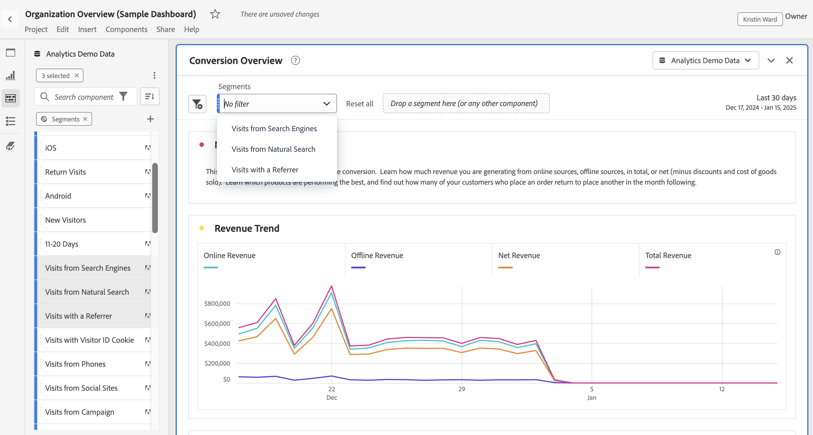

# 面板概述

[!UICONTROL 面板]是表格和可视化图表的集合您可以从 Workspace 左上角的图标或[空白面板](blank-panel.md)访问面板。当您要根据时段、报表包或分析用例组织您的项目时，面板非常有用。Analysis Workspace 中提供了以下面板类型：

| 面板名称 | 描述 |
| --- | --- |
| [空白面板](blank-panel.md) | 从可用的面板和可视化图表中选择以开始分析。 |
| [“快速分析”面板](quickinsight.md) | 快速构建自由格式表和随附的可视化图表，以便更快地分析和发现见解。 |
| [“Analytics for Target”面板](a4t-panel.md) | 在 Analysis Workspace 中分析 Target 的活动和体验。 |
| [归因面板](attribution.md) | 使用任意维度和转化量度，快速比较和可视化任意数量的归因模型。 |
| [自由格式面板](freeform-panel.md) | 不受限制地执行比较和细分，然后添加可视化图表来讲述丰富的数据案例。 |
| [“媒体并行查看者”面板](media-concurrent-viewers.md) | 分析一段时间内的并发查看者，了解有关并发峰值的详细信息，并且可以进行细分和比较。 |
| [区段比较面板](c-segment-comparison/segment-comparison.md) | 对所有数据点快速比较两个区段，以自动查找相关差异。 |

[!UICONTROL 快速见解]、[!UICONTROL 空白]和[!UICONTROL 自由格式]面板非常适合开始您的分析，而 [!UICONTROL Analytics for Target]、[!UICONTROL 归因 IQ]、[!UICONTROL 媒体并行查看者]和[!UICONTROL 区段比较]有助于进行更深入的分析。项目中有一个 `"+"` 按钮，通过该按钮，您可以随时添加空白面板。

默认开始面板是[!UICONTROL 自由格式]面板，但您也可以将[空白面板](/help/analyze/analysis-workspace/c-panels/blank-panel.md)设置为默认值。

## 报表包 {#report-suite}

面板中的表格和可视化图表从在面板的右上角选中的[!UICONTROL 报表包]中派生数据。报表包还确定在左边栏中有哪些组件可用。在项目中，您可以根据分析用例，使用一个或[多个报表包](https://experienceleague.adobe.com/docs/analytics/analyze/analysis-workspace/build-workspace-project/multiple-report-suites.html)。要将一个报表包应用到项目中的所有面板，请&#x200B;**右键单击面板标题 > 将报表包应用于所有面板**。

报表包的列表按照相关性排序，Adobe 根据当前用户在近期使用该包的频率以及该包在组织中的使用频率来定义相关性。

## 日历 {#calendar}

面板日历控制面板中表格和可视化报表的报告范围。

注意：如果在表格、可视化报表或面板拖放区域中使用了某个（紫色）日期范围组件，则该组件会覆盖面板日历。

## 拖放区域 {#dropzone}

使用面板拖放区域，您可以将区段和下拉过滤器应用到面板中的所有表格和可视化报表。您可以将一个或多个过滤器应用到面板。各个过滤器上方的标题可以通过单击铅笔图标进行修改，您也可以右键单击以将其全部删除。

### 区段过滤器

将任意区段从左边栏拖放到面板拖放区域以开始过滤面板。

### 临时区段过滤器

非区段组件也可以直接拖放到拖放区域中来创建临时区段，为您节省转至区段生成器的时间和操作。通过这种方式创建的区段自动定义为点击级别区段。通过单击区段旁的信息图标 (i)、单击铅笔形状编辑图标并在区段生成器中进行编辑，可以修改此定义。

临时区段位于项目的本地，除非您将其设为公共，否则不会显示在左边栏中。

### 下拉过滤器 {#dropdown-filter}

除了区段过滤器，您还可通过下拉过滤器以可控方式与数据交互。例如，您可以为移动设备类型添加下拉过滤器，这样您就可以按照平板电脑、手机或台式机来细分面板。

下拉过滤器也可用于将多个项目合并在一起。例如，如果您有一个项目的多个版本，每个版本具有不同的“国家/地区”区段，您可以将所有版本合并为一个项目并添加“国家/地区”下拉过滤器。

要创建下拉过滤器，请执行以下操作：

1. 要使用[!UICONTROL 维度项]创建下拉过滤器，例如[!UICONTROL 营销渠道]维度，请在左边栏中单击该维度旁边的右箭头图标。这会打开所有可用项。从左边栏中选择一个或多个组件项，然后&#x200B;**在按住 Shift 键的同时**&#x200B;将其放到面板拖放区域中。这会将组件转换为下拉过滤器，而不是转换为单个区段。
1. 要使用量度、区段或日期范围等其他组件创建下拉过滤器，请在左边栏中选择一种组件类型，然后&#x200B;**在按住 Shift 键的同时**&#x200B;将其放到面板拖放区域中。
1. 从下拉过滤器中选择以下选项之一来更改面板中的数据。您也可以通过选择&#x200B;**[!UICONTROL 无过滤器]**&#x200B;来不过滤任何面板数据。

[观看视频](https://experienceleague.adobe.com/docs/analytics-learn/tutorials/analysis-workspace/using-panels/using-panels-to-organize-your-analysis-workspace-projects.html)以详细了解如何将下拉过滤器添加到项目中。

## 右键单击菜单 {#right-click}

面板的其他功能可通过在面板的标题上右键单击来使用。

其中提供了以下设置：

| 设置 | 描述 |
| --- | --- |
| 插入复制的面板/可视化图表 | 此设置允许您将复制的面板或可视化图表粘贴（“插入”）到项目中的其他位置或完全不同的项目中。 |
| 复制面板 | 此设置允许您右键单击并复制面板，以便将其插入到项目中的其他位置或完全不同的项目中。 |
| 将报表包应用于所有面板 | 此设置允许您将活动的面板报表包应用到项目中的所有面板。 |
| 复制面板 | 生成一个与当前面板完全相同的副本，然后可对其进行修改。 |
| 折叠/展开所有面板 | 折叠和展开所有项目面板。 |
| 折叠/展开面板中的所有可视化图表 | 折叠和展开当前面板中的所有可视化图表。 |
| 编辑描述 | 添加（或编辑）面板的文本描述。 |
| 获取面板链接 | 此设置允许您将人员引导至项目中的特定面板。单击该链接时，收件人需要先登录，然后才能转至所链接到的那个面板。 |
