# 快速洞察面板 {#quick-insights-panel}

<!-- markdownlint-disable MD034 -->

>[!CONTEXTUALHELP]
>id="workspace_quickinsights_button"
>title="快速洞察"
>abstract="创建面板，快速生成自由格式表和随附的可视化图表，以便更快地分析和发现洞察。"

<!-- markdownlint-enable MD034 -->

>[!BEGINSHADEBOX]

_本文记录了_  _**Adobe Analytics** 中的快速洞察面板。_ _请参阅[快速洞察面板](https://experienceleague.adobe.com/zh-hans/docs/analytics/analyze/analysis-workspace/panels/quickinsight)以获取本文的_  _**Customer Journey Analytics** 版本。_

>[!ENDSHADEBOX]

[!UICONTROL 快速洞察]可为 [!UICONTROL Analysis Workspace] 的非分析师和新用户了解如何快速轻松地回答业务问题提供指导。此外，对于希望快速回答简单问题的高级用户来说，它也是一个不错的工具，无需自己制表。

刚开始使用 [!UICONTROL Analysis Workspace] 时，您可能会想知道：

* 哪些可视化图表最有用，
* 哪些维度和量度可能有助于洞察，
* 在哪里拖放项目，
* 在哪里创建过滤器，
* 等。

为了帮助解决这些问题，[!UICONTROL 快速洞察]利用了一种算法，该算法为您提供了您公司所使用的最热门的维度、量度、区段和日期范围。该算法基于您的公司对 [!UICONTROL Analysis Workspace] 中数据组件的使用。事实上，您会在下拉列表中看到标记为 [!UICONTROL POPULAR] 的维度、量度和区段，如下所示：

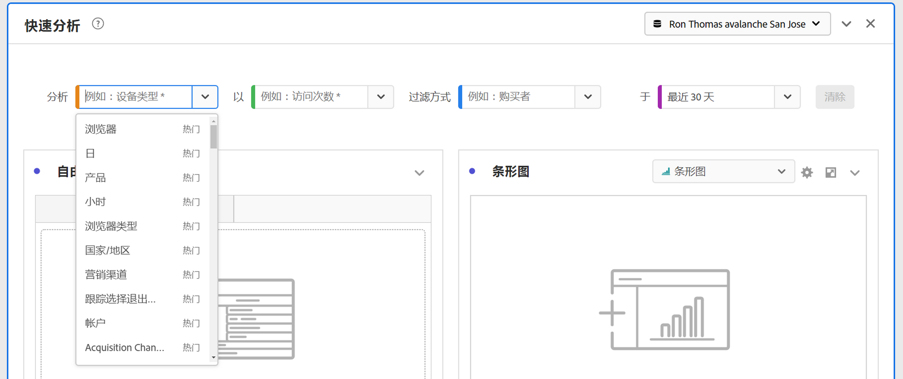

[!UICONTROL 快速洞察]会帮助您

* 在 [!UICONTROL Analysis Workspace] 中妥善生成数据表以及随附的可视化图表。
* 了解 [!UICONTROL Analysis Workspace] 中基本组件和要素的术语和词汇。
* 在[!UICONTROL 自由格式表]中轻松进行维度的简单划分、添加多个量度或比较区段。
* 更改或尝试各种可视化图表类型，快速直观地找到用于分析的查找工具。

## 基本关键术语

以下是您需要熟练掌握的一些基本术语。每个数据表都包含 2 个或多个用于讲述数据故事的生成基块（组件）。

| 构成要素（组件） | 定义 |
|---|---|
| **[!UICONTROL 维度]** | 维度是可以在项目中查看、划分和比较的量度数据的说明或特性。它们是非数字值和日期，可划分为不同维度项。例如，*浏览器*&#x200B;或&#x200B;*页面*&#x200B;是一个维度。 |
| **[!UICONTROL 维度项]** | 维度项是维度的单个值。例如，浏览器维度的维度项可能是 *Chrome*、*Firefox*、*Edge* 等。 |
| **[!UICONTROL 量度]** | 量度是关于查看次数、点进次数、重新加载次数、平均逗留时间、单位、订单数、收入等人员活动的量化信息。 |
| **[!UICONTROL 可视化图表]** | Workspace 提供了[许多可视化图表](/help/analyze/analysis-workspace/visualizations/freeform-analysis-visualizations.md)，用于生成数据的可视化表示形式。例如条形图、圆环图、直方图、线形图、地图、散点图等。 |
| **[!UICONTROL 维度划分]** | 维度划分是一种按其他维度来划分维度的方法。例如，您可以按移动设备划分美国各州的情况，以获取每个州的移动设备访问次数。或者您可以按移动设备类型、地区、内部营销活动等划分移动设备。 |
| **[!UICONTROL 区段]** | 利用区段可根据相关特征或网站交互辨别一部分人。例如，您可以根据以下内容生成[!UICONTROL 访客]区段 <li>归因：浏览器类型、设备、访问次数、国家/地区、性别或</li><li>交互：营销活动、关键词搜索、搜索引擎或</li><li>退出和进入：来自 Facebook 的访客、定义的登陆页面、反向链接域或</li><li> 自定义变量：表单字段、定义的类别、客户 ID。 |

## 使用

要使用&#x200B;**[!UICONTROL 快速洞察]**&#x200B;面板：

1. 创建&#x200B;**[!UICONTROL 快速洞察]**&#x200B;面板。有关如何创建面板的信息，请参阅[创建面板](panels.md#create-a-panel)。

1. 首次使用&#x200B;**[!UICONTROL 快速洞察]**&#x200B;面板时，请先通过这则简短的[!UICONTROL 入门教程]来了解一些基础知识。选择快速洞察面板标题旁边的 ，然后从弹出窗口中选择&#x200B;**[!UICONTROL 入门教程]**。

1. 指定面板的[输入](#panel-input)。

1. 观察面板的[输出](#panel-output)。

### 面板输入

选择您的生成基块：

* **[!UICONTROL 分析]** - 指定一个维度（橙色）
* **[!UICONTROL 依据]** - 指定一个量度（绿色）
* **[!UICONTROL 过滤依据]** - 指定一个区段（蓝色）
* **[!UICONTROL 在]**&#x200B;中 - 指定一个时间范围（紫色）。

您必须选择至少一个维度和一个量度才能使可视化图表正常运行。

您可以通过以下三种方式指定生成基块：

* 从左侧面板中拖放组件。
* 开始在其中一个生成基块字段中输入内容。当找到输入内容时，生成基块字段会自动填充可能的值。
* 指定一个生成基块下拉菜单（例如&#x200B;**[!UICONTROL 分析]**&#x200B;中的 `Country`）并在可能的值列表中进行搜索（使用 ），以查找您想要使用的值（例如，**[!UICONTROL 国家代码]**）。

选择&#x200B;**[!UICONTROL 清除]**&#x200B;来清除所有输入字段。

### 面板输出

1. 当您添加了至少一个维度和一个量度后，您就可以看到结果。

   

   * 包含维度（[!UICONTROL 国家/地区 Site]）和量度（[!UICONTROL 访问次数]）的自由格式表，按[!UICONTROL 过去 12 个月]来自[!UICONTROL 搜索引擎]的[!UICONTROL 访问次数]分段。

   * 随附的可视化图表，在这个示例中是[条形图](/help/analyze/analysis-workspace/visualizations/bar.md)。生成的可视化图表以您添加到表中的数据类型为基础。任何基于时间的数据（例如每日/月的[!UICONTROL 访问次数]）均默认显示为[!UICONTROL 线形图]。任何非基于时间的数据（例如[!UICONTROL 每台设备]的[!UICONTROL 访问次数]均默认显示为[!UICONTROL 条形图]。您可以通过单击可视化图表类型旁边的下拉箭头来更改可视化图表类型。

1. 如下文[更多提示](#more-tips)中所述，可尝试添加某些更细致的调整。

1. 建议使用&#x200B;**[!UICONTROL 项目 > 保存]**&#x200B;保存您的项目。

## 更多提示

[!UICONTROL 快速洞察生成器]中会弹出其他有用提示，其中一些提示取决于您的上一个操作。

* 首先，您可能需要完成&#x200B;**[!UICONTROL 更多提示]**&#x200B;教程。在创建至少包含一个维度和一个量度的项目后 24 小时内会显示本教程。选择快速洞察面板标题旁边的 ，然后从弹出窗口中选择&#x200B;**[!UICONTROL 更多提示]**。

  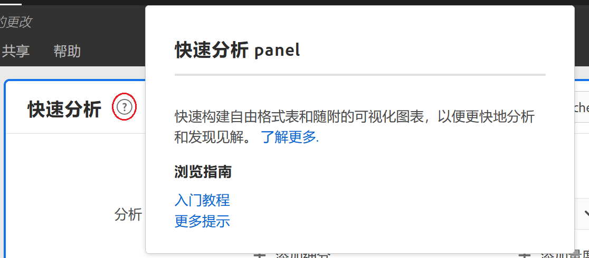

* 您可以分析多个维度和量度、组合或比较分段并指定数据范围：

  

   * **[!UICONTROL 分析]**&#x200B;维度&#x200B;**[!UICONTROL 划分条件]**：您最多可以使用 3 个级别对维度进行划分，以挖掘您真正需要的数据。请参阅➊、➋和➌。

   * 添加更多的量度&#x200B;**[!UICONTROL 条件]**：您最多可以添加 2 个量度。查看➍和➎。

   * **[!UICONTROL 过滤依据]**：您最多可以再添加 2 个区段。例如，将“预订”添加为区段，并将该区段与您所比较的“预订常客”和“首次飞行的客人”区段结合起来。请参阅➏、➐和➑。

   * 在：可以指定日期范围。请参阅➒。

## 已知限制

如果尝试直接在表中进行编辑，则会导致[!UICONTROL 快速洞察]面板无法同步。选择面板右上方的&#x200B;**[!UICONTROL 重新同步生成器]**，可将其恢复为之前的[!UICONTROL 快速洞察]设置。

在将任何内容直接添加到该表之前，您会收到一则警告：

否则，直接生成会导致此表如传统的自由格式表那样，不含对于新用户有用的功能。

>[!MORELIKETHIS]
>
>[创建面板](/help/analyze/analysis-workspace/c-panels/panels.md#create-a-panel)
>
<!--
# Quick Insights panel

[!UICONTROL Quick Insights] provides guidance for non-analysts and new users of [!UICONTROL Analysis Workspace] to learn how to answer business questions quickly and easily. It is also a great tool for advanced users who want to answer a simple question quickly without having to build a table themselves.

When you first start using this [!UICONTROL Analysis Workspace], you might wonder what visualizations would be most useful, which dimensions and metrics might facilitate insights, where to drag and drop items, where to create a segment, etc. 

To help with this, and based on your own company's usage of data components in [!UICONTROL Analysis Workspace], [!UICONTROL Quick Insights] leverages an algorithm that will present you with the most popular dimensions, metrics, segments, and date ranges your company uses. In fact, you will see dimensions, metrics, and segments tagged as [!UICONTROL Popular] in the drop-down list, as shown here:

[!UICONTROL Quick Insights] helps you

* Properly build a data table and an accompanying visualization in [!UICONTROL Analysis Workspace].
* Learn the terminology and vocabulary for basic components and pieces of [!UICONTROL Analysis Workspace].
* Do simple breakdowns of dimensions, add multiple metrics, or compare segments easily within a [!UICONTROL Freeform table].
* Change or try out various visualization types to find the find tool for your analysis quickly and intuitively.

Here is a video overview of the [!UICONTROL Quick Insights] panel:

>[!VIDEO](https://video.tv.adobe.com/v/37248/?quality=12)

## Basic key terminology

Following are some of the basic terms you need to be familiar with. Each data table consists of 2 or more building blocks (components) that you utilize to tell your data story.

|Building block (Component)|Definition|
|---|---|
|[!UICONTROL Dimension]|Dimensions are descriptions or characteristics of metric data that can be viewed, broken down, and compared in a project. They are non-numeric values and dates that break down into dimension items. For example, "browser", or "page" are dimensions.|
|[!UICONTROL Dimension item]|Dimension items are individual values for a dimension. For example, dimension items for the browser dimension would be "Chrome", "Firefox", "Edge", etc.|
|[!UICONTROL Metric]|Metrics are quantitative information about visitor activity, such as views, click-throughs, reloads, average time spent, units, orders, revenue, and so on.|
|[!UICONTROL Visualization]|Workspace offers [a number of visualizations](/help/analyze/analysis-workspace/visualizations/freeform-analysis-visualizations.md) to build visual representations of your data, such as bar charts, donut charts, histograms, line charts, maps, scatterplots, and others.|
|[!UICONTROL Dimension Breakdown]|A dimension breakdown is a way to literally break down a dimension by other dimensions. In our example, you could break down US States by Mobile Devices to get the mobile device visits per state, or you could break Mobile Devices down by Mobile Device types, by Regions, by Internal Campaigns, etc..|
|[!UICONTROL Segment]|Segments let you identify subsets of visitors based on characteristics or website interactions. For example, you can build [!UICONTROL Visitor] segments based on attributes: browser type, device, number of visits, country, gender, or based on interactions: campaigns, keyword search, search engine, or based on exits and entries: visitors from Facebook, a defined landing page, referring domain, or based on custom variables: form field, defined categories, customer ID.  |

## Get started with Quick Insights

1. Log in to Adobe Analytics using the credentials you have been provided with.
1. Go to [!UICONTROL Workspace] and click **[!UICONTROL Create New Project]** and then click **[!UICONTROL Quick Insights]**. (You can also access this panel from the **[!UICONTROL Panel]** menu in the left rail.)

    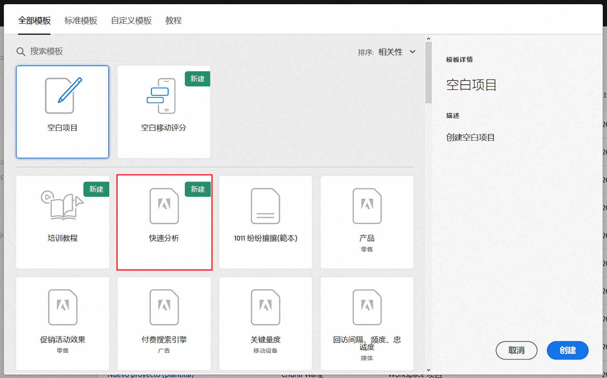

    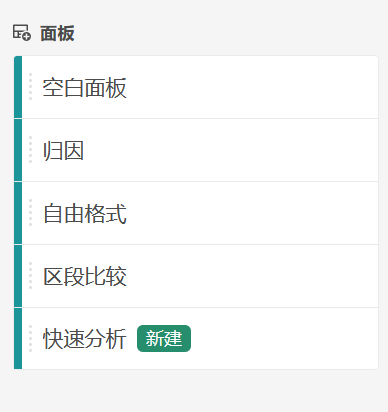

1. When you first start out, go through the short tutorial that teaches you some of the [!UICONTROL Quick Insights panel] basics. Or, click to **[!UICONTROL Skip Tutorial]**.
1. Select your building blocks (also known as components): dimensions (orange), metrics (green), segments (blue), or date ranges (purple) You have to select at least one dimension and one metric for a table to be built automatically. 

    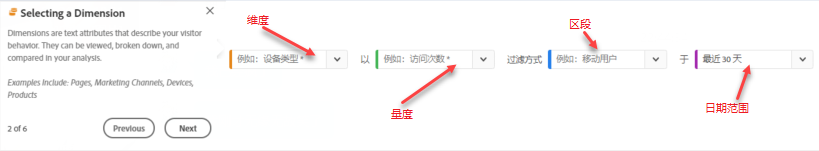

    You have three ways of selecting the building blocks:
    * Drag and drop them from the left rail.
    * If you know what you are looking for: Start typing and [!UICONTROL Quick Insights] will fill in the blanks for you.
    * Click on the drop-down and search the list.

1. When you have added at least one dimension and one metric, the following will be created for you:

    * A Freeform table with the dimension (here, US States) vertically and the metric (here, Visits) horizontally at the top. Check out this table: 

    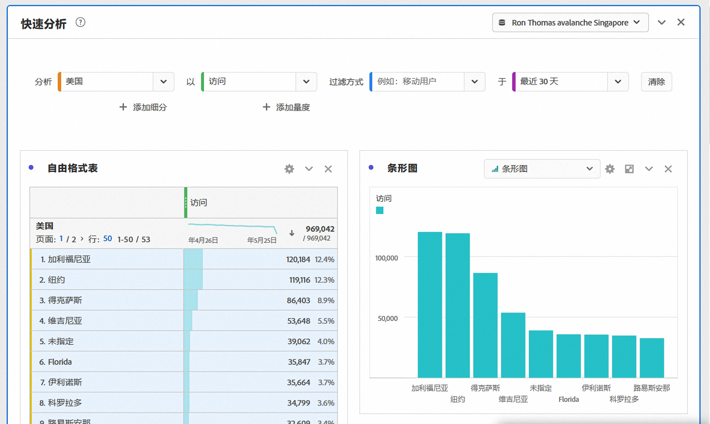

    * An accompanying visualization, in this case a [bar chart](/help/analyze/analysis-workspace/visualizations/bar.md). The visualization that is generated is based on the type of data you added to the table. Any time-based data (such as [!UICONTROL Visits] per Day/Month) defaults to a [!UICONTROL Line] chart. Any non-time-based data (such as [!UICONTROL Visits] per [!UICONTROL Device]) defaults to a [!UICONTROL Bar] chart. You can change the type of visualization by clicking on the drop-down arrow next to the visualization type.

1. (Optional) Drill down on dimensions and see dimension items by clicking the > right-arrow next to the dimension.

1. Try adding some more refinements as described below under "More tips."

1. Save your project by clicking **[!UICONTROL Project > Save]**.

## More tips

Other useful hints will pop up in the [!UICONTROL Quick Insights Builder], some of them depending on your last action.

* First, complete the **[!UICONTROL More tips]** tutorial: Access it via the Help (?) icon next to the [!UICONTROL Quick Insights] title. This tutorial shows up 24 hours after you have created a project with at least one dimension and one metric.

    

* **Breakdown by**: You can use up to 3 levels of breakdowns on dimensions to drill down to the data you really need.

    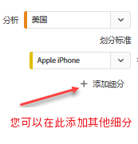

* **Add more metrics**: You can add up to 2 more metrics by using the AND operator to add them the table.

    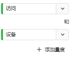

* **Add more segments**: You can add up to 2 more segments by using the AND or OR operators to add them the table. Look at what happens to the table when you add Mobile Users OR Loyal Visitors. They are next to each other, above the metrics. If you added Mobile Users AND Loyal Visitors, you would see results from both segments together, and they would be stacked on top of each other in the table.

    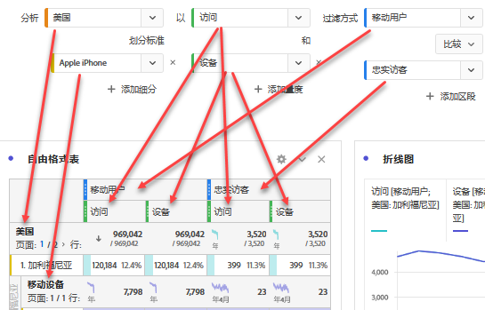

## Known limitations

If you try to edit directly within the table, it will cause the [!UICONTROL Quick Insights] panel to become out of sync. You can restore it to the previous [!UICONTROL Quick Insights] settings by clicking **[!UICONTROL Resync Builder]** at the top right of the panel.

 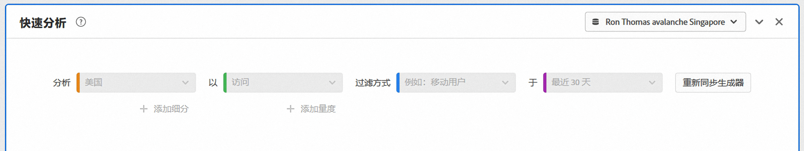

You will get a warning before adding anything directly to the table:

 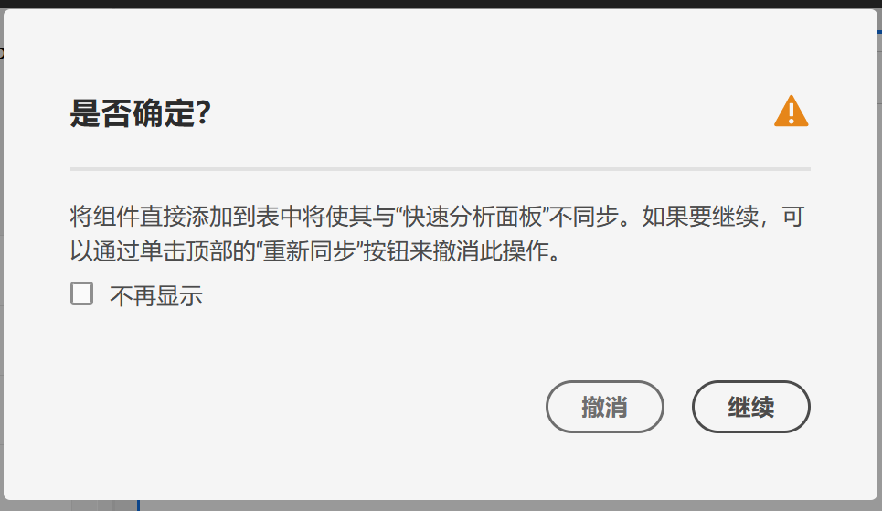

Otherwise, building directly will cause the table to now behave as a traditional Freeform table, without the helpful features for new users.

-->