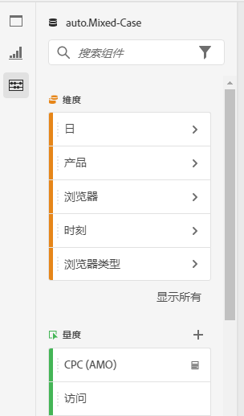
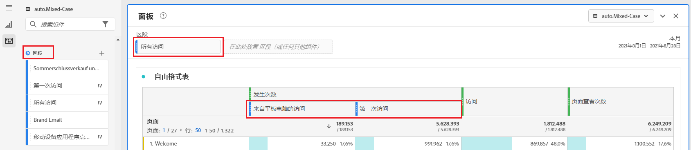
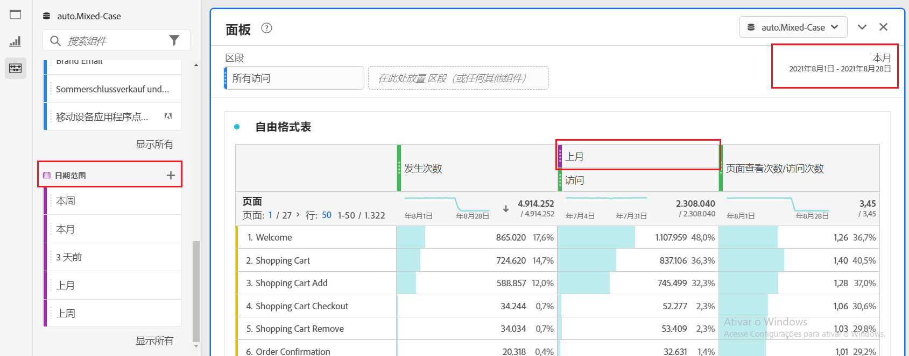
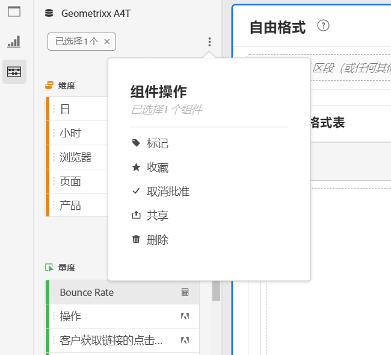

# 组件概述

组件是 Adobe Analytics 中的功能，可以在可视化图表（例如自由格式表）中使用，或者用于补充报告功能。

要从主 Adobe Analytics 界面管理组件：

1. 从顶部栏中选择&#x200B;**[!UICONTROL 组件]**。
1. 选择&#x200B;**[!UICONTROL 组件]**&#x200B;以查看您可以管理的组件的概述，或者直接从菜单中选择您想要管理的组件。

您可以管理以下组件：

* [区段](/help/components/segmentation/seg-home.md)：构建、管理、共享强大的、有针对性的受众区段，并将其应用到您的报告中。使用区段可以根据相关特征或交互识别人员的子集。
* [计算量度](/help/components/c-calcmetrics/cm-overview.md)：使用量度和公式作为新组件以便在报告中使用
* [日期范围](calendar-date-ranges/custom-date-ranges.md)：自定义和优化 Analysis Workspace 中提供的日期范围。
* [已计划项目](../curate-share/t-schedule-report.md)：管理您已计划项目。
* [位置](../../../components/locations/locations-manager.md)：管理用于导出项目的目标位置。
* [警报](/help/components/c-alerts/intellligent-alerts.md)：允许您根据变化的百分比或特定数据点收到通知。
* [注释](annotations/overview.md)：向您的组织传达与上下文相关的数据细节与洞察。
* [偏好设置](/help/analyze/analysis-workspace/user-preferences.md)：管理 Analysis Workspace 的相关偏好选项。

## Analysis Workspace 组件

Analysis Workspace 中的组件包括量度、维度、区段和日期范围，您可以将其拖放到 Workspace 项目中的面板和可视化图表中。您创建的自定义组件会被添加到这些面板中，例如计算量度或自定义日期范围。

要访问“组件”面板，请在按钮面板中选择**[!UICONTROL 组件]**。

请参阅[创建项目](/help/analyze/analysis-workspace/home.md)，以了解有关如何在项目中使用组件的信息。

## 管理组件 {#actions}

您可以使用 Analysis Workspace 中的&#x200B;**[!UICONTROL 组件]**&#x200B;菜单快速创建新组件。请参阅 [Analysis Workspace 菜单](/help/analyze/analysis-workspace/home.md#menu)，以了解更多详细信息。

您可以管理组件（逐个管理或通过选择多个组件来进行管理）。

1. 选择一个或多个组件。

1. 从上下文菜单或从  组件操作按钮（位于“组件”顶部）中，选择以下操作之一。

   >[!TIP]
   >
   >通过按住 **[!UICONTROL Shift]** 键或按住 **[!UICONTROL Command]** 键 (macOS) 或 **[!UICONTROL Ctrl]** 键 (Windows) 可选择多个组件。

   

   | 组件操作 | 描述 |
   |--- |--- |
   |  [!UICONTROL **标记**] | 通过将标记应用于组件来组织或管理组件。然后，您可以通过选择或者键入 `#` 在左侧面板中按标记搜索。标记在组件管理器中也可用作过滤器。 |
   |  [!UICONTROL **收藏夹**] | 将组件添加到您的收藏夹列表中。与标记相似，您可在左侧面板中按“收藏夹”进行搜索，然后在组件管理器中对其进行过滤。 |
   |  **[!UICONTROL 取消收藏]** | 将组件从您的收藏夹列表中移除。 |
   |  [!UICONTROL **批准**] | 将组件标记为“已批准”可告知用户该组件得到了组织的批准。与标记一样，您可以在左侧面板中按“已批准”进行搜索和筛选。标识的是已批准的组件。 |
   |  [!UICONTROL **分享**] | 将组件与组织中的用户共享。此选项仅对自定义组件可用，例如区段或计算量度。 |
   |  [!UICONTROL **删除**] | 删除不再需要的组件。此选项仅对自定义组件可用，例如区段或计算量度。 |

自定义组件也可通过其相应的组件管理器进行管理。例如，参阅[管理区段](/help/components/segmentation/segmentation-workflow/seg-manage.md)。

## 管理组件列表

您可以在 Analysis Workspace 的左侧面板中对组件列表进行搜索、筛选和排序，以找到特定组件。

### 搜索

1. 在左侧面板中选择&#x200B;**组件** 。

2. 在搜索字段中，开始键入要在项目中使用的组件名称。

   颜色和图标标识的是组件的类型。**维度**  是橙色的，**区段**  是蓝色的，**日期范围**  是紫色的，**量度**  是绿色的。 Adobe 图标  表示计算量度模板或区段模板。计算器图标  表示您的组织中某位管理员创建的计算量度。

3. 从下拉菜单中选择组件。

### 筛选

1. 在左侧面板中选择&#x200B;**组件**&#x200B;图标 。

2. 选择&#x200B;**筛选** ，或在搜索字段中输入 `#`。

3. 选择以下任一过滤器选项以过滤组件列表：

   | 图标 | 筛选选项 | 描述 |
   |---------|---|----------|
   |  | **[!UICONTROL 已批准]** | 仅显示标记为由管理员批准的组件。 |
   |  | **[!UICONTROL 收藏夹]** | 仅显示收藏夹列表中的组件。 有关将组件添加到收藏夹列表的信息，请参阅[管理组件](#manage-components)。 |
   |  | **[!UICONTROL 维度]** | 仅显示维度的组件。 |
   |  | **[!UICONTROL 量度]** | 仅显示量度的组件。 |
   |  | **[!UICONTROL 区段]** | 仅显示区段的组件。 |
   |  | **[!UICONTROL 日期范围]** | 仅显示日期范围的组件。 |
   |  | **[!UICONTROL *标记名称&#x200B;*]** | 仅显示具有特定选定标记的组件。Adobe 模板有一个专用标记，它是 Adobe 提供的[默认计算量度](/help/components/c-calcmetrics/cm-reference/default-calcmetrics.md)。 |

   在筛选中选择  以删除该筛选。

4. 您可以选择对组件列表进行排序，如[对组件列表进行排序](#sort-the-component-list)中所述。

### 排序

<!-- {{release-limited-testing-section}}-->

1. （可选）对组件列表应用任何筛选条件，如[筛选组件列表](#filter-the-component-list)中所述。

2. 在左侧面板中选择&#x200B;**组件** 。

3. 选择&#x200B;**排序** ，然后选择以下任一筛选选项对组件列表进行排序。

可以使用以下排序选项：

{{components-sort-options}}

## 访问权限

在 Analysis Workspace 中，管理员可以[管理](/help/analyze/analysis-workspace/curate-share/curate.md)哪些组件在报告中对用户可见。

<!--
# Components overview

Components in Analysis Workspace consist of dimensions, metrics, segments, and date ranges that you can drag-and-drop onto a project. 

To access the Components menu, click the **[!UICONTROL Components]** icon in the left rail. You can switch among [panels](https://experienceleague.adobe.com/docs/analytics/analyze/analysis-workspace/panels/panels.html), [visualizations](https://experienceleague.adobe.com/docs/analytics/analyze/analysis-workspace/visualizations/freeform-analysis-visualizations.html), and components from the left rail icons or by using [hotkeys](/help/analyze/analysis-workspace/build-workspace-project/fa-shortcut-keys.md).

You can also adjust the [View density settings](https://experienceleague.adobe.com/docs/analytics/analyze/analysis-workspace/build-workspace-project/view-density.html) for the project to see more values in the left rail at once by going to **[!UICONTROL Project > Project Info & Settings > View Density]**.

## Dimensions {#dimensions}

[**Dimensions**](https://experienceleague.adobe.com/docs/analytics/components/dimensions/overview.html) are text attributes that describe your visitor behavior and can be viewed, broken down, and compared in your analysis. They can be found in the left Component rail (orange section) and are typically applied as rows of a table. 

Examples of dimensions include [!UICONTROL Page Name], [!UICONTROL Marketing Channels], [!UICONTROL Device Type], and [!UICONTROL Products]. Dimensions are provided by Adobe and are captured through your custom implementation (eVar, Props, classifications, etc).

Each dimension also contains **dimension items** within it. Dimension items can be found in the left Component rail by clicking the right-arrow next to any dimension name (items are yellow).

Examples of dimension items include [!UICONTROL Homepage] (within the [!UICONTROL Page] dimension), [!UICONTROL Paid Search] (within the [!UICONTROL Marketing Channel] dimension), [!UICONTROL Tablet] (within the [!UICONTROL Mobile Device Type] dimension), and so on.

## Metrics {#metrics}

[**Metrics**](https://experienceleague.adobe.com/docs/analytics/components/metrics/overview.html) are quantitative measures about visitor behavior. They can be found in the left Component rail (green section) and are typically applied as columns of a table.

Examples of metrics include [!UICONTROL Page views], [!UICONTROL Visits], [!UICONTROL Orders], [!UICONTROL Average Time spent], and [!UICONTROL Revenue/Order]. Metrics are provided by Adobe, or captured through your custom implementation ([!UICONTROL Success events]), or created using the [Calculated metric builder](https://experienceleague.adobe.com/docs/analytics/components/calculated-metrics/calcmetric-workflow/cm-build-metrics.html).

## Segments {#segments}

[**Segments**](https://experienceleague.adobe.com/docs/analytics/analyze/analysis-workspace/components/segments/t-freeform-project-segment.html) are audience filters that are applied to your analysis. They can be found in the left Component rail (blue section) and are typically applied at the top of a panel or above metric columns in a table. 

Examples of segments include [!UICONTROL Mobile Device Visitors], [!UICONTROL Visits from Email], and [!UICONTROL Authenticated Hits]. Segments are provided by Adobe, or created in the [panel dropzone](https://experienceleague.adobe.com/docs/analytics/analyze/analysis-workspace/panels/panels.html), or created using the [Segment builder](https://experienceleague.adobe.com/docs/analytics/components/segmentation/segmentation-workflow/seg-build.html).

## Date Ranges {#date-ranges}

[**Date Ranges**](https://experienceleague.adobe.com/docs/analytics/analyze/analysis-workspace/components/calendar-date-ranges/calendar.html) are the range of dates you conduct your analysis across. They can be found in the left Component rail (purple section) and are typically applied in the calendar of each panel.

You can make the date range components relative to the panel calendar. For additional information, see [About relative panel date ranges](/help/analyze/analysis-workspace/components/calendar-date-ranges/calendar.md#relative-panel-dates).

Examples of date ranges include July 2019, [!UICONTROL Last 4 weeks], and [!UICONTROL This month]. Date ranges are provided by Adobe, applied in the [panel calendar](https://experienceleague.adobe.com/docs/analytics/analyze/analysis-workspace/panels/panels.html), or created using the [Date range builder](https://experienceleague.adobe.com/docs/analytics/analyze/analysis-workspace/components/calendar-date-ranges/custom-date-ranges.html).

## Manage components {#actions}

You can manage components directly in the left rail. 

1. Right-click a component.

   Or
   
   Select a component, then select the **Action** (3-dot) icon at the top of the component list.

   >[!TIP]
   >
   >   You can select multiple components by holding Shift, or by holding Command (on Mac) or Ctrl (on Windows).

   

   | Component action | Description |
   |--- |--- |
   | [!UICONTROL **Tag**] | Organize or manage components by applying tags to them. You can then search by tag in the left rail by clicking the filter or typing #. Tags also act as filters in the component managers. |
   | [!UICONTROL **Favorite**] | Add the component to your list of favorites. Like tags, you can search by Favorites in the left rail and filter by them in the component managers. |
   | [!UICONTROL **Approve**] | Mark components as Approved to signal to your users that the component is organization-approved. Like tags, you can search by Approved in the left rail and filter by them in the component managers. |
   | [!UICONTROL **Share**] | Share components to users in your organization. This option is available for custom components only, such as segments or calculated metrics. |
   | [!UICONTROL **Delete**] | Delete components that you no longer need. This option is available for custom components only, such as segments or calculated metrics. |

Custom components can also be managed through their respective Component managers. For example, the [Segment Manager](/help/components/segmentation/segmentation-workflow/seg-manage.md).

## Search, filter, and sort the component list

You can search, filter, and sort the component list in the left rail of Analysis Workspace to quickly locate a particular component. 

### Search the component list

1. Select the **Components** icon  in the left rail.

2. In the search field, begin typing the name of the component you want to use in your project.

   The type of component can be identified by both color and icon. **Dimensions**  are orange, **Segments**  are blue, **Date ranges**  are purple, and **Metrics**  are green. The Adobe icon indicates either a calculated metric template or a segment template, and the calculator icon  indicated a calculated metric that was created by an Analytics administrator in your organization. 

3. Select the component when it appears in the drop-down list.

### Filter the component list

1. Select the **Components** icon  in the left rail.

2. Select the **Filter** icon .

   Or

   Type the pound sign (#) in the search field.

3. Select any of the following filter options to filter the list of components:

   |Option | Function |
   |---------|----------|
   | [!UICONTROL **Approved**] | Show only components that are marked as Approved by an administrator. |
   | [!UICONTROL **Favorites**] | Show only components that are in your list of Favorites. For information about adding components to your list of favorites, see [Components overview](/help/analyze/analysis-workspace/components/analysis-workspace-components.md). |
   | [!UICONTROL **Dimensions**] | Show only components that are Dimensions. |
   | [!UICONTROL **Metrics**] | Show only components that are Metrics. |
   | [!UICONTROL **Segments**] | Show only components that are Segments.  |
   | [!UICONTROL **Date ranges**] | Show only components that are Date Ranges. |
   | [!UICONTROL **Show all**] | Show all components. This option is available only for administrators. |
   | [!UICONTROL **Unapproved**] | Show only components that are not yet marked as Approved by an administrator. As an administrator, this is helpful when identifying components that require your review and approval. This option is available only for administrators. |

4. (Optional) To further hone the list, you can sort the component list, as described in [Sort the component list](#sort-the-component-list).

### Sort the component list

1. (Optional) Apply any filters to the component list, as described in [Filter the component list](#filter-the-component-list).

2. Select the **Components** icon  in the left rail.

3. Select the **Sort** icon , then select any of the following filter options to sort the list of components:

   {{components-sort-options}}

-->