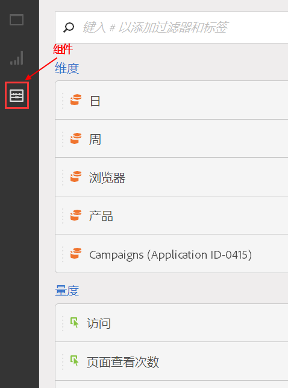

# 组件概述

Analysis Workspace 中的组件包括量度、维度、区段和时间粒度，您可以将这些组件拖放到项目中。您创建的自定义组件会被添加到这些面板中，例如自定义日期范围。

要访问“组件”面板，请单击左边栏中的&#x200B;**[!UICONTROL 组件]图标。** You can switch among Panels (Blank panel, [Freeform panel](../../../analyze/analysis-workspace/visualizations/freeform-table.md#concept_0D2E24FCCBAF4194AA941448860E422F), or [Segment Comparison](../../../analyze/analysis-workspace/c-panels/c-segment-comparison/segment-comparison.md#concept_74FAC1C6D0204F9190A110B0D9005793) panel), [Visualizations](../../../analyze/analysis-workspace/visualizations/freeform-analysis-visualizations.md#concept_09242627629147A88A68F1506954C276), and Components using the left-rail icons or by using [hotkeys](../../../analyze/analysis-workspace/build-workspace-project/fa-shortcut-keys.md#concept_9A6356084DBC4D468E265E7A65B3E051).

See [Create a freeform analysis project](../../../analyze/analysis-workspace/build-workspace-project/t-freeform-project.md#task_C2C698ACC7954062A28E4784911E6CF2) for information about using Components in a project.

## 组件操作 {#section_B7BB29B89AE04297874CDE2C52EAD516}

您可以通过多种方式管理组件（逐个选择或通过选择多个组件）。右键单击组件，或单击组件列表顶部的&#x200B;**[!UICONTROL 操作]。**

>[!NOTE]
>
>这些操作不适用于时间组件。

| 组件操作 | 描述 |
|--- |--- |
| 标记 | 通过对组件应用标记来组织或管理组件。然后它会显示在相应的组件管理器中，如 Analytics &gt; 组件 &gt; 区段，或 Analytics &gt; 组件 &gt; 项目 |
| 收藏 | 将组件添加到您的收藏夹列表中。然后它会显示在相应的组件管理器中，如 Analytics &gt; 组件 &gt; 区段，或 Analytics &gt; 组件 &gt; 项目. |
| 批准 | 批准组件以使其成为规范。然后它会显示在相应的组件管理器中，如 Analytics &gt; 组件 &gt; 区段，或 Analytics &gt; 组件 &gt; 项目 |
| 共享 | 仅适用于区段。 |
| 删除 | 仅适用于区段。 |

[在YouTube上创建指标、区段和日期](https://www.youtube.com/watch?v=XXJuNAte8E8&index=25&list=PL2tCx83mn7GuNnQdYGOtlyCu0V5mEZ8sS) (2：51)