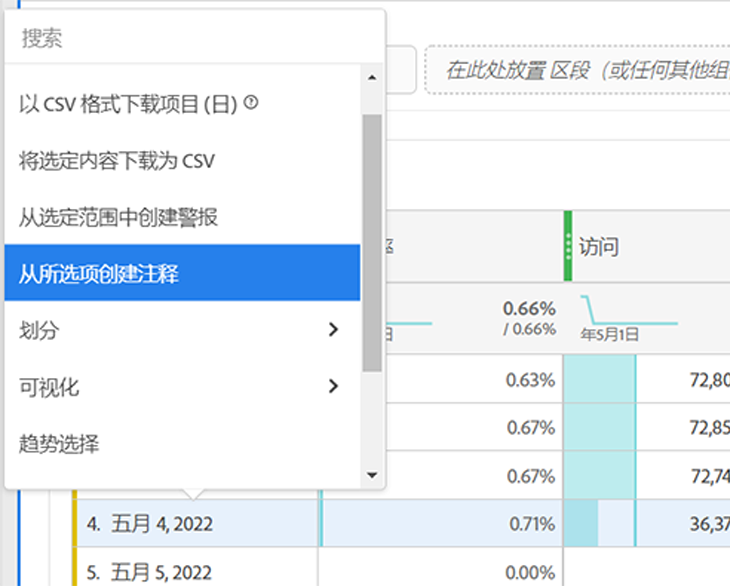
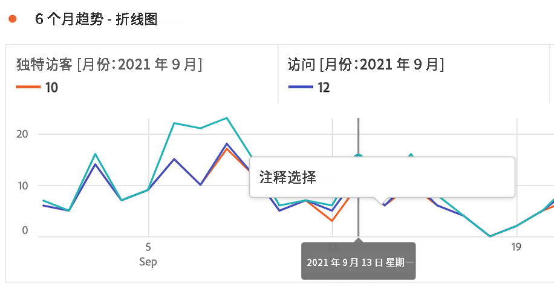
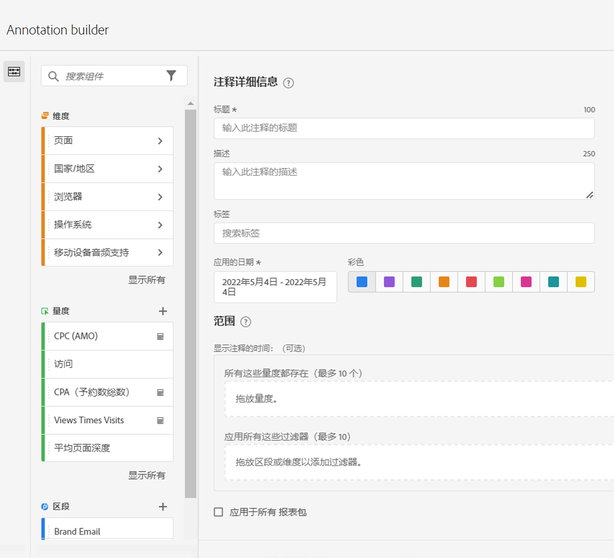

# 创建注释 {#create-annotations}

<!-- markdownlint-disable MD034 -->

>[!CONTEXTUALHELP]
>id="components_annotations_details"
>title="注释详细信息"
>abstract="注释使您能够有效地将上下文数据的细微差别和洞察传达给贵组织。它们可让您将日程表活动与特定维度/量度关联起来。"

<!-- markdownlint-enable MD034 -->

<!-- markdownlint-disable MD034 -->

>[!CONTEXTUALHELP]
>id="components_annotations_scope"
>title="范围"
>abstract="您可以利用范围来自定义将要注释的数据。计算量度和区段不会自动继承其定义中使用的组件的注释。您可以将新的计算量度添加到现有注释的范围部分。新的区段需要新的注释。"

<!-- markdownlint-enable MD034 -->

默认情况下，只有管理员可以创建注释。用户有权查看注释，就像查看其他 Analytics 组件（例如区段、计算指标等）一样。

但是，管理员可以通过 [Adobe Admin Console](https://experienceleague.adobe.com/docs/analytics/admin/admin-console/permissions/analytics-tools.html) 向用户提供[!UICONTROL 注释创建]权限（Analytics 工具）。

1. 要创建注释，有若干方法可使用：

| 创建方法 | 详细信息 |
| --- | --- |
| **转到 [!UICONTROL Analytics] > [!UICONTROL 组件] > [!UICONTROL 注释]。** | 随后将打开“注释管理器”页面。单击[!UICONTROL 创建新注释]，然后将打开[!UICONTROL 注释生成器]。 |
| **右键单击表上的某个点。** | 随后将打开[!UICONTROL 注释生成器]。请注意，默认情况下，以这种方式创建的注释仅在创建它们的项目中可见。但是您可以使它们可用于所有项目。另请注意，已填充日期和任何指标等。
 |
| **右键单击[!UICONTROL 折线]图上的某个点。** | 随后将打开[!UICONTROL 注释生成器]。请注意，默认情况下，以这种方式创建的注释仅在创建它们的项目中可见。但是您可以使它们可用于所有项目。另请注意，已填充日期和任何指标等。
 |
| **在工作区中，转到[!UICONTROL 组件] > [!UICONTROL 创建注释]。** | 随后将打开[!UICONTROL 注释生成器]。 |
| **使用此热键**&#x200B;打开注释生成器：(PC) `ctrl` `shift` + o、(Mac) `shift` + `command` + o | 请注意，使用热键创建注释，您只是为当前日期创建单日注释，并无任何预先选择的范围（指标或维度）。 |

{style="table-layout:auto"}

1. 填写[!UICONTROL 注释生成器]的各个元素。

   

   | 元素 | 描述 |
   | --- | --- |
   | [!UICONTROL 仅用于项目的注释] | 默认情况下，注释应用于当前项目。通过选中此框，您可以使注释可用于您负责的所有项目。
  |
   | [!UICONTROL 标题] | 为注释命名，例如“Memorial Day” |
   | [!UICONTROL 描述] | （可选）提供注释的描述，例如“美国的公共假日”。 |
   | [!UICONTROL 标记] | （可选）通过创建或应用标记来整理注释。 |
   | [!UICONTROL 应用的日期] | 选择为了让注释可见而显示的日期或日期范围。 |
   | [!UICONTROL 颜色] | 将颜色应用于注释。注释以选定的颜色出现在项目中。颜色可用于对注释进行分类，例如公共假日、外部活动、跟踪问题等。 |
   | [!UICONTROL 范围] | （可选）拖放触发注释的指标。然后拖放充当过滤器（即，与注释一起可见的内容）的任何维度或区段。如果不指定范围，注释将应用于您的所有数据。<ul><li>**[!UICONTROL 以下任一指标存在]**：拖放最多 10 个会触发注释显示的指标。</li><li>**[!UICONTROL 使用所有这些过滤器]**：拖放最多 10 个会在注释显示时进行过滤的维度或区段。</li></ul>
用例：eVar 已停止收集特定日期范围的数据。将 eVar 拖入&#x200B;**[!UICONTROL 以下任一指标存在]**&#x200B;对话框。否则，您的[!UICONTROL 访问量]指标不会报告任何数据 — 请遵循相同的过程。
**请注意：**&#x200B;任何应用于组件、随后用作计算指标或区段定义的一部分的注释，均不自动继承注释。还必须将所需的计算指标添加到范围部分才能显示注释。但是，应为要用相同信息进行注释的任何区段创建新的注释。
示例：将注释应用于某一天的[!UICONTROL 订单]。然后，在相同日期范围的某个计算指标中使用[!UICONTROL 订单]。新的计算指标将不自动显示订单的注释；还必须将该计算指标添加到范围部分才能显示注释。 |
   | [!UICONTROL 应用于所有报表包] | 默认情况下，注释应用于原始报表包。通过选中此框，您可以使注释应用于公司内的所有报表包。 |

   {style="table-layout:auto"}

1. 单击&#x200B;**[!UICONTROL 保存]**。
