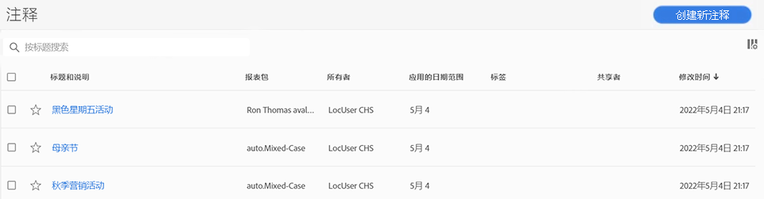

# 管理注释

[!UICONTROL 注释管理器]显示您拥有或与您共享的所有注释。 特定于项目的注释不会在此处显示。 您可以使用此界面共享、筛选、标记、复制、删除和收藏您的注释。 管理员可以管理和批准注释。

**[!UICONTROL 组件]** > **[!UICONTROL 注释]**

## 注释管理器用户界面

| UI 元素 | 描述 |
| --- | --- | 
| [!UICONTROL 标题和描述] | 在 Annotation Builder 中提供。要编辑标题和描述，请单击标题链接 - 这可以让您返回 Annotation Builder。 |
| [!UICONTROL 报表包] | 此注释应用于的报表包。 |
| [!UICONTROL 所有者] | 指示注释的所有者。如果您不是管理员，则只能看到您拥有的注释或与您共享的注释。 |
| [!UICONTROL 应用的日期范围] | 此注释应用于的日期或日期范围。 |
| [!UICONTROL 共享对象] | 列出您与多少个人或组共享注释。单击以了解更多详细信息。 |
| [!UICONTROL 修改日期] | 显示上次修改注释的日期和时间。 |

{style="table-layout:auto"}

## 编辑注释

编辑注释意味着您可以调整日期范围、颜色、范围，或者它是否适用于所有报表包或项目。 您可以通过两种方式编辑注释：

* 在折线图中，将鼠标悬停在注释上，然后单击弹出框内的铅笔图标。
* 在[!UICONTROL 注释管理器]中，单击注释的标题。

这两个选项都会让您回到 [!UICONTROL 注释生成器]。在那里，您可以进行必要的调整并保存新版本。

## 共享注释

在共享注释或使用与您共享的注释时，请记住：

* 如果创建仅包含项目注释的项目，然后与另一个用户共享该项目，则与您共享该项目的任何人都无法编辑或删除注释。
* 如果保存注释并直接与用户共享，则只有在拥有管理员权限的情况下，用户才能编辑/删除注释。
* 如果某个项目与您共享，其中包含仅用于项目的注释，则它仅会显示在该项目中。 如果注释直接与您共享，则它将显示在可以显示该注释的所有项目中。

## 注释和时区

所有注释都使用时间戳创建，但没有时间或时区信息。在报告时，始终应用面板报表包的时区。 例如，无论您处于哪个报表包时区，为圣诞节创建的注释都会发生在12月25日。

## 其他注释任务

注释管理器允许管理员编辑、添加、标记、删除、重命名、批准、复制、导出和筛选注释。虚拟报表包管理器对非管理员用户不可见。

选择至少一个注释时，可以使用其他选项：

| 任务 | 描述 |
| --- | --- |
| [!UICONTROL 添加] | 将您带到Annotation Builder，您可以在其中创建注释。 |
| [!UICONTROL 标记] | 所有用户均可为注释创建标记，并将一个或多个标记应用于注释。但是，您只能查看自己拥有的注释的标记。 |
| [!UICONTROL 删除] | 删除注释会将其从组织中的任何项目中删除。 |
| [!UICONTROL 重命名] | 重命名注释会在它应用于的所有项目中重命名它。 |
| [!UICONTROL Copy] | 创建一个独特副本，使其具有自身的注释 ID，但使用相同的名称和定义。 |
| [!UICONTROL 导出到 CSV] | 将注释定义导出到 .csv 文件。 |
| [!UICONTROL 筛选]（左边栏） | 按标记、报表包、所有者和其他筛选器（“我的”、“已批准”、“收藏”、“已与我共享”和“全部显示”）进行筛选。 |

{style="table-layout:auto"}
