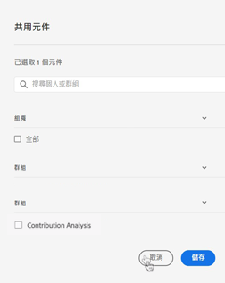

# 管理批注

>[!NOTE]
>
>此功能当前处于有限测试阶段。

的 [!UICONTROL 组件] > [!UICONTROL 批注] manager提供了多种管理批注的方法，如共享、过滤、标记、批准、复制、删除和标记为收藏。

的 [!UICONTROL 批注] “管理器”显示您拥有的所有注释，这些注释的范围已涵盖所有项目，并且已与您共享。

>[!NOTE]
>
>[!UICONTROL 批注] 您仅为特定项目创建的项目不会显示在管理器中。

## 注释管理器用户界面

| UI元素 | 描述 |
| --- | --- | 
| [!UICONTROL 标题和描述] | 在注释生成器中提供。 要编辑标题和描述，请单击标题链接 — 这会使您返回到注释生成器。 |
| [!UICONTROL 报表包] | 此注释所适用的报表包。 |
| [!UICONTROL 所有者] | 指示批注的所有者。 作为非管理员，您只能看到您拥有的批注或与您共享的批注。 |
| [!UICONTROL 应用的日期范围] | 此注释适用的日期或日期范围。 |
| [!UICONTROL 共享人] | 列出您与其共享注释的个人或组数量。 单击以了解更多详细信息。 |
| [!UICONTROL 修改日期] | 显示上次修改注释的日期和时间。 |

## 编辑批注

编辑注释意味着您可以调整日期范围、颜色、范围，或者它是否适用于所有报表包或项目。 您可以通过两种方式编辑注释：

* 在折线图中，将鼠标悬停在批注上，然后单击弹出窗口中的铅笔图标。

* 在 [!UICONTROL 批注管理器]，单击批注的标题。

这两个选项都可使您重新进入注释生成器。 在此，您可以进行必要的调整并保存新版本。

## 共享批注

1. 选择要共享的注释并单击 [!UICONTROL 共享].

1. 在 [!UICONTROL 共享组件] 对话框中，搜索要与其共享注释的个人或组。

1. 在 [!UICONTROL 组织], ....

1. 单击[!UICONTROL 保存]。

## 标记批注

要关注

