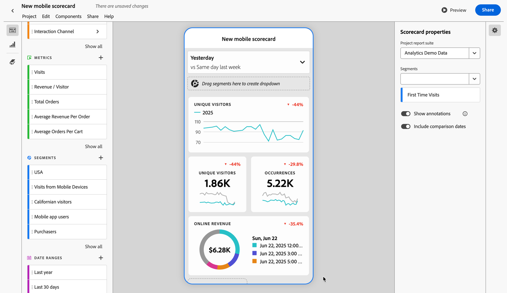
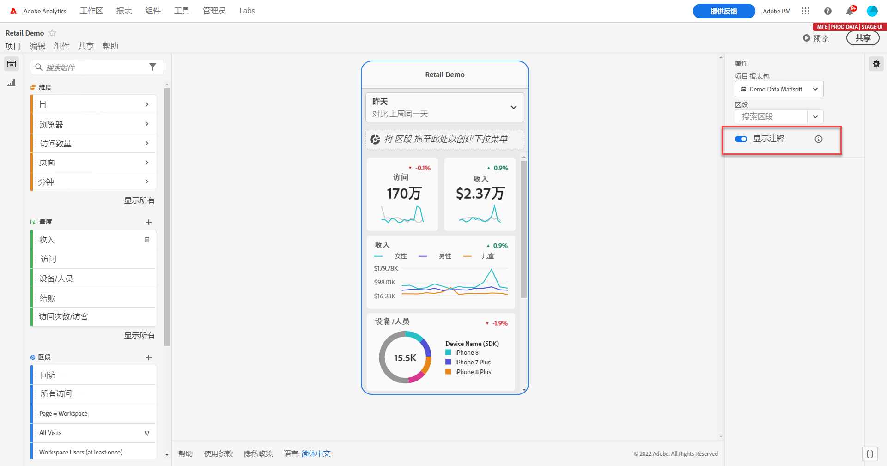
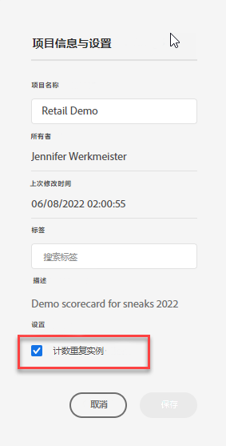

# 移动记分卡注释

您可以在移动记分卡中显示在Analysis Workspace中创建的批注。 您可以使用移动记分卡中的注释分享有关您的组织和营销活动的上下文数据细节和洞察。

## 在移动记分卡中显示注释

要在移动记分卡中显示注释，请首先从 Workspace 项目或组件菜单中创建注释。

有关创建注释的信息，请参阅[创建注释](create-annotations.md)。默认情况下，移动记分卡中的注释处于关闭状态，并且必须为要在移动记分卡中显示的每个记分卡启用。

1. 打开注释。要打开注释，请参阅[打开或关闭注释](overview.md#turn-annotations-on-or-off)。

1. 创建注释并确保将其共享给您的所有项目。有关更多信息，请参阅[创建注释](create-annotations.md)。

1. 选择&#x200B;**[!UICONTROL 显示注释]**&#x200B;可在移动记分卡中显示注释。

   

   您可以选择确认在&#x200B;**[!UICONTROL 项目]** > **[!UICONTROL 项目信息和设置]**&#x200B;中选择了&#x200B;**[!UICONTROL 显示注释]**

## 在移动记分卡中查看注释

启用注释后，注释图标在记分卡生成器中可见。注释仅出现在详细视图的图表和表格中。从记分卡的主图块视图中看不到注释。

当注释图标可见时，您无法在生成器画布中完全查看注释或与之交互。使用  **[!UICONTROL 预览]**&#x200B;来查看应用程序中出现的注释并与之交互。

在 Workspace 中创建注释时可选择注释颜色。灰色注释表示存在多个注释。

## 预览注释

您可以使用  预览功能来预览注释。选择一项注释来打开该注释的详细信息。

如果有更多批注可用，您会看到批注底部出现多个圆点(●)。 向左或向右滑动即可在注释之间切换。

<!--
# Share Annotations in Mobile Scorecards

You can display annotations that are created in Workspace in Mobile Scorecards. This allows you to share contextual data nuances and insights about your organization and campaigns directly within Mobile Scorecard projects, viewable in the Analytics dashboards mobile app.

## Surface Annotations in Mobile Scorecards

To surface annotations in mobile scorecards, create the annotation first from Workspace projects or from the components menu.

For information on creating annotations, see [Create Annotations](create-annotations.md). Annotations are turned off in mobile scorecards by default and must be enabled for each scorecard that you want to surface in mobile scorecards.

1. Turn on annotations. To turn annotations on, see [Turn annotations on or off](overview.md#annotations-on-off).

1. Create an annotation and make sure it is shared to all your projects. To create an annotation in Workspace,  see [Create Annotations](create-annotations.md).

1. Select **Show annotations** to display the annotation in Mobile Scorecards.

   

1. Confirm that show annotations is selected, go to **Project** > **Project info and settings**.

   

## View annotations in Mobile Scorecards

When annotations are enabled, annotation icons are visible in the Scorecard Builder. Annotations appear only on charts and tables in the detailed view. Annotations are not visible from the main tile view of the scorecard.

 

When annotation icons are visible, you can't fully view or interact with annotations in the builder canvas. Use the Preview mode to view and interact with annotations as they appear in the app  **Preview**.

Annotation colors are selected when the annotation is created in workspace. Gray annotations indicated the presence of more than one annotation.

## View chart annotations

| Date | Appearance |
| --- | --- |
| **Single day** |     |
| **Date range** |  |
| **Overlapping annotations** |   To view annotation details in the Analytics dashboards app, tap an annotation icon.   When viewing an annotation in a chart, you can swipe left and right to navigate all annotations present in the chart. When viewing an annotation in the table, swipe left and right to navigate all annotations associated with that row item in the table.      In charts that do not have a time-based *x axis*, such as the donut or horizontal bar charts, annotations that apply to the chart can be viewed by tapping the icon located in the lower right-hand corner.   |
-->