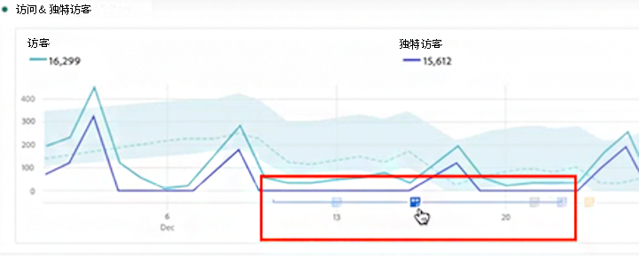

# 注释概述

工作区注释使您能够有效地将上下文数据的细微差别和见解传达给您的组织。它们可让您将日历活动与特定维度/指标关联起来。您可以对已知数据问题、公共假日、营销活动启动等内容注释日期或日期范围。然后您可以以图形方式显示活动并查看营销活动或其他活动是否影响了您的网站流量、收入或任何其他指标。

例如，假设您正在与您的组织共享项目。如果因营销活动而产生重大流量尖峰，则可创建“营销活动启动日期”注释，并将其用于您整个报告包。 当您的用户查看任何包括该日期的数据集时，他们会在其项目中与其数据一起看到该注释。

请牢记这一点：

* 注释可以与单个日期或日期范围相关联。

* 它们可以应用于您的整个数据集或指定的指标、维度或区段。

* 它们可以应用于在其中创建它们的项目（默认）或所有项目。

* 它们可以应用于在其中创建它们的报告包（默认）或所有报告包。

## 权限 {#permissions}

默认情况下，只有管理员可以创建注释。用户有权查看注释，就像查看其他 Analytics 组件（例如区段、计算指标等）一样。

但是，管理员可以通过 [Adobe Admin Console](https://experienceleague.adobe.com/docs/analytics/admin/admin-console/permissions/analytics-tools.html?lang=zh-Hans) 向用户提供[!UICONTROL 注释创建]权限（Analytics 工具）。

## 启用或禁用注释 {#annotations-on-off}

可以在多个级别上启用或禁用注释：

* 在可视化级别上：[!UICONTROL 可视化]设置 > [!UICONTROL 显示注释]

* 在项目级别上：[!UICONTROL 项目信息和设置] > [!UICONTROL 显示注释]

* 在用户级别上：[!UICONTROL 组件] > [!UICONTROL 用户偏好] > [!UICONTROL 数据] > [!UICONTROL 显示注释]

