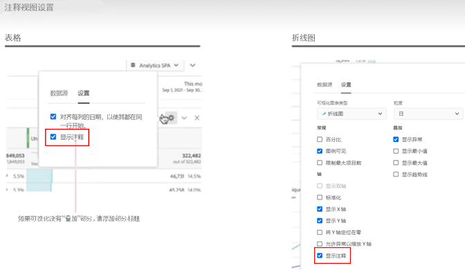

# 注释概述

通过注释，您可以将上下文数据的细微差别和洞察有效地传达给组织中的其他利益相关者。通过注释，您可以将日程表活动与特定的维度和量度关联起来。您可以对已知数据问题、公共假日、营销活动启动等内容注释日期或日期范围。然后您可以以图形方式显示活动并查看营销活动或其他活动是否影响了您的网站流量、移动应用程序使用情况、收入或任何其他量度。

例如，您正与您的组织共享项目。如果您的独立访客数量出现显著下降，您可以创建一个&#x200B;**访客减少**&#x200B;的注释，并将其作用范围设定为整个报表包。当用户查看包含该日期的任何报表包时，他们将在项目中看到该注释，与数据并列显示。

注释可应用于：

* 单个日期或日期范围。

* 您的整个数据集或特定量度、维度或区段。

* 创建注释的项目（默认）或所有项目。

* 创建注释的数据视图（默认）或所有数据视图。

请参阅[创建注释](create-annotations.md)，了解可用于创建注释的各种选项。然后，您可以在[注释生成器](create-annotations.md#annotation-builder)中构建、修改和保存注释。

您可以使用[注释管理器](manage-annotations.md)来管理注释。

## 启用或禁用注释

可以在多个级别上启用或禁用注释：

| 级别 | 如何…… |
|---|---|
| **可视化内容** | 启用或禁用 > **[!UICONTROL 设置]** > **[!UICONTROL 显示注释]**。  |
| **项目** | 从 Workspace 项目菜单中，选择&#x200B;**[!UICONTROL 项目]** > **[!UICONTROL 项目信息和设置]**，并启用或禁用&#x200B;**[!UICONTROL 显示注释]**。  |
| **用户** | 从&#x200B;**[!UICONTROL 组件]**&#x200B;选项卡中选择&#x200B;**[!UICONTROL 偏好设置]**，或从 Workspace 项目菜单中选择&#x200B;**[!UICONTROL 项目]** > **[!UICONTROL 用户偏好设置]**。 在&#x200B;**[!UICONTROL 偏好设置]**&#x200B;中，选择&#x200B;**[!UICONTROL 项目与分析]**。从左侧选项卡栏中选择&#x200B;**[!UICONTROL 数据]**。在底部，启用或禁用&#x200B;**[!UICONTROL 显示注释]**（位于&#x200B;**[!UICONTROL 自由格式表]**&#x200B;标题下方）。  |

<!--
# Annotations overview

Annotations in Workspace enable you to effectively communicate contextual data nuances and insights to your organization. They let you tie calendar events to specific dimensions/metrics. You can annotate a date or date range with known data issues, public holidays, campaign launches, etc. You can then graphically display events and see whether campaigns or other events have affected your site traffic, revenue, or any other metric.

For example, let's say you are sharing projects with your organization. If you had a major spike in traffic due to a marketing campaign, you could create a "Campaign launch date" annotation and scope it for your whole report suite. When your users view any data sets that included that date, they see the annotation within their projects, alongside their data.

Keep this in mind:

* Annotations can be tied to a single date or to a date range.

* They can apply to your entire data set or to specified metrics, dimensions, or segments.

* They can apply to the project in which they were created (default) or to all projects.

* They can apply to the report suite in which they were created (default) or to all report suites.

## Permissions {#permissions}

By default, only Admins can create annotations. Users have rights to view annotations like they do with other other Analytics components (such as segments, calculated metrics, etc.).

However, Admins can give the [!UICONTROL Annotation Creation] permission (Analytics Tools) to users via the [Adobe Admin Console](https://experienceleague.adobe.com/docs/analytics/admin/admin-console/permissions/analytics-tools.html?lang=zh-Hans).

## Turn annotations on or off {#annotations-on-off}

Annotations can be turned on or off at several levels:

* At the Visualization level: [!UICONTROL Visualization] settings > [!UICONTROL Show annotations]

* At the Project level: [!UICONTROL Project info & settings] > [!UICONTROL Show annotations]

* At the User level: [!UICONTROL Components] > [!UICONTROL User preferences] > [!UICONTROL Data] > [!UICONTROL Show annotations]

-->