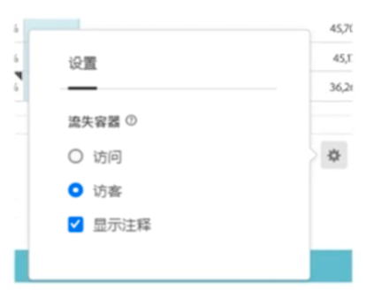

# 注释概述

>[!NOTE]
>
>此功能当前正在进行小范围测试。

注释使您能够有效地将上下文数据的细微差别和见解传达给您的组织。它们允许您将日历事件与特定维度/量度关联。 您可以使用已知数据问题、公共假日、营销活动启动次数等对日期或日期范围添加批注。 然后，您可以通过图形显示事件，并查看促销活动或其他事件是否影响了网站流量、收入或任何其他量度。

例如，假设您正在与您的组织共享您创建的项目。 您会注意到流量或其他数据出现下降或尖峰，并且会将注释绑定到受影响的量度、维度或区段。 然后，这些注释会显示在表格或折线图可视化中，并为您和工作区项目的用户提供数据上下文。

请牢记这一点：

* 批注可以绑定到单个日期或日期范围。

* 它们可以应用于整个数据集，或应用于指定的量度、维度或区段。

* 它们可以应用于创建它们的项目（默认）或所有项目。

* 它们可以应用于创建它们的报表包（默认）或所有报表包。

## 权限

默认情况下，只有管理员才能创建注释。 用户有权查看批注，这与他们与其他Analytics组件（如区段、计算量度等）一样。

但是，管理员可以为 [!UICONTROL 注释创建] 权限（Analytics工具） [Adobe Admin Console](https://experienceleague.adobe.com/docs/analytics/admin/admin-console/permissions/analytics-tools.html?lang=en).

## 启用或禁用注释

可以在以下几个级别打开或关闭注释：

* 在可视化级别： [!UICONTROL 可视化图表] 设置> [!UICONTROL 显示注释]

* 在项目级别： [!UICONTROL 项目信息和设置] > [!UICONTROL 显示注释]

* 在用户级别： [!UICONTROL 组件] > [!UICONTROL 用户首选项] > [!UICONTROL 数据] > [!UICONTROL 显示注释]

