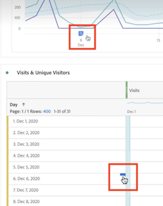
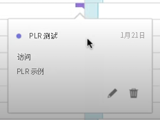
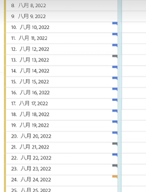
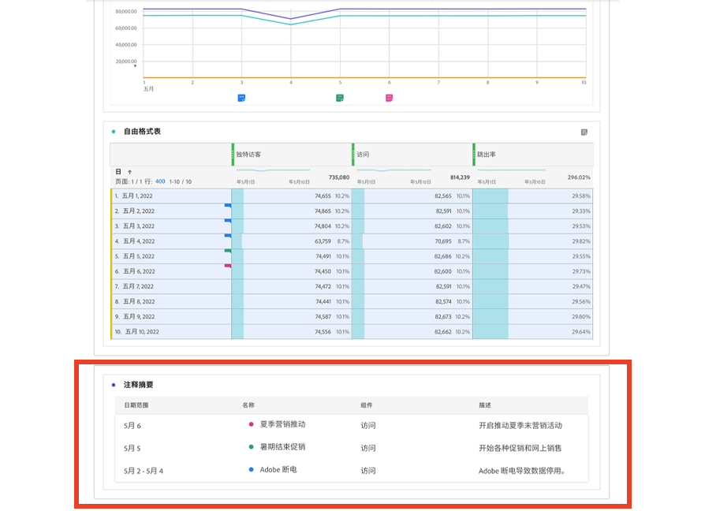

# 查看注释

注释的显示方式略有不同，具体取决于注释出现的位置以及它们跨越一天还是跨越日期范围。

## 在Workspace中查看注释

| 可视化效果 类型 | 描述 |
| --- | --- |
| **折线图&#x200B;** **单日** | 当您在折线可视化内容中选择时，您会看到一个带有注释详细信息的弹出窗口。  要在[注释生成器](create-annotations.md#annotation-builder)中编辑注释，请选择。要删除注释，请选择。 |
| **折线图&#x200B;** **日期范围** | 当选择  时，您会看到一个弹出窗口，其中包含注释详细信息，并且底部的一行会指示日期范围。 要在[注释生成器](create-annotations.md#annotation-builder)中编辑注释，请选择。要删除注释，请选择。 |
| **自由格式表** | 在自由格式表中，您可以通过可视化内容右上角的注释按钮访问所有注释。选择可查看所有注释的（滚动列表）。  对于每个注释，您可以选择在[注释生成器](create-annotations.md#annotation-builder)中编辑注释，也可以选择来删除注释。 |

{style="table-layout:auto"}

## 在 PDF 中查看注释

当您将项目下载为 PDF 或将项目发送为 PDF 时，注释会在注释摘要部分以 PDF 形式进行汇总。

<!--
# View annotations

Annotations manifest slightly differently, depending on whether they span a single day or a date range.

## View annotations in Line charts or Tables

| Date | Appearance |
| --- | --- |
| **Single day** |   
When you hover over the annotation, you can see its details, you can edit it by selecting the pen icon, or you can delete it:
  |
| **Date range** |  The icon changes and when you hover over it, the date range appears.

When you select it in the line chart, the annotation metadata appear, and you can edit or delete it:
In a table, an icon appears on every date in the date range.
|
| **Overlapping annotations** | On days that have more than one annotation tied to them, the icon appears in a grey color.

When you hover over the grey icon, all overlapping annotations appear:
 |

{style="table-layout:auto"}

## View annotations in a .pdf file

Since you cannot hover over icons in a .pdf file, this file (after export) provides notes of explanations at the bottom of a panel. Here is an example:

## View annotations with non-trended data

Sometimes annotation are shown with non-trended data, but tied to a specific dimension. In that case, they appear only in a summary annotation in the bottom right corner. Here is an example:

The summary chart appears in all visualization types in the corner, not just in non-trended freeform tables and summary numbers. It also appears in visualizations like [!UICONTROL Donut], [!UICONTROL Flow],[!UICONTROL Fallout],[!UICONTROL Cohort], and so on.

-->