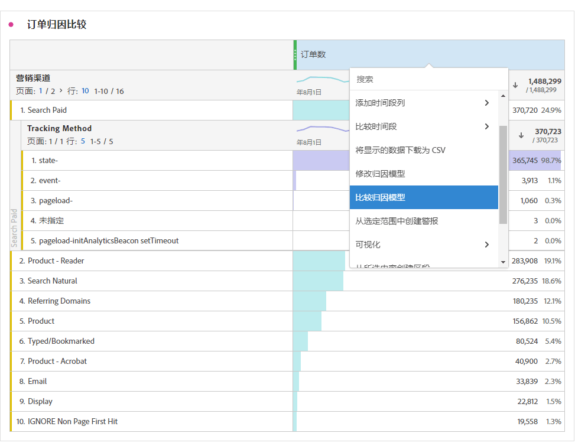

# 指标

指标允许您量化 Analysis Workspace 中的数据点。它们最常用作可视化中的列，并与维度相关联。

## 在 Analysis Workspace 中使用量度

量度在Analysis Workspace中的使用非常灵活。 将量度拖动到空的自由格式表，可查看在项目日期期间该量度的趋势。 当存在维度时，您还可以拖动量度，以查看该量度与每个维度项目的比较情况。 将量度拖动到现有量度标题上方会替换该量度，如果将量度拖动到标题旁边，则可以并排查看这两个量度。

有关如何将量度和其他类型的组件添加到Analysis Workspace的信息，请参阅[在Analysis Workspace中使用组件](use-components-in-workspace.md)。

## 指标类型

Adobe 提供了多种类型的指标，可供在 Analysis Workspace 中使用：

* **标准指标**：您在项目中使用的大多数指标都是标准指标。相关例子包括[页面浏览量](/help/components/metrics/page-views.md)、[收入](/help/components/metrics/revenue.md)或者[自定义事件。](/help/components/metrics/custom-events.md)有关更多信息，请参阅组件用户指南中的[指标概述。](/help/components/metrics/overview.md)

* **计算指标** ：基于标准指标、静态数字或算法函数的用户定义指标。 用户定义的计算指标会在可用组件列表中显示一个计算器图标。有关更多信息，请参阅组件用户指南中的[计算指标概述。](/help/components/c-calcmetrics/cm-overview.md)

* **计算量度模板** ：Adobe定义的与计算量度行为相似的量度。 您可以在 Workspace 项目中按原样使用它们，或保存副本以自定义其逻辑。计算指标模板会在可用组件列表中显示一个 Adobe 图标。

您可以查看某个量度是否获得批准。 如果您想了解有关某个量度的更多详细信息，请将鼠标悬停在该量度上，然后选择。 有关详细信息，请参阅[组件信息](use-components-in-workspace.md#component-info)。

## 在 Analysis Workspace 中使用指标

指标可以在 Analysis Workspace 中以各种方式使用。有关如何将量度和其他类型的组件添加到Analysis Workspace的信息，请参阅[在Analysis Workspace中使用组件](/help/analyze/analysis-workspace/components/use-components-in-workspace.md)。

>[!BEGINSHADEBOX]

查看 [使用量度](https://video.tv.adobe.com/v/40817?quality=12&learn=on){target="_blank"}观看演示视频。

>[!ENDSHADEBOX]

## 创建计算量度

计算量度允许您使用简单的运算符或统计函数查看量度彼此的关系。

可通过多种方式创建计算量度。 您选择的方法确定计算量度是从所有项目的组件列表中可用，还是仅用于创建该量度的项目。

### 为所有项目创建计算指标

您可以使用[计算量度生成器](/help/components/c-calcmetrics/c-workflow/cm-workflow/c-build-metrics/cm-build-metrics.md)来[创建计算量度](/help/components/c-calcmetrics/c-workflow/cm-workflow/cm-workflow.md)。 通过这种方式创建时，计算量度在组件列表中可用，并可用于您整个组织的项目。

### 为单个项目创建计算指标

您可以快速创建一个计算量度，该量度仅适用于创建它的项目。

要为单个项目创建计算指标，请执行以下操作：

1. 在Analysis Workspace中，打开要在其中创建计算指标的项目。

1. 在自由格式表中，右键单击单列的列标题。

   或

   按住Shift键的同时选择两列，然后右键单击其中一个选定的列。

1. 选择&#x200B;**[!UICONTROL 从所选内容创建量度]**

   

1. 要仅为此项目创建计算量度，请从可用选项中进行选择。

   在选中单列时，以下选项可用：

   * [!UICONTROL **Mean**]：创建一个新列，以显示该列的一组维度元素中的平均值。 列值使用[Mean](/help/components/c-calcmetrics/cm-reference/cm-functions.md#mean)函数。

   * [!UICONTROL **中间值**]：创建一个新列，以显示该列维度元素集的中间值。 列值使用[Median](/help/components/c-calcmetrics/cm-reference/cm-functions.md#median)函数。

   * [!UICONTROL **列max**]：创建一个新列，以显示该列维度元素集的最大值。 列值使用[Column Maximum](/help/components/c-calcmetrics/cm-reference/cm-functions.md#column-maximum)函数。

   * [!UICONTROL **列min**]：创建一个新列，以显示该列维度元素集的最小值。 列值使用[列最小值](/help/components/c-calcmetrics/cm-reference/cm-functions.md#column-minimum)函数。

   * [!UICONTROL **列sum**]：创建一个新列，该列将某个量度的所有数值相加（跨维度的元素）。 列值使用[列Sum](/help/components/c-calcmetrics/cm-reference/cm-functions.md#column-sum)函数。

   选择两列时，以下选项可用：

   * [!UICONTROL **除**]：创建一个新列来除以两个选定列的值。

   * [!UICONTROL **减**]：创建减去两个选定列的值的新列。

   * [!UICONTROL **添加**]：创建一个新列，用于添加两个选定列的值。

   * [!UICONTROL **乘**]：创建将两个选定列的值相乘的新列。

   * [!UICONTROL **百分比变化**]：创建一个新列，以显示两个选定列之间的百分比变化。

[计算指标：无实施指标](https://experienceleague.adobe.com/zh-hans/docs/analytics-learn/tutorials/components/calculated-metrics/calculated-metrics-implementationless-metrics) (3:42)

## 比较不同归因模型的指标

若要快速将一个归因模型与另一个进行比较，请右键单击某个量度并选择&#x200B;**[!UICONTROL 比较归因模型]**：

此快捷键允许您比较一个归因模型与另一个归因模型，而无需将归因模型拖动到某个量度中且不必对其进行两次配置。

## 使用[!UICONTROL 累积平均]函数应用指标平滑

以下是一段关于该主题的视频：

>[!BEGINSHADEBOX]

查看演示视频的 [累积平均值](https://video.tv.adobe.com/v/27068?quality=12&learn=on){target="_blank"}。

>[!ENDSHADEBOX]

