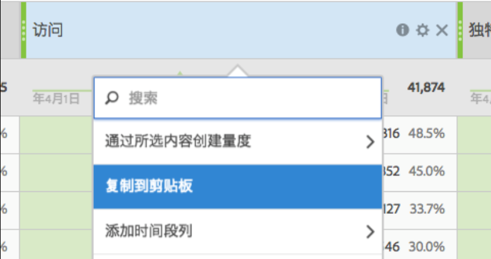

# 量度

可通过两种方式在 Analysis Workspace 中使用量度。

您可以从“[!UICONTROL 组件]”菜单将标准量度、计算量度或计算量度模板拖放到表中：

> [!NOTE] 尽管这看似简单，但指标的使用却相当强大。 您可以通过将相应的度量拖动到表的度量部分，将度量添加到报表。 您还可以按指标划分维度，从而使您能够精细地控制表视图。 此外，您还可以将度量作为维插入，将维作为度量插入以创建超时报告。 使用各种组件来玩转，了解您可以做什么。 这种可能性是无穷的。

Or you can click **[!UICONTROL Components]** &gt; **[!UICONTROL New Metric]**. 此操作可将您转到[计算量度生成器](https://marketing.adobe.com/resources/help/en_US/analytics/calcmetrics/)，您可以从现有量度创建自定义量度。

为了更便于快速创建计算量度，**[!UICONTROL 从所选内容创建量度]已添加到自由格式表中的列右键单击菜单。**&#x200B;在选定一个或多个标头列单元格时，会显示该选项。

[使用YouTube上的参与量度](https://www.youtube.com/watch?v=ngmJHcg65o8&list=PL2tCx83mn7GuNnQdYGOtlyCu0V5mEZ8sS&index=32) (4:16)
