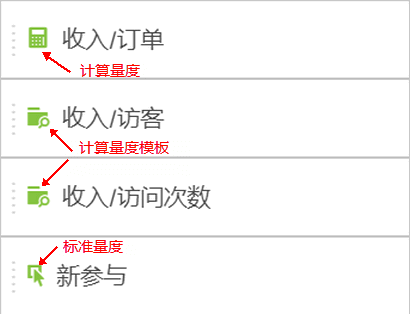

# 量度

可通过两种方式在 Analysis Workspace 中使用量度。

您可以从“[!UICONTROL 组件]”菜单将标准量度、计算量度或计算量度模板拖放到表中：

>[!NOTE]
>
>虽然这看似简单，但使用指标相当强大。您可以将相应指标拖动到表格的量度部分，从而向报表中添加量度。您还可以按指标划分维度，从而细致控制表视图。此外，您可以将量度作为维度和维度插入，以创建超时报告。使用各种组件进行播放，了解您可以做什么。无限可能。

Or you can click **[!UICONTROL Components]** &gt; **[!UICONTROL New Metric]**. 此操作可将您转到[计算量度生成器](https://marketing.adobe.com/resources/help/en_US/analytics/calcmetrics/)，您可以从现有量度创建自定义量度。

为了更便于快速创建计算量度，**[!UICONTROL 从所选内容创建量度]已添加到自由格式表中的列右键单击菜单。**&#x200B;在选定一个或多个标头列单元格时，会显示该选项。

[使用YouTube上的参与指标](https://www.youtube.com/watch?v=ngmJHcg65o8&list=PL2tCx83mn7GuNnQdYGOtlyCu0V5mEZ8sS&index=32) (4：16)
