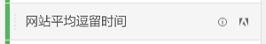

# 指标

指标允许您量化 Analysis Workspace 中的数据点。它们最常用作可视化中的列，并与维度相关联。

## 指标类型

Adobe 提供了多种类型的指标，可供在 Analysis Workspace 中使用：

* **标准指标**：您在项目中使用的大多数指标都是标准指标。相关例子包括[页面浏览量](/help/components/metrics/page-views.md)、[收入](/help/components/metrics/revenue.md)或者[自定义事件。](/help/components/metrics/custom-events.md)有关更多信息，请参阅组件用户指南中的[指标概述。](/help/components/metrics/overview.md)

  

* **计算指标**：基于标准指标、静态数字或算法函数的由用户定义的指标。用户定义的计算指标会在可用组件列表中显示一个计算器图标。有关更多信息，请参阅组件用户指南中的[计算指标概述。](/help/components/c-calcmetrics/cm-overview.md)

  

* **计算指标模板**：Adobe 定义的指标，其行为类似于计算指标。您可以在 Workspace 项目中按原样使用它们，或保存副本以自定义其逻辑。计算指标模板会在可用组件列表中显示一个 Adobe 图标。

  

## 在 Analysis Workspace 中使用指标

指标可以在 Analysis Workspace 中以各种方式使用。有关如何将量度和其他类型的组件添加到Analysis Workspace的信息，请参阅[在Analysis Workspace中使用组件](/help/analyze/analysis-workspace/components/use-components-in-workspace.md)。

>[!VIDEO](https://video.tv.adobe.com/v/40817/?quality=12)

## 创建计算量度

计算量度允许您使用简单的运算符或统计函数轻松查看量度之间的相互关系。

可通过多种方式创建计算量度。 您选择的方法确定计算量度是从所有项目的组件列表中可用，还是仅用于创建该量度的项目。

### 为所有项目创建计算指标

您可以使用计算指标生成器创建计算指标。 通过这种方式创建时，计算量度在组件列表中可用，然后可在整个组织的项目中使用。

有关如何访问计算量度生成器的信息，请参阅[生成量度](/help/components/c-calcmetrics/c-workflow/cm-workflow/c-build-metrics/cm-build-metrics.md)。

### 为单个项目创建计算指标

您可以创建快速计算量度，这些量度仅可用于创建它们的项目。

要为单个项目创建计算指标，请执行以下操作：

1. 在Analysis Workspace中，打开要在其中创建计算指标的项目。

1. 在自由格式表中，右键单击一个或多个标题列单元格，然后选择&#x200B;**[!UICONTROL 从所选内容创建指标]**

   

1. 要仅为此项目创建计算量度，请从以下选项中进行选择：

   * [!UICONTROL **除**]

   * [!UICONTROL **减**]

   * [!UICONTROL **添加**]

   * [!UICONTROL **乘**]

   或者，要打开计算指标生成器并为所有项目创建计算指标，请选择&#x200B;[!UICONTROL **在计算指标生成器中打开**]，然后继续执行[生成指标](/help/components/c-calcmetrics/c-workflow/cm-workflow/c-build-metrics/cm-build-metrics.md)。

[计算指标：无实施指标](https://experienceleague.adobe.com/docs/analytics-learn/tutorials/components/calculated-metrics/calculated-metrics-implementationless-metrics.html?lang=zh-Hans) (3:42)

## 比较不同归因模型的指标

如果您希望轻松快速地将一个归因模型与另一个进行比较，请右键单击某个指标并选择&#x200B;**[!UICONTROL 比较归因模型]**：

此快捷键可让您快速、轻松地将一个归因模型与另一个归因模型进行比较，而无需将归因模型拖动到某个指标中且不必对其进行两次配置。

## 使用[!UICONTROL 累积平均]函数应用指标平滑

以下是一段关于该主题的视频：

>[!VIDEO](https://video.tv.adobe.com/v/27068/?quality=12)
