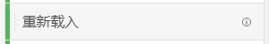

# 度量

量度允许您量化Analysis Workspace中的数据点。 它们最常用作可视化图表中的列，并与维度关联。

Adobe提供了多种类型的量度以用于Analysis Workspace：

* **标准量度**：您在项目中使用的大多数量度都是标准量度。 示例包括 [页面查看次数](/help/components/metrics/page-views.md)， [收入](/help/components/metrics/revenue.md)，或 [自定义事件](/help/components/metrics/custom-events.md). 参见 [量度概述](/help/components/metrics/overview.md) 有关更多信息，请参阅组件用户指南。

   

* **计算量度**：基于标准指标、静态数字或算法函数的用户定义指标。 用户定义的计算指标在可用组件列表中显示计算器图标。 参见 [计算量度概述](/help/components/c-calcmetrics/cm-overview.md) 有关更多信息，请参阅组件用户指南。

   

* **计算量度模板**：Adobe定义的指标，其行为与计算指标类似。 您可以在工作区项目中按原样使用它们，也可以保存副本以自定义其逻辑。 计算指标模板在可用组件列表中显示Adobe图标。

   

量度在Analysis Workspace中的使用非常灵活。 将量度拖动到空的自由格式表中，可查看在项目的日期时段内该量度的趋势。 当存在维度时，您还可以拖动量度，以查看该量度与每个维度项目的比较。 将量度拖动到现有量度标题之上会替换该量度，将量度拖动到标题旁会让您并排查看这两个量度。

>[!VIDEO](https://video.tv.adobe.com/v/40817/?quality=12)

## 计算量度

计算量度允许您使用简单的运算符或统计函数轻松查看量度之间的相互关系。 可通过以下几种方式创建计算量度：

* 单击左侧组件列表下“量度”标题旁边的加号图标。
* 导航到 **[!UICONTROL 组件]** > **[!UICONTROL 计算量度]** > **[!UICONTROL 添加]**.
* 右键单击列标题> **[!UICONTROL 从所选内容创建量度]** 选择一个或多个标题列单元格时。 此选项会自动为您创建计算指标，而无需使用计算指标规则生成器。

[计算量度：无实施量度](https://experienceleague.adobe.com/docs/analytics-learn/tutorials/components/calculated-metrics/calculated-metrics-implementationless-metrics.html?lang=zh-Hans) (3:42)

## 比较不同归因模型的量度

如果您希望轻松快速地将一个归因模型与另一个进行比较，请右键单击某个量度并选择&#x200B;**[!UICONTROL 比较归因模型]**：

此快捷键可让您快速、轻松地将一个归因模型与另一个归因模型进行比较，而无需将归因模型拖动到某个量度中且不必对其进行两次配置。

## 使用[!UICONTROL 累积平均]函数应用量度平滑

以下是一段关于该主题的视频：

>[!VIDEO](https://video.tv.adobe.com/v/27068/?quality=12)
