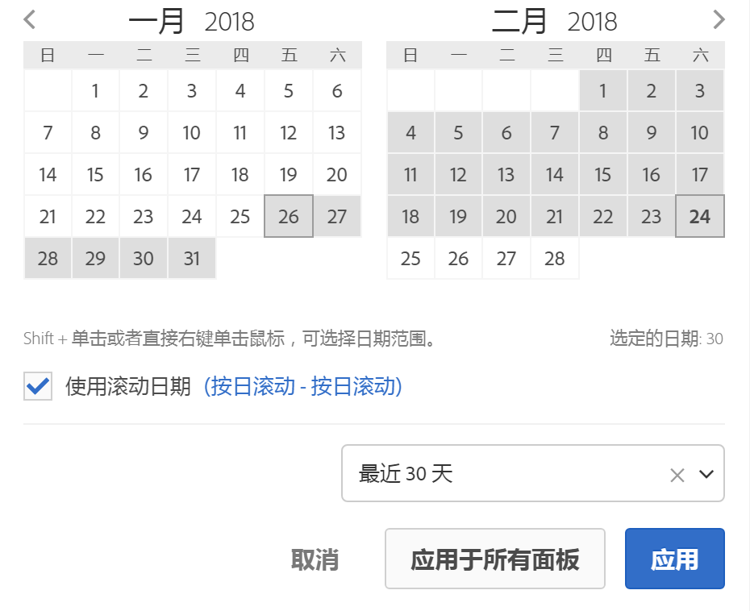

# 日历和日期范围概述

在日历中，您可以指定日期和日期范围，或者选择一个预设。

日历选择在面板级别应用，但您可以选择将它们应用于所有面板。默认情况下，工作区日历显示当月和上个月。

首次单击开始选择日期范围。然后向任一方向突出显示日期范围，直到单击第二次选择结束日期范围。如果在单击第一个日期的同时按住`Shift`键（或使用右键单击），可选择日期范围。

您还可以将日期（和时间维度）拖放到工作区项目中。您可以选择特定的日期、周、月、年或滚动日期。

[在YouTube上的Analysis Workspace中使用日期范围和日历](https://www.youtube.com/watch?v=L4FSrxr3SDA&list=PL2tCx83mn7GuNnQdYGOtlyCu0V5mEZ8sS&index=28) (4：07)

| 设置 | 描述 |
|--- |--- |
| 选定的日期 | 选定的天数/周/月/年。 |
| 使用滚动日期 | 滚动日期允许您生成一个动态报表，从而可根据您运行报表的时间向前或向后查看一段特定的时间段。例如，如果您要报告“上个月”安排的所有订单（基于“创建日期”字段）并在十二月运行该报表，则会看到十一月安排的订单。如果您在一月运行同一报表，则会看到十二月安排的订单。日期预览：指示滚动日历包含哪些时间段。开始：您可以在当天、当周、当月、当季、当年之间进行选择。结束：您可以在当天、当周、当月、当季、当年之间进行选择。For an example, go [here](/help/analyze/analysis-workspace/components/calendar-date-ranges/custom-date-ranges.md). |
| 日期范围 | 您可以选择一个预设日期范围。最近 30 天为默认设置。 |
| 应用于所有面板 | 您不仅可以更改当前面板的选定日期范围，还会更改项目内所有其他面板的日期范围。 |
| 应用 | 将日期范围仅应用于此面板。 |
