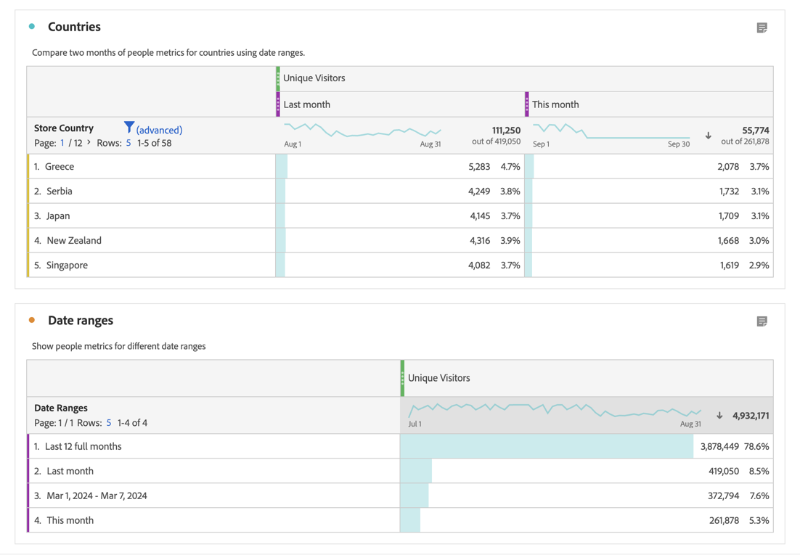

# 日期范围概述

在工作区项目中，您通常会使用[面板中的日程表](/help/analyze/analysis-workspace/c-panels/panels.md#calendar)来指定该面板中可视化图表的日期范围。

使用日期范围组件可以定义和覆盖面板的日程表设置。

## 使用日期范围

您可以使用日期范围组件重新定义面板的日程表。

或者，您可以使用自由格式表中的日期范围作为量度或维度。

- **量度**。例如，比较两个不同月份的特定量度的维度。
- **维度**。比较日期范围维度上不同维度项的量度。

>[!NOTE]
>
>当您在自由格式表中使用日期范围时，这些日期范围会覆盖为自由表格所属面板指定的日程表。
>

您可以像[使用任何组件](/help/analyze/analysis-workspace/components/analysis-workspace-components.md#analysis-workspace-components)一样使用日期范围。从  **[!UICONTROL 日期范围]**&#x200B;组件面板中拖动日期范围，并将该组件放置在：

- **[!UICONTROL 日程表]**：用日期范围  **[!UICONTROL 替换]**&#x200B;当前的日程表配置。
- **量度列标题**： **[!UICONTROL 替换]**&#x200B;量度、将日期范围 **[!UICONTROL  添加&#x200B;]**为量度，或者使用日期范围组件 **[!UICONTROL &#x200B;过滤&#x200B;]**该量度。
- **维度列标题**： **[!UICONTROL 替换]**&#x200B;当前的维度。现在的新维度是&#x200B;**[!UICONTROL 日期范围]**。当维度是日期范围时，您就可以将其他日期范围 **[!UICONTROL  添加&#x200B;]**为维度项。
- **维度项**：按日期范围  **[!UICONTROL 细分]**&#x200B;特定维度项。

您还可以通过直接在自由格式表格可视化中添加日期范围列：

1. 在量度列中，从上下文菜单中选择：

   - **[!UICONTROL 添加时间段列]**。您可以选择基于当前日程表的建议选项，或创建一个[自定义日期范围](#custom-date-ranges)。
   - **[!UICONTROL 比较时间段]**。您可以选择基于当前日程表的建议选项，或创建一个[自定义日期范围](#custom-date-ranges)。

1. 根据您的选择，额外的日期范围列将会添加到自由格式表中。

## 默认日期范围

Analysis Workspace 提供了许多默认日期范围。

| 日 | 周 | 月 | 季度 | 年 |
|---|---|---|---|---|
| 今天 | 本周 | 本月 | 本季度 | 本年 |
| 昨天 | 本周（不包括今天） | 本月（不包括今天） | 本季度（不包括今天） | 今年（不包括今天） |
| 2 天前 | 2 周前 | 2 个月前 |   |  |
| 3 天前 | 3 周前 | 3 个月前 |  | |
| 最近 7 天 | 上周 | 上个月 | 上个季度 | 去年 |
| 最近 14 天 | 最近的 2 个整周 | 最近 2 个月整 | 最近 4 个整季度 | |
| 最近 30 天 | 最近的 3 个整周 | 最近 3 个月整 | | |
| 最近 60 天 | 最近的 4 个整周 | 最近 6 个月整 | | |
| 最近 90 天 | 最近的 12 个整周 | 最近 12 个月整 | | |
| 最近 7 整天 | 最近的 52 个整周 | 最近 13 个月整 | | |
| 最近 14 整天 | | | | |
| 最近 30 整天 | | | | |
| 最近 90 整天 | | | | |

<table style="table-layout:fixed">

## 自定义日期范围

您可以创建自定义日期范围。请参阅[创建日期范围](create.md)，了解可用于创建日期范围的各种选项。然后，您可以在[日期范围生成器](create.md#date-range-builder)中构建、修改和保存日期范围。

您可以使用[日期范围管理器](manage.md)来管理日期范围。

<!--
# Calendar and date ranges overview {#date-range}

>[!CONTEXTUALHELP]
>id="components_dateranges_endtime"
>title="End time"
>abstract="End times always include 59 seconds."

In the calendar, you can specify dates and date ranges, or select a preset.

>[!BEGINSHADEBOX]

See  [Calendar and date ranges overview](https://video.tv.adobe.com/v/23973?quality=12&learn=on){target="_blank"} for a demo video.

>[!ENDSHADEBOX]

Calendar selections apply at the panel level, but you have the option to apply them to all panels. When you click a date range in Workspace, the interface displays the current calendar month and the previous calendar month. You can adjust these two calendars by clicking the right and left arrows in each respective upper corner.

{width="60%"} 

## Select and apply date ranges {#select-apply}

The first click on a calendar starts a date range selection. The second click completes a date range selection, which becomes highlighted. If the `Shift` key is held down (or right-click is used), it appends to the currently selected range.

You can also drag dates (and time dimensions) into a Workspace project. You can select specific days, weeks, months, years, or a rolling date.

[Using Date Ranges and Calendar in Analysis Workspace](https://experienceleague.adobe.com/docs/analytics-learn/tutorials/analysis-workspace/calendar-and-date-ranges/using-dates-in-analysis-workspace.html) (4:07)

| Setting | Description |
|--- |--- |
|Selected Days|Selected days/weeks/months/years.|
|Make date range components relative to panel calendar| If disabled, any date range components used within a table, visualization, or panel drop zone override the panel calendar. 
If enabled, any date range components used within a table, visualization, or panel drop zone are in relation to the panel date range. For example, if the panel date range is set to November 1 through November 30, and a Last Week date range component is used in a freeform table, the information in the freeform table refers to the last week in October. |
|Use rolling dates| Rolling dates allow you to generate a dynamic report that looks forward or backward for a set period of time based on when you ran the report. For example, if you want to report on all Orders placed "Last Month" (based on the Created Date field) and ran that report in December, you'd see orders placed in November. If you ran that same report in January, you'd see orders placed in December.<ul><li>**[!UICONTROL Date Preview]**: Indicates what time period the rolling calendar encompasses.</li><li>**[!UICONTROL Start]**: You can choose among current day, current week, current month, current quarter, current year.</li><li>**[!UICONTROL End]**: You can choose among current day, current week, current month, current quarter, current year.</li></ul>To view an example, see [Custom date ranges](/help/analyze/analysis-workspace/components/calendar-date-ranges/custom-date-ranges.md).  Selected by default.|
|Date Range|Lets you pick a preset date range. Last 30 days is the default. **[!UICONTROL This week/month/quarter/year (excluding today)]** lets you choose from date ranges that do not include partial-day data from today.|
|Apply to All Panels|Lets you not only change the selected date range for the current panel, but also for all other panels within the project.|
|Apply|Applies the date range to this panel only.|

## About relative panel date ranges {#relative-panel-dates}

If you're working in Workspace, you can make the date range components relative to the panel calendar. 
Three common use cases where you'll see relative panel dates take effect are Combo charts, Key metrics summary, and Freeform table date ranges.

To use relative panel date ranges

1. Select the **Workspace** tab.
1. Select **Blank project**.
1. Add dimensions, metrics, and segments from the left rail. 
1. Click the panel date range field to toggle the relative panel date range setting.
1. Select **Make date range components relative to panel calendar**.
    * Select the option to make the date range components relative to the panel calendar.
        If relative dates are selected, then rolling dates will be based on the start date of the panel calendar and not today's date.
    * If this option isn't selected, then rolling dates will be based on today's date.

    {width="60%"} 

1. Click **Apply**.
    The relative dates are shown in the upper-right.

    

## Guidelines for relative panel date ranges {#guidelines}

Keep in mind the following guidelines when using relative panel date ranges.

### Formulas and relative date ranges {#formula-relative-dates}

If you have relative dates selected, all date formulas will use the panel's start date as the starting point.

### Custom calendars and relative date ranges {#custom-calendar-formulas}

When you use a week-based custom calendar and you add months or years, the formula calculates the offset of the day in the given period. The actual date may be different because of the offset. The formula chooses the day landing in the same place in the custom calendar. For example, the third Friday of the third week in a custom calendar.

### About segments that use rolling dates and relative panel date ranges {#segments-relative-dates}

If you build a segment or use a segment with a rolling date, for example, the Last 7 Days or the Last 2 Weeks, and you click on the segment preview, it will start the rolling date from *Today* instead of the panel start date. As a result the preview for the segment will not match when you actually use the segment in the table. The preview is impacted, not the segment itself. 

## Guidelines for panel date ranges and previews {#guidelines-panel-dates}

* Starting with the February release, component and data previews will be based on the panel date range and not the last 90 days. 
* All components listed in the left rail will be available based on the panel date range. 
* All date previews in the segment and calculated metric builders will be based on the panel date range (unless accessed from the component managers, which do not have an associated panel, they will still be based on the last 90 days). 
* Any data previews will display data or components based on the panel date range.

-->