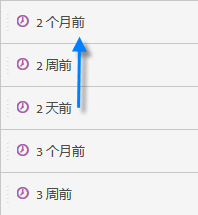
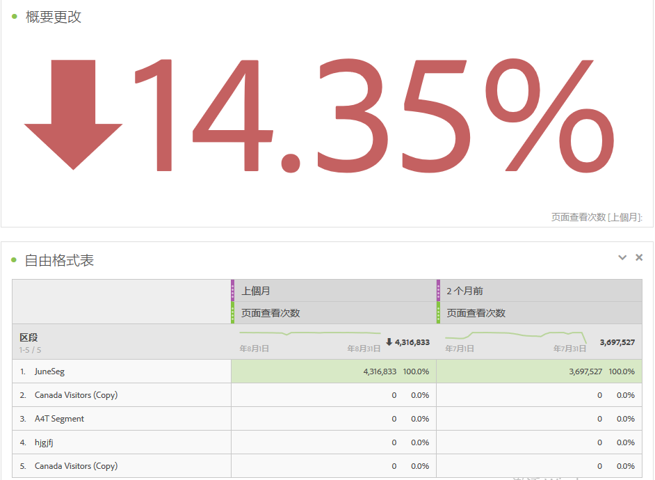
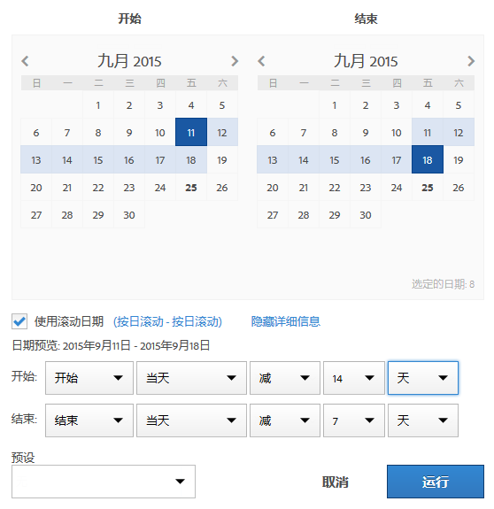

# 创建自定义日期范围

在 Analysis Workspace 中创建自定义日期范围，并将它们另存为“时间”组件。

**[!UICONTROL “组件]** ”&gt; **[!UICONTROL “新日期范围”]**

日期范围应用于面板级别。To add a date range to your project, click **Panels** &gt; *`<select panel>`*, and specify a new date range.

## Date range for "two months ago" {#section_C4109C57CB444BB2A79CC8082BD67294}

下面的自定义日期范围显示了“两个月之前”的日期范围，其中，“概要更改”可视化信息显示了方向上的变化。

自定义日期范围显示在项目中“日期范围”组件面板的最上方：

您可以将这个自定义日期范围拖至使用“上个月”预设的自定义月连续日期范围旁边的列中，以便进行比较。添加一个“概要更改”可视化信息并从每个列中选择总量，可显示方向上的变化：

## Use a 7-day rolling date range {#section_7EF63B2E9FF54D2E9144C4F76956A8DD}

日期范围应用于面板级别。若要在项目中添加日期范围，请单击&#x200B;**操作** &gt; **添加面板**，然后指定一个新的日期范围。

在“日期范围生成器”中，您可以创建一个与其他日期范围一同显示在“组件”面板中的自定义日期范围。

例如，您可以创建一个日期范围，指定一个于一周前结束的连续 7 天的时段。

使用“按天连续” *`rolling daily`*。

* The Start settings would be *`current day minus 14 days`*.

* The End settings would be *`current day minus 7 days`*.

这个日期范围可作为一个组件拖至任何自由格式表中。
