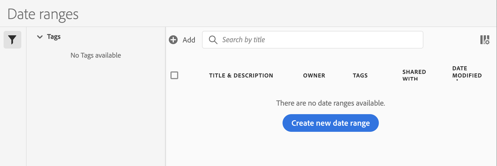

# 创建自定义日期范围

您可以在Analysis Workspace中创建自定义日期范围并将其另存为时间组件。

有关将现有日期范围添加到项目的信息，请参阅 [日历和日期范围概述](/help/analyze/analysis-workspace/components/calendar-date-ranges/calendar.md).

要创建自定义日期范围，请执行以下操作：

1. 在Adobe Analytics中，选择 **[!UICONTROL 组件]** > **[!UICONTROL 日期范围]**.

   

1. 选择 [!UICONTROL **创建新日期范围**].

1. 在日期范围生成器中，指定以下信息：

   | 选项 | 描述 |
   |---------|----------|
   | [!UICONTROL **标题**] | 日期范围的标题，当用户在Analysis Workspace中选择该日期范围时，它将显示出来。 |
   | [!UICONTROL **描述**] | 日期范围的描述。 |
   | [!UICONTROL **标记**] | 要应用于日期范围的任何标记。 |
   | [!UICONTROL **日期范围**] | 允许您选择自定义日期范围。 默认情况下，选择最近30天。 |
   | [!UICONTROL **预设**] | 从预设日期范围列表中选择，例如 [!UICONTROL **昨天**]， [!UICONTROL **最近7天**]， [!UICONTROL **最近30天**]，等等。 |
   | [!UICONTROL **开始时间**] | 日期范围在一天中的开始时间。 |
   | [!UICONTROL **结束时间**] | 日期范围结束的时间。 |
   | [!UICONTROL **使用滚动日期**] | 滚动日期允许您生成一个动态报告，从而可根据您运行报告的时间向前或向后查看一段特定的时间段。例如，如果您要报告“上个月”安排的所有订单（基于“创建日期”字段）并在十二月运行该报告，则会看到十一月安排的订单。如果您在一月运行同一报告，则会看到十二月安排的订单。<ul><li>**[!UICONTROL 日期预览]**：指示滚动日程表包含哪些时间段。</li><li>**[!UICONTROL 开始]**：您可以在当天、当周、当月、当季、当年之间进行选择。</li><li>**[!UICONTROL 结束]**：您可以在当天、当周、当月、当季、当年之间进行选择。</li></ul> 默认选定。 |

1. 选择&#x200B;[!UICONTROL **保存**]。

## 示例：“两个月之前”的日期范围 {#section_C4109C57CB444BB2A79CC8082BD67294}

下面的自定义日期范围显示了“两个月之前”的日期范围，其中，“概要更改”可视化信息显示了方向上的变化。

自定义日期范围显示在项目中“日期范围”组件面板的最上方：

您可以将这个自定义日期范围拖至使用“上个月”预设的自定义月连续日期范围旁边的列中，以便进行比较。添加一个“概要更改”可视化图表并从每个列中选择总量，可显示方向上的变化：

## 示例：使用7天滚动日期范围 {#section_7EF63B2E9FF54D2E9144C4F76956A8DD}

您可以创建一个日期范围，以指定一周前结束的7天滚动时段：

使用 *`rolling daily`*。

* “开始”设置是 *`current day minus 6 days`*。

* “结束”设置是 *`current day minus 7 days`*。

这个日期范围可作为一个组件拖至任何自由格式表中。
