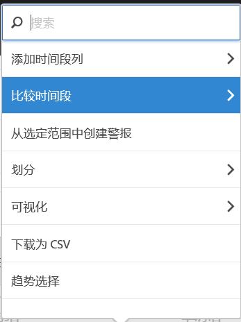
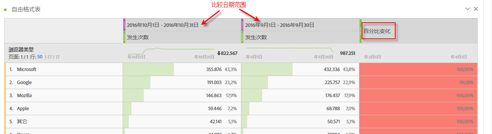
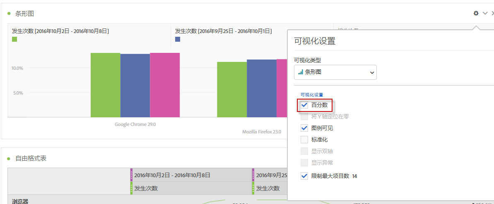
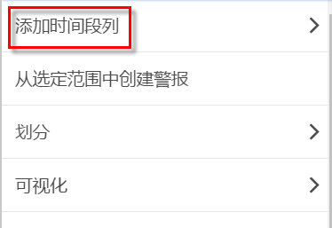
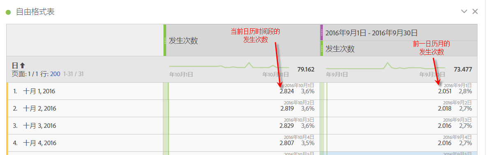
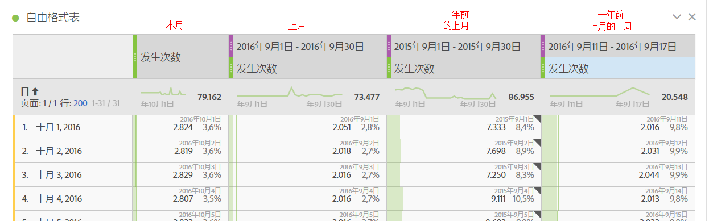
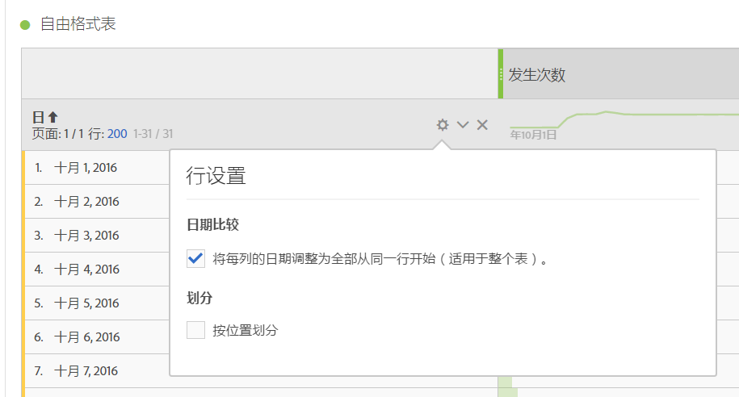
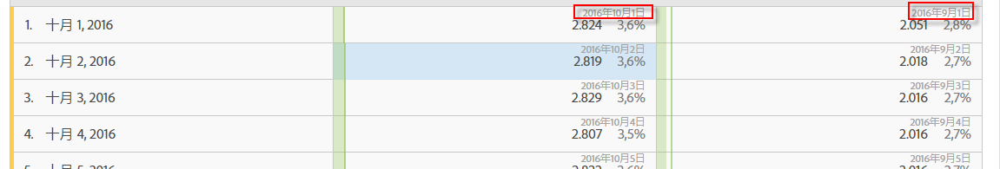

# 日期比较

Analysis Workspace 中的日期比较允许您采用包含日期范围的任何列来创建常见的日期比较，例如：年同比、季度同比、月同比，等等。

## 比较时间段 {#section_C4E36BFE0F5C4378A74E705747C9DEE4}

分析需要上下文，通常这类上下文是由前一时间段提供的。例如，问题“我们比去年同期做得好/差多少？”是了解您的业务的基础。日期比较会自动包含“差异”列，该列显示相较指定时间段的百分比变化。

1. 创建自由格式表，并且在该表中包含您要在一个时间段内比较的任何维度和量度。
1. Right-click a table row and select **[!UICONTROL Compare Time Periods]**.

   

   >[!IMPORTANT]
   >
   >对量度行、日期范围行和时间维度行禁用此右键单击选项。

1. 根据您设置表格日期范围的具体方式，您可以使用以下选项进行比较：

   | 选项 | 描述 |
   |---|---|
   | **[!UICONTROL 在此日期范围之前的周/月/季/年]** | 与周/月/等进行比较。紧邻此日期范围之前。 |
   | **[!UICONTROL 去年同周/月/季/年]** | 与一年前的同一日期范围进行比较。 |
   | **[!UICONTROL 选择范围]** | 允许您选择自定义日期范围。 |

   >[!NOTE]
   >
   >When you select a custom number of days, for example October 7 - October 20 (a 14-day range), you will get only 2 options: **[!UICONTROL Prior 14 days before this date range]**, and **[!UICONTROL Select range]**.

1. 得出的比较与下图类似：

   

   “百分比变化”列中的行在具有负值时显示红色，在具有正值时显示绿色。

1. （可选）与在任何其他工作区项目中一样，您也可以根据这些时间比较创建可视化。例如，以下是一个条形图：

   

   请注意，为了在条形图中显示百分比变化，您必须在“[!UICONTROL 可视化设置]”中选中“[!UICONTROL 百分比]”设置。

## Add a time period column for comparison {#section_93CC2B4F48504125BEC104046A32EB93}

现在，您可以向表中的每一列添加一个时间段，此操作允许您添加一个不用于日历设置的时间段。这是比较日期的另一种方法。

1. 右键单击表格中的列并选择&#x200B;**[!UICONTROL 添加时间段列]** 

1. 根据您设置表格日期范围的具体方式，您可以使用以下选项进行比较：

   | 选项 | 描述 |
   |---|---|
   | **[!UICONTROL 在此日期范围之前的周/月/季/年]** | 添加包含周/月/等的列。紧邻此日期范围之前。 |
   | **[!UICONTROL 去年同周/月/季/年]** | 添加一年前的同一日期范围。 |
   | **[!UICONTROL 选择范围]** | 允许您选择自定义日期范围。 |

   >[!NOTE]
   >
   >When you select a custom number of days, for example October 7 - October 20 (a 14-day range), you will get only 2 options: **[!UICONTROL Prior 14 days before this date range]**, and **[!UICONTROL Select range]**.

1. 时间段将被插入到选定列的顶部：

   

1. 您可以根据需要添加任意数量的时间列，还可以混合和匹配不同的日期范围：

   

1. 此外，您也可以对每个列进行排序，这将根据排序所依据的列更改日顺序。

## Align column dates to start on same row {#section_5085E200082048CB899C3F355062A733}

A new setting for all tables lets you **[!UICONTROL Align Dates from each column to all start on the same row (applies to entire table)]**. “适用于整个表”表示如果您要在表格中执行划分，并为划分更改此设置，那么它将更改整个表的设置。

>[!IMPORTANT]
>
>This setting is **disabled** (unchecked) for all existing projects and **enabled** (checked) for all new projects.

示例：如果选择调整日期，并在 2016 年 10 月和 9 月间进行月同比比较，那么左列将从 10 月 1 日开始，右列将从 9 月 1 日开始：

<!-- 

See Jonny Moon's email from November 3. 

 -->

