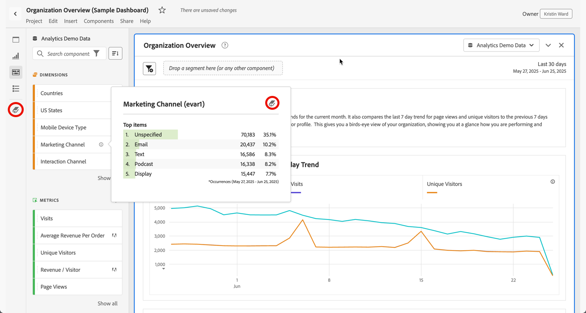

# 数据字典概述 {#data-dictionary-overview}

<!-- markdownlint-disable MD034 -->

>[!CONTEXTUALHELP]
>id="component_datadictionary"
>title="数据词典"
>abstract="数据字典可帮助用户和管理员跟踪并更好地了解其Analytics环境中的组件。  Analytics管理员负责组织有关数据字典中每个组件的信息。"

<!-- markdownlint-enable MD034 -->

Analysis Workspace 中的数据词典可帮助用户和管理员跟踪并更好地了解其 Analytics 环境中的组件。

Analytics 管理员负责整理有关数据词典中每个组件的信息，并将其提供给用户。

>[!BEGINSHADEBOX]

观看演示视频，请参阅 [Analysis Workspace的数据字典](https://video.tv.adobe.com/v/3418028/?quality=12&learn=on){target="_blank"}。

>[!ENDSHADEBOX]

## 对用户的好处

数据词典帮助用户更好地了解他们可用的每个组件。

数据词典中可用的信息包括：

* 组件的功能和预期用途。

* 通常与您正在查看的组件一起使用的组件。

* 与正在查看的组件类似的组件。

* 系统管理员是否批准组件。

有关如何访问数据词典及其包含的信息的详细信息，请参阅[查看数据词典中的组件信息](view-data-dictionary.md)。

## 对管理员的好处

数据词典帮助系统管理员跟踪和管理其 Analytics 环境中的组件。

Analytics管理员可以将数据字典用于以下目的：

* 识别需要合并的重复组件。

* 识别未收集任何数据的组件，以便更新或删除它们。

* 确定尚未批准的组件。

* 直接在 Analysis Workspace 中更新组件描述。对数据字典中组件描述所做的任何更新都会反映在数据视图中。

  同样，对数据视图中组件描述所做的任何更新都会反映在 Analysis Workspace 中。

  有关在 Analysis Workspace 或数据视图中添加组件描述的更多信息，请参阅[添加组件描述](/help/analyze/analysis-workspace/components/add-component-descriptions.md)。

## 访问数据字典

您可以在 Analysis Workspace 中通过以下任何方式访问数据字典：

* 按钮面板中的。

* 组件信息弹窗中的。

有关数据字典中提供的不同选项的详细信息，请参阅[查看数据字典中的组件信息](view-data-dictionary.md)。

## 更新和整理数据字典

Adobe Analytics管理员负责为其组织维护健康的数据字典，如[监控数据字典运行状况](monitor-data-dictionary-health.md)中所述。

在此过程中，Adobe Analytics管理员可以编辑数据字典中每个组件的相关信息，如[编辑数据字典中的组件条目](edit-entries-data-dictionary.md)中所述。

## 移动、最小化或关闭数据词典

当您打开数据词典时（如[访问数据词典](#access-the-data-dictionary)中所述），它显示为 Analysis Workspace 顶部的一个窗口。

您可以通过以下任何方式操作“数据词典”窗口：

* 将其拖动到 Analysis Workspace 中的任何区域

  如果您关闭并重新打开 Analysis Workspace，“数据词典”窗口将保留在您上次移动它的位置上。<!--True?-->

* 最小化窗口。

  最小化时，数据词典在 Analysis Workspace 的右下角显示为蓝色选项卡。

  当您选择蓝色选项卡时，数据词典将打开您最近查看的组件。

* 关闭窗口。

<!--
# Data Dictionary overview

The Data Dictionary in Analysis Workspace helps both users and administrators keep track of and better understand the components in their Analytics environment.   

Analytics administrators are responsible for curating information about each component in the Data Dictionary to make it available to users.

>[!BEGINSHADEBOX]

See  [Data dictionary](https://video.tv.adobe.com/v/3418028?quality=12&learn=on){target="_blank"} for a demo video.

>[!ENDSHADEBOX]

## Benefits for users

The Data Dictionary helps users gain a better understanding of each component that is available to them. 

Information available in the Data Dictionary includes: 

* A component's function and intended use

* Components typically used with the one you are viewing

* Components that are similar to the one you are viewing

* Whether a component is approved by the system administrator 

For information about how to access the Data Dictionary and for details about the information it contains, see [View component information in the Data Dictionary](/help/analyze/analysis-workspace/components/data-dictionary/view-data-dictionary.md).

## Benefits for administrators

The Data Dictionary helps system administrators keep track of and curate the components in their Analytics environment. 

Following are some of the ways Analytics administrators can use the Data Dictionary: 

* Identify duplicate components that need to be consolidated.

* Identify components that aren't collecting any data so they can be either updated or deleted.

* Identify components that are not yet approved.

* Update component descriptions directly in Analysis Workspace. Any updates made to component descriptions in the Data Dictionary are reflected in the Report Suite.

  Similarly, any updates made to component descriptions in the Report Suite are reflected in Analysis Workspace.

  For more information about adding component descriptions in either Analysis Workspace or in a Report Suite, see [Add component descriptions](/help/analyze/analysis-workspace/components/add-component-descriptions.md).

## Access the Data Dictionary

You can access the Data Dictionary in any of the following ways within Analysis Workspace:

* From the **Data Dictionary** icon in the left rail.

  

* From the **Data Dictionary** icon within the info popover of a component. 

  

For detailed information about the various options available in the Data Dictionary, see [View component information in the Data Dictionary](/help/analyze/analysis-workspace/components/data-dictionary/view-data-dictionary.md).

## Update and curate the Data Dictionary

Analytics administrators are responsible for maintaining a healthy Data Dictionary for their organization, as described in [Monitor Data Dictionary Health](/help/analyze/analysis-workspace/components/data-dictionary/monitor-data-dictionary-health.md).

As part of this process, Analytics administrators can edit information about each component in the data dictionary, as described in [Edit component entries in the Data Dictionary](/help/analyze/analysis-workspace/components/data-dictionary/edit-entries-data-dictionary.md).

## Move, minimize, or close the Data Dictionary

When you open the Data Dictionary (as described in [Access the Data Dictionary](#access-the-data-dictionary)), it displays as a window on top of Analysis Workspace. 

You can manipulate the Data Dictionary window in any of the following ways:

* Drag it to any area within Analysis Workspace 

  If you close and re-open Analysis Workspace, the Data Dictionary window remains in the location where you last moved it.

* Minimize it

  When minimized, the Data Dictionary appears as a blue tab in the lower-right corner of Analysis Workspace.

  When you select the blue tab, the Data Dictionary opens to the component you were most recently viewing. 

* Close it

-->