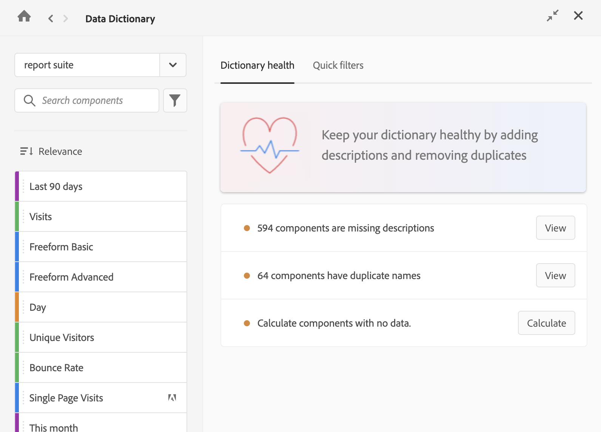

# 监测数据字典健康状况 {#monitor-data-dictionary}

<!-- markdownlint-disable MD034 -->

>[!CONTEXTUALHELP]
>id="aa_datadictionary_share_primary"
>title="共享主要组件"
>abstract="选择此选项后，主组件将与所有有权访问重复组件的用户共享（包括组件所有者以及与其共享组件的用户）。 这些用户随后可以在组件列表中选择该主组件，用于未来项目。 但是，他们无法编辑该组件，即使他们曾是已合并重复组件的所有者。  仅当主组件为区段、计算量度或日期范围时，此选项才可用。 量度和维度始终对所有用户可用。
>
>When this option is deselected, the primary component still replaces duplicates in existing projects and segments, but users who didn't previously have access to it can't access it from the component list for future projects. "

<!-- markdownlint-disable MD034 -->

<!-- markdownlint-enable MD034 -->

>[!CONTEXTUALHELP]
>id="aa_datadictionary_delete_duplicates"
>title="删除已替换的重复项"
>abstract="选择此选项后，已整合的重复项将无法再使用。 如果您希望重复项继续可用，请取消选择此选项。"

<!-- markdownlint-enable MD034 -->

Analytics 管理员负责维持健康的数据词典。

## 健康数据词典的特征

在一个健康的数据词典中，所有组件：

* 均使用并收集数据

* 包含有用的描述，以便用户了解如何充分使用各种组件

* 没有不必要的重复

* 经管理员批准

## 检查数据词典的健康状况

要在您的数据词典中识别健康问题：

1. 打开一个 Analysis Workspace 项目。

1. 选择 Analysis Workspace 左侧的“数据词典”图标。 （[数据字典概述](/help/analyze/analysis-workspace/components/data-dictionary/data-dictionary-overview.md)中的“访问数据字典”一节中描述了访问数据词典的其他方法。）

   显示“数据词典”窗口。

   

1. 确保在下拉菜单中选择了正确的报告包。

1. 在&#x200B;[!UICONTROL **词典健康状况**]&#x200B;选项卡上，选择以下任一选项旁边的&#x200B;[!UICONTROL **视图**]：

   * [!UICONTROL **个组件缺少描述**]

   * [!UICONTROL **组件有重复项**]

   * [!UICONTROL **个组件没有数据连接**]

   根据您的选择，适当的过滤器将应用于数据词典，并且仅显示相关组件。

1. 编辑任何组件以改善数据词典的健康状况。 有关如何在数据词典中编辑组件的信息，请参阅[在数据字典中编辑组件条目](/help/analyze/analysis-workspace/components/data-dictionary/edit-entries-data-dictionary.md)。
