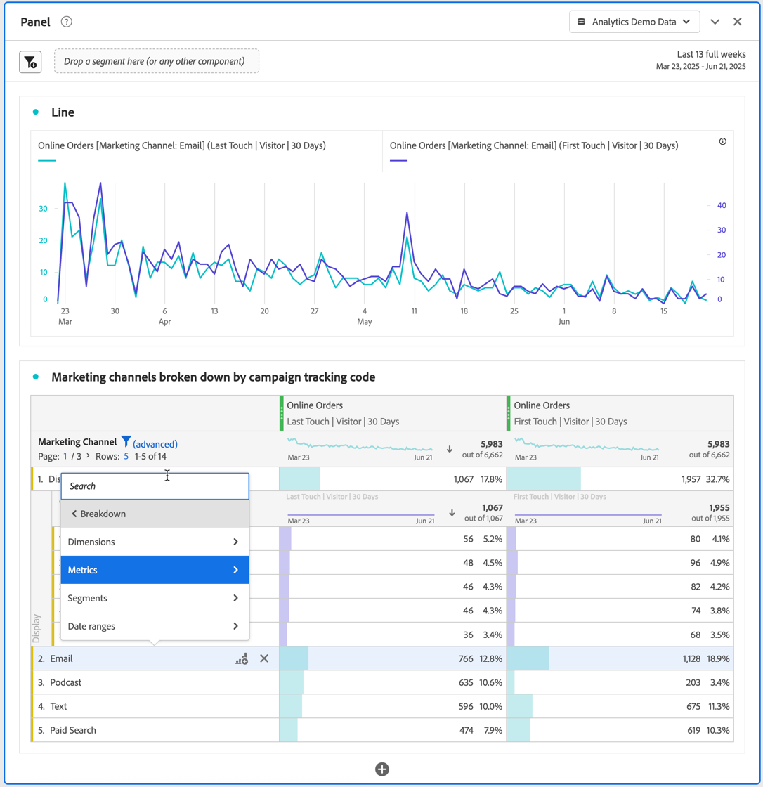

# 在工作区中划分维度

您可以根据特定需求，以无限方式细分数据；使用相关量度、维度、区段、时间线和其他分析细分值构建查询。

1. 在[自由格式表](/help/analyze/analysis-workspace/visualizations/freeform-table/freeform-table.md)中，从一个或多个选定行的上下文菜单中，选择&#x200B;**[!UICONTROL 划分]** 。

   

1. 从子菜单中选择&#x200B;**[!UICONTROL 维度]**、**[!UICONTROL 量度]**、**[!UICONTROL 区段]**&#x200B;或&#x200B;**[!UICONTROL 日期范围]**，然后选择一个项目。 或只是在&#x200B;**[!UICONTROL *搜索&#x200B;*]**&#x200B;字段中搜索组件。

您可以按维度项目或受众区段，在选定的时间期限内划分量度。此外，您还可以进一步深入到更精细的粒度级别。

>[!NOTE]
>
>数据表可显示的细分数量最多为 200 个。导出细分时此限制数量会增加。

## 按位置划分

默认情况下，划分固定在静态行项目。 例如，假设您按营销渠道细分排名前 3 的“页面”维度项（主页、搜索结果、结账）。然后，您离开项目，两周后返回。再次打开项目时，排名前 3 的页面已更改，此时“主页”、“搜索结果”和“结账”页面成为排名第 4-6 的页面。默认情况下，营销渠道划分仍会显示在“主页”、“搜索结果”和“结账”下方，即使三者现在分别位于第4-6行中。

相反，**按位置**&#x200B;划分，始终划分排名前3的项目，而不管这些项目是什么。 回顾该示例，当您重新打开项目时，营销渠道细分与表中排名前 3 的页面相关联。而不是主页、搜索结果和结帐，三者现在位于第4-6行中。 请参阅[行设置](/help/analyze/analysis-workspace/visualizations/freeform-table/column-row-settings/table-settings.md)如何配置此设置。

## 将归因模型应用于划分

也可以对表中的任何划分应用归因模型。此归因模型可能与父列相同或不同。例如，您可以对“营销渠道”维度上的线性订单进行分析，但同时将 U 型订单应用于渠道中的特定跟踪代码。要编辑已应用于划分的归因模型，请将鼠标悬停在划分模型上并选择&#x200B;**[!UICONTROL 编辑]**。

将归因模型应用到细分或者编辑它们时的预期行为如下：

* 如果在没有其他归因存在时应用某个归因，则该归因应用到整个列树。

* 如果您在应用某个归因之后添加细分，则它会使用所添加给定细分的默认值（如果该维度有默认值）。否则，它会使用来自父列的细分。一些维度具有默认分配。例如，时间维度和反向链接使用同一接触。产品维度使用最后接触。其他维度没有默认值，将使用父列分配。

* 如果列树中已有归因，更改该归因仅影响您正在编辑的列。

>[!BEGINSHADEBOX]

有关演示视频，请参阅 [Analysis Workspace中的Dimension](https://video.tv.adobe.com/v/23971?quality=12&learn=on){target="_blank"}。

>[!ENDSHADEBOX]

>[!BEGINSHADEBOX]

有关演示视频，请参阅 [Dimension划分](https://video.tv.adobe.com/v/23969?quality=12&learn=on){target="_blank"}。

>[!ENDSHADEBOX]

>[!BEGINSHADEBOX]

请参阅 [添加维度和量度](https://video.tv.adobe.com/v/30606?quality=12&learn=on){target="_blank"}以查看演示视频。

>[!ENDSHADEBOX]

>[!BEGINSHADEBOX]

请参阅 [在自由格式表中使用维度](https://video.tv.adobe.com/v/40179?quality=12&learn=on){target="_blank"}以获取演示视频。

>[!ENDSHADEBOX]

>[!BEGINSHADEBOX]

观看演示视频的 [按位置划分的Dimension](https://video.tv.adobe.com/v/24033){target="_blank"}。

>[!ENDSHADEBOX]

<!--
# Break down dimensions

Break down dimensions and dimension items in Analysis Workspace.

Break down your data in unlimited ways for your specific needs; build queries using relevant metrics, dimensions, segments, time lines, and other analysis breakdown values.

1. [Create a project](/help/analyze/analysis-workspace/home.md) with a data table.
1. In the data table, right-click a line item and select **[!UICONTROL Breakdown]** > *`<item>`*.

   

   You can break down metrics by dimension items or audience segments across selected time periods. You can also drill down further to a more granular level.

   >[!NOTE]
   >
   >The number of breakdowns to show in the table is limited to 200. This limit will increase for exporting breakdowns.

## Apply attribution models to breakdowns

Any breakdown within a table can also have any attribution model applied to it. This attribution model can be the same or different from the parent column. For example, you can analyze linear Orders on your Marketing Channels dimension but apply U-Shaped Orders to the specific tracking codes within a Channel. To edit the attribution model applied to a breakdown, hover over the breakdown model and click **[!UICONTROL Edit]**:

This is the expected behavior when applying attribution models to breakdowns or editing them:

* If you apply an attribution when no other attributions exist, then the attribution applies to the entire column tree.

* If you add a breakdown after an attribution has been applied, it will use the default for the given breakdown that was added, if that dimension has a default. Otherwise it will use the breakdown from the parent column. Some dimensions have a default allocation.  For example, [!UICONTROL Time] dimensions and [!UICONTROL Referrer] use [!UICONTROL Same Touch]. The [!UICONTROL Product] dimension uses [!UICONTROL Last Touch]. Other dimensions don't have a default, and will use the parent column allocation.

* If there are already attributions in the column tree, changing the attribution only impacts the one you are editing.

## Videos

>[!BEGINSHADEBOX]

See  [Adding dimensions and metrics to your project in Analysis Workspace](https://video.tv.adobe.com/v/30606?quality=12&learn=on){target="_blank"} for a demo video.

>[!ENDSHADEBOX]

>[!BEGINSHADEBOX]

See  [Working with dimensions in a Freeform Table](https://video.tv.adobe.com/v/40179?quality=12&learn=on){target="_blank"} for a demo video.

>[!ENDSHADEBOX]

>[!BEGINSHADEBOX]

See  [dimension breakdowns by position](https://video.tv.adobe.com/v/24033?quality=12&learn=on){target="_blank"} for a demo video.

>[!ENDSHADEBOX]

-->