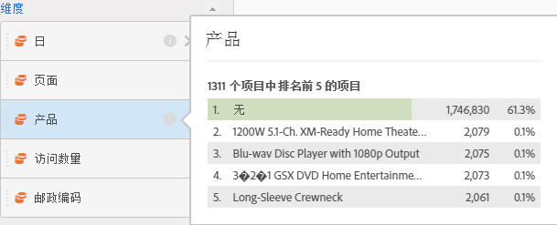
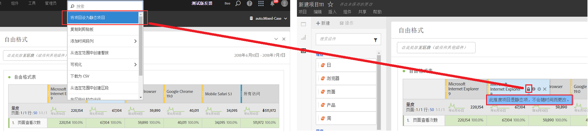

# 预览维度

## Dimension preview {#section_13D5A69AE6194715A721BC87D283F6F2}

将鼠标悬停在某个维度旁边的“信息”(i) 图标上。此时会显示非时间维度的前 5 个值（对于时间维度，显示前 15 个值）。过去，这些值会保持不变（例如，选定的 5 个值永远不会更改）。

但现在，默认情况下将显示动态值而非静态值，同时还会提供一个将动态值转变为静态值的选项。其他注意事项：

* 更新数据时，动态维度列也将随之更新，以显示当前的 5/15 个维度项目。
* 如果移动或复制动态维度列，那么这些维度值将变为静态值。
* 将鼠标悬停在一个静态维度列时，您会看到一个锁定图标，它表明该维度是静态的。

## Show dimension items {#section_A074B3A984634AC7B1362889088E0A42}

当您将鼠标悬停在维度上并单击其旁边的灰色右箭头时，会显示其维度项目列表。任何维度项目列表通常会显示过去 30 天排名最前的项目。

If you scroll down to the bottom of the list, you will see a **[!UICONTROL Show Top Items From Last 6 Months]**. 单击此选项可查看过去 180 天排名最前的维度项目。
