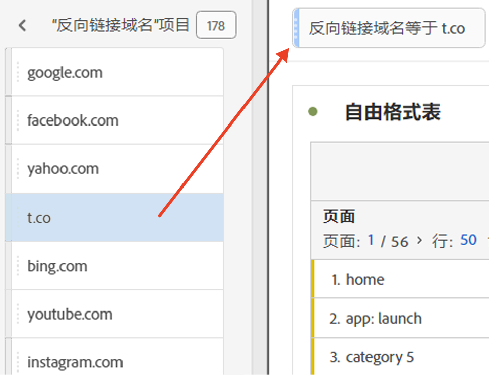
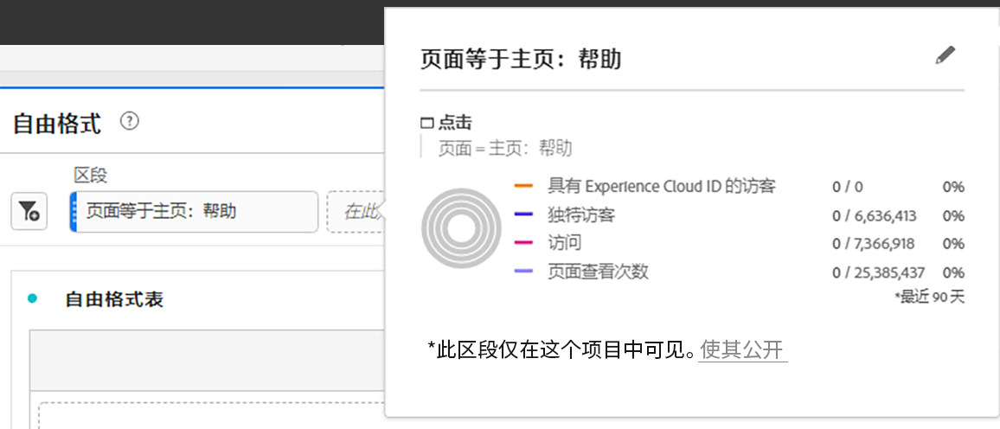

# 临时区段

以下是有关创建临时区段的视频：

>[!VIDEO](https://video.tv.adobe.com/v/23978/?quality=12)

如果您想要快速了解某个区段对项目有何影响，无需转到区段生成器，则可以创建临时区段。 将这些区段视为临时的项目级区段。 它们通常不会成为区段“库”的一部分，如左边栏中的组件区段。 但是，您可以保存它们，如下所示。

要比较临时区段可以执行的操作与完整的组件级别区段，请访问[此处](/help/analyze/analysis-workspace/components/segments/t-freeform-project-segment.md)。

1. 将任何组件类型（维度、维度项目、事件、量度、区段、区段模板、日期范围）拖放到面板顶部的区段拖放区域。 组件类型将被自动转换为区段。以下是如何为Twitter反向链接域创建区段的示例：

   

   您的面板会自动应用此区段，您便可以立即看到结果。

1. 您可以向面板添加无限数量的组件。
1. 如果您决定要保存此区段，请参阅以下章节。

请记住：

* 您&#x200B;**不能**&#x200B;将以下组件类型放入区段区域：不能从中生成区段的量度和维度/量度。
* 对于完整的维度和事件，Analysis Workspace 将创建“存在”点击区段。示例：`Hit where eVar1 exists`或`Hit where event1 exists`。
* 如果将“未指定”或“无”放入区段下拉区域中，它们将自动转换为“不存在”区段，以便在分段时正确进行处理。

>[!NOTE]
>
>通过这种方式创建的区段是项目的内部区段。

## 保存临时区段 {#ad-hoc-save}

您可以选择按照以下步骤来保存这些区段：

1. 在拖放区域中将光标悬停区段上，然后单击“i”图标。
1. 在显示的信息面板中，单击&#x200B;**[!UICONTROL Save]**。

   

