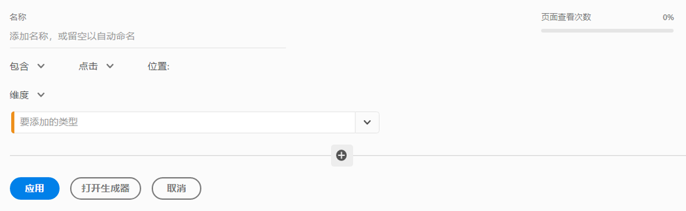
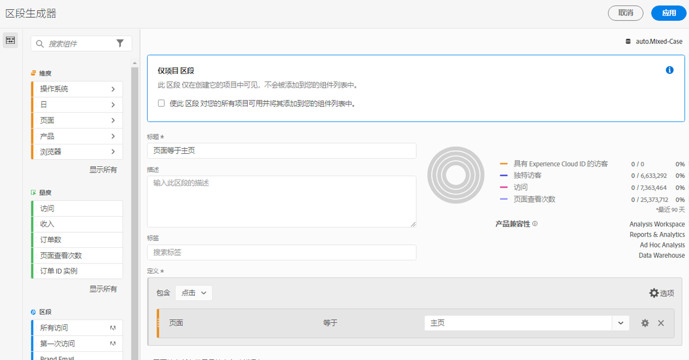

# 快速区段

可在项目中创建快速区段以规避完整版[区段生成器](/help/components/segmentation/segmentation-workflow/seg-build.md)的复杂操作。快速区段

* 仅适用于创建它们的项目（您可以更改此设置）。
* 允许有最多 3 条规则。
* 不容纳嵌套容器或顺序规则。
* 可在具有多个报表包的项目中起作用。

要比较快速区段与完整的组件列表区段的作用，请转到[此处](/help/analyze/analysis-workspace/components/segments/t-freeform-project-segment.md)。

>[!IMPORTANT]
> 快速区段当前正在进行小范围测试，将于 2021 年 10 月 21 日正式发布。

## 先决条件

任何人都可以创建[!UICONTROL 快速区段]。不过，您需要具有 [Adobe Admin Console](https://experienceleague.adobe.com/docs/analytics/admin/admin-console/permissions/summary-tables.html?lang=zh-Hans#analytics-tools) 中的[!UICONTROL 区段创建]权限才能在[!UICONTROL 区段生成器]中保存或打开快速区段。

## 创建快速区段

在自由格式表中，单击面板标题中的筛选条件+ 图标：

从该空白板中配置快速区段：

| 设置 | 描述 |
| --- | --- |
| 名称 | 区段的默认名称为该区段中的规则名称的组合。您可以对区段重命名。 |
| 包括/排除 | 可在区段定义中包括或排除组件，但不得既包括又排除。 |
| “点击”/“访问”/“访客”容器 | 快速区段仅包括一个[区段容器](https://experienceleague.adobe.com/docs/analytics/components/segmentation/seg-overview.html?lang=zh-Hans#section_AF2A28BE92474DB386AE85743C71B2D6)，从中可在区段中包括（或从区段中排除）某个维度/量度/日期范围。[!UICONTROL 访客]包含访客在不同的访问和页面查看间专属的总体数据。通过[!UICONTROL 访问]容器可设置规则以根据访问划分访客的数据，而通过[!UICONTROL 点击]容器可根据个别页面查看划分访客信息。默认容器为[!UICONTROL 点击]。 |
| 组件（维度/指标/日期范围） | 通过添加组件（维度和/或量度和/或日期范围）及其值，可定义最多 3 条规则。有 3 种方法可以找到正确的组件：<ul><li>只需开始打字，[!UICONTROL 快速区段]生成器即自动查找相应的组件。</li><li>使用下拉列表查找组件。</li><li>从左边栏中拖放组件。</li></ul> |
| 运算符 | 使用下拉菜单查找标准运算符和[!UICONTROL 非重复计数]运算符。[了解详情](https://experienceleague.adobe.com/docs/analytics/components/segmentation/segment-reference/seg-operators.html?lang=zh-Hans) |
| 加号 (+) | 添加另一条规则。 |
| AND/OR 限定符 | 可将“AND”或“OR”限定符添加到规则，但不得在单个区段定义中混用“AND”和“OR”。 |
| 应用 | 将此区段应用于面板。如果此区段不包含任何数据，则系统将询问您是否要继续。 |
| 打开生成器 | 打开区段生成器。在区段生成器中保存或应用区段后，即不再将它视为“快速区段”。它成为组件列表区段库的一部分。 |
| 取消 | 取消此快速区段 - 不要应用它。 |
| 日期范围 | 该验证器使用面板日期范围执行其数据查找。但在快速区段中应用的任何日期范围都将取代面板顶部的面板日期范围。 |
| 预览（右上角） | 让您查看您的区段是否有效以及该区段的作用范围。表示在应用此区段时预计将看到的数据集的划分方式。您可能会收到一条通知，表明此区段没有数据。如果是这种情况，您可继续操作或更改区段定义。 |

兼有维度和量度的区段的示例如下：

该区段显示在顶部。请注意它的蓝色条纹边栏，与左侧区段库中组件级区段的蓝色边栏不同。

## 编辑快速区段

1. 将光标悬停在快速区段上并选择铅笔图标。
1. 编辑区段定义和/或区段名称。
1. 单击[!UICONTROL 应用]。

## 保存快速区段

>[!IMPORTANT]
>保存或应用区段后，在快速区段生成器中就无法再编辑它，而只能在常规的区段生成器中编辑它。

1. 应用快速区段后，将光标悬停在它上并选择信息（“i”）图标。

   

1. 单击&#x200B;**[!UICONTROL 使其对所有项目都可用，并将它添加到组件列表]**。
1. （可选）为区段重命名。
1. 单击&#x200B;**[!UICONTROL 保存]**。

请注意区段的边栏如何从蓝色条纹变为蓝色。它现在显示在左边栏中的组件列表中。

## 仅用于项目的区段是什么？

仅用于项目的区段或者是快速区段，或者是临时工作区项目区段。在[!UICONTROL 区段生成器]中编辑/打开此类区段时，将出现表示仅用于项目的框。如果您在生成器中应用某个快速区段，但未选中使其可用的框，则它仍为仅用于项目的区段，但在[!UICONTROL 快速区段生成器]中无法再打开它。

如果选中该框并单击&#x200B;**[!UICONTROL 保存]**，则它现在为组件列表区段。

