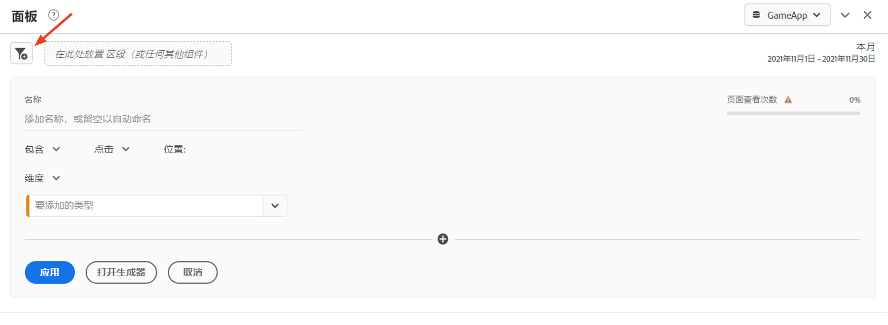
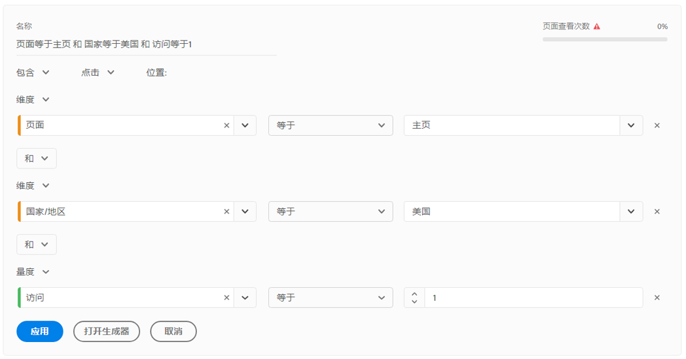

# 快速区段

利用快速区段，您可以轻松地浏览给定项目中的数据，而无需在[区段生成器](/help/components/segmentation/segmentation-workflow/seg-build.md)中创建更复杂的组件列表区段。

创建快速区段时，请考虑以下事项：

* 快速区段仅适用于在其中创建它们的项目。此类过滤器在其他项目中不可用，无法共享给其他用户。
* 最多允许使用 3 个规则。
* 不支持嵌套容器或顺序规则。

>[!BEGINSHADEBOX]

有关演示视频，请参阅 [快速区段](https://video.tv.adobe.com/v/345335?quality=12&learn=on&captions=chi_hans){target="_blank"}。

>[!ENDSHADEBOX]

## 创建快速区段

Ananalysis Workspace 中的任何用户都可创建快速区段。

要创建快速区段，请执行以下操作：

1. 选择以下某种方法来开始创建快速区段：

   * **临时（拖放）：** 从左边栏将组件拖到面板标题中的段放置区。

     

     您可以按照 [编辑快速片段](#edit-quick-segments)中的说明来编辑该片段。

     >[!NOTE]
     >
     > 在创建临时（拖放）快速区段时，请考虑以下事项：
     > * 不支持以下组件类型：计算量度和维度，以及无法从中生成区段的量度。
     > * 对于完整的维度和事件，Analysis Workspace 将创建“存在”点击区段。示例：`Hit where eVar1 exists` 或 `Hit where event1 exists`。
     > * 如果将“未指定”或“无”拖入区段放置区域，则它自动转换为“不存在”区段，以使其在区段中受到正确对待。

   * **使用区段图标：**&#x200B;在自由格式表中，选择面板标头中的&#x200B;**区段**&#x200B;图标。

     

1. 调整以下任一设置：

   | 设置 | 描述 |
   | --- | --- |
   | [!UICONTROL 名称] | 区段的默认名称为该区段中的规则名称的组合。可以将区段重命名为更友好的名称。 |
   | [!UICONTROL 包括/排除] | 可在区段定义中包括或排除组件，但不得既包括又排除。 |
   | [!UICONTROL 点击/访问/访客]容器 | 快速区段仅包括一个[区段容器](https://experienceleague.adobe.com/docs/analytics/components/segmentation/seg-overview.html#section_AF2A28BE92474DB386AE85743C71B2D6?lang=zh-Hans)，从中可在区段中包括（或从区段中排除）某个维度/量度/日期范围。[!UICONTROL 访客]包含访客在不同的访问和页面查看间专属的总体数据。 通过[!UICONTROL 访问]容器可设置规则，允许您根据访问划分访客的数据，而通过[!UICONTROL 点击]容器可根据个别页面查看划分访客信息。默认容器为[!UICONTROL 点击]。 |
   | [!UICONTROL 组件]（维度/量度/日期范围） | 通过添加组件（维度、量度、日期范围或维度值）可定义最多 3 条规则。有 3 种方法可以找到正确的组件：<ul><li>只需开始键入，快速区段生成器即自动查找相应的组件。</li><li>使用下拉列表查找组件。</li><li>从左边栏中拖放组件。</li></ul> |
   | [!UICONTROL 运算符] | 使用下拉菜单查找标准运算符和[!UICONTROL 非重复计数]运算符。请参阅[区段运算符](/help/components/segmentation/seg-reference/seg-operators.md)。 |
   | 加号 (+) | 添加另一条规则。 |
   | AND/OR 限定符 | 可将“AND”或“OR”限定符添加到规则，但不得在单个区段定义中混用“AND”和“OR”。 |
   | [!UICONTROL 应用] | 将此区段应用于面板。如果此区段不包含任何数据，系统将询问您是否要继续。 |
   | [!UICONTROL 打开生成器] | 打开区段生成器。在区段生成器中保存或应用区段后，即不再将它视为“快速区段”。它成为组件列表区段库的一部分。 
要使组件在所有项目中和左边栏中可用，请选择&#x200B;[!UICONTROL **使此区段对所有项目都可用，并将它添加到组件列表**]&#x200B;选项。

有关更多信息，请参阅本文中的[将快速区段另存为组件列表区段](#save-a-quick-segment-as-a-component-list-segment)部分。

**注意：**&#x200B;只有在 [Adobe Admin Console](/help/admin/admin-console/permissions/analytics-tools.md) 中拥有区段创建权限的用户才能打开区段生成器。
 |
   | [!UICONTROL 取消] | 取消此快速区段（不要应用它）。 |
   | [!UICONTROL 日期范围] | 该验证器使用面板日期范围执行其数据查找。但在快速区段中应用的任何日期范围都将取代面板顶部的面板日期范围。 |
   | 预览（右上角） | 让您查看您的区段是否有效以及该区段的作用范围。表示在应用此区段时预计将看到的数据集的划分方式。您可能会收到一条通知，表明此区段没有数据。在这种情况下，可继续操作或更改区段定义。 |

1. 选择&#x200B;[!UICONTROL **应用**]&#x200B;以保存您的更改。

## 编辑快速区段

1. 将光标悬停在快速区段上并选择&#x200B;**编辑**&#x200B;图标。

   

1. 编辑区段定义和/或区段名称。

1. 选择&#x200B;[!UICONTROL **应用**]。

## 将快速区段另存为组件列表区段

>[!IMPORTANT]
>
> 在保存快速区段时，请考虑以下事项：
> 
> * 要保存快速区段，您需要在 [Adobe Admin Console](/help/admin/admin-console/permissions/analytics-tools.md) 中拥有区段创建权限。
> 
> * 保存或应用区段后，无法再在快速区段生成器中编辑区段。相反，您必须使用常规区段生成器。

您可以选择将快速区段另存为组件列表区段。组件列表区段的优势包括：

* 可跨所有 Workspace 项目使用
* 支持更复杂的区段以及顺序区段

您可以从快速区段生成器或[!UICONTROL 过滤器生成器]保存区段。

### 在快速区段生成器中保存 {#save2}

1. 应用快速区段后，将光标悬停在其上方并选择信息（“i”）图标。
1. 选择&#x200B;**[!UICONTROL 使其对所有项目可用，并添加到组件列表]**。
1. （可选）为区段重命名。
1. 选择&#x200B;**[!UICONTROL 保存]**。

   区段现在显示在左边栏中的组件列表中。另请注意，区段的边栏颜色将从浅蓝色变为深蓝色，这表示无法再在快速区段生成器中编辑或打开区段。

### 在区段生成器中保存 {#save3}

1. 应用快速区段后，将光标悬停在其上方并选择信息（“i”）图标。
1. 选择&#x200B;**[!UICONTROL 保存区段]**。
1. （可选）重命名区段，然后选择&#x200B;[!UICONTROL **应用**]。

   返回到 Workspace，请注意，区段的边栏颜色将从浅蓝色变为深蓝色，这表示无法再在快速区段生成器中编辑或打开区段。通过保存它，它就成为组件列表的一部分。

应用区段后，可选择将它添加到区段组件列表，并使其对所有项目都可用。

1. 将光标悬停在保存的区段上并选择铅笔图标。

1. 选择&#x200B;[!UICONTROL **打开生成器**]。

1. 在区段生成器顶部，请注意&#x200B;[!UICONTROL **仅用于项目的区段**]&#x200B;对话框：

   

1. 选中&#x200B;**[!UICONTROL 使其对所有项目都可用，并添加到组件列表]**&#x200B;旁边的复选框。

1. 选择&#x200B;**[!UICONTROL 保存]**。

   所有项目的区段组件列表中现在都显示该区段。
还可与组织中的其他人员[共享该区段](https://experienceleague.adobe.com/docs/analytics/analyze/analysis-workspace/curate-share/curate.html?lang=zh-Hans#concept_4A9726927E7C44AFA260E2BB2721AFC6)。

## 快速区段示例

以下是兼有维度和量度的区段的示例：

## 已知问题

1. 创建一个包含 2 个条目的快速区段，并将它&#x200B;**[!UICONTROL 保存]**&#x200B;为 Test1。
1. 单击&#x200B;**[!UICONTROL 另存为]**，并将此快速区段另存为 Test2。
1. 编辑 Test2 快速区段并将它再次另存为 Test2。请注意，Test1 快速区段已由 Test2 修改。
