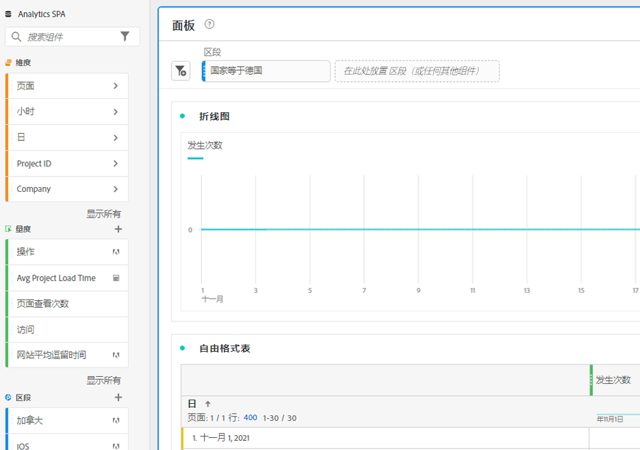
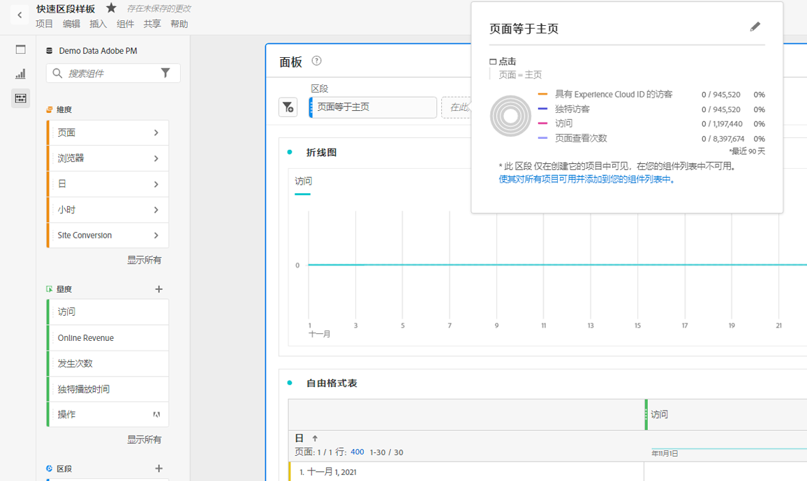
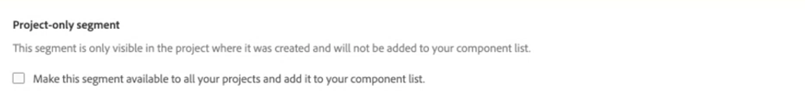

# 快速区段

您可以在项目中创建快速区段，以绕过完整[区段生成器](/help/components/segmentation/segmentation-workflow/seg-build.md)的复杂性。 快速区段

* 仅应用于创建了这些项目的项目（您可以更改此设置）。
* 最多允许3个规则。
* 不要包含嵌套容器或顺序规则。
* 在包含多个报表包的项目中工作。

要比较快速区段可以执行的操作与完整的组件列表区段，请前往[此处](/help/analyze/analysis-workspace/components/segments/t-freeform-project-segment.md)。

>[!IMPORTANT]
> 快速区段当前处于有限测试中，通常还不可用。

## 先决条件

任何人都可以创建[!UICONTROL 快速区段]。 但是，您需要[!UICONTROL 区段创建]权限(位于[Adobe Admin Console](https://experienceleague.adobe.com/docs/analytics/admin/admin-console/permissions/summary-tables.html?lang=en#analytics-tools)中)才能保存快速区段，或在[!UICONTROL 区段生成器]中将其打开。

## 创建快速区段

在自由格式表中，单击面板标题中的过滤器+图标：

| 设置 | 描述 |
| --- | --- |
| 名称 | 区段的默认名称是区段中规则名称的组合。 您可以重命名区段。 |
| 包含/排除 | 您可以在区段定义中包含或排除组件，但不能同时包含和排除组件。 |
| 点击/访问/访客容器 | 快速区段仅包含一个[区段容器](https://experienceleague.adobe.com/docs/analytics/components/segmentation/seg-overview.html?lang=en#section_AF2A28BE92474DB386AE85743C71B2D6)，它允许您在区段中（或从中排除）包含维度/量度/日期范围。  访客包含所有访问和页面查看中特定于该访客的一切数据。通过[!UICONTROL 访问]容器可设置规则来根据访问对访客的数据进行划分，通过[!UICONTROL 点击]容器可根据各个页面查看对访客信息进行划分。 默认容器为[!UICONTROL Hit]。 |
| 组件(Dimension/量度/日期范围) | 通过添加组件维度和/或量度和/或日期范围及其值，最多定义3个规则。 有3种方法可找到正确的组件：<ul><li>开始键入内容，[!UICONTROL 快速区段]生成器会自动找到相应的组件。</li><li>使用下拉列表查找组件。</li><li>从左边栏拖放组件。</li></ul> |
| 运算符 | 使用下拉菜单查找标准运算符和[!UICONTROL Distinct Count]运算符。 [了解详情](https://experienceleague.adobe.com/docs/analytics/components/segmentation/segment-reference/seg-operators.html?lang=en) |
| 加号(+) | 添加其他规则 |
| 和/或限定符 | 您可以在规则中添加“AND”或“OR”限定符，但不能在单个区段定义中混合使用“AND”和“OR”。 |
| 应用 | 将此区段应用到面板。 如果区段不包含数据，则系统将询问您是否要继续。 |
| 打开生成器 | 打开区段生成器。 在区段生成器中保存该区段后，该区段不再被视为“快速区段”。 它将成为组件列表区段库的一部分。 |
| 取消 | 取消此快速区段 — 请勿应用该区段。 |
| 日期范围 | 验证器使用面板日期范围进行数据查找。 但是，在快速区段中应用的任何日期范围都会覆盖面板顶部的面板日期范围。 |
| 预览（右上方） | 用于查看您是否拥有有效的区段以及区段的广泛程度。 表示在应用此区段时，您预计会看到的数据集的划分。 您可能会收到一条通知，指示此区段没有数据。 您可以继续或更改区段定义。 |

以下是将维度和量度组合在一起的区段示例：

区段显示在顶部。 请注意其蓝色条纹边栏，而不是左侧区段库中组件级别区段的蓝色边栏。

## 编辑快速区段

1. 将鼠标悬停在快速区段上，然后选择铅笔图标。
1. 编辑区段定义或区段名称。

## 保存快速区段

您可以选择在[!UICONTROL 快速区段生成器]或在[!UICONTROL 区段生成器]中保存快速区段。

>[!IMPORTANT]
>保存或应用区段后，您便无法再在快速区段生成器中编辑该区段，只能在常规的区段生成器中进行编辑。

### 在快速区段生成器中保存

1. 应用快速区段后，将鼠标悬停在该区段上，然后选择信息(“i”)图标。

   

1. 单击&#x200B;**[!UICONTROL 使所有项目都可用并添加到组件列表]**。
1. （可选）重命名区段。
1. 单击&#x200B;**[!UICONTROL 保存]**。

请注意区段的侧栏如何从蓝色条带变为蓝色。 现在，它会显示在左边栏的组件列表中。

应用区段后，您可以选择将其添加到区段组件列表，并使其可用于所有项目。

1. 将鼠标悬停在保存的区段上，然后选择铅笔图标。

1. 在区段生成器顶部，请注意以下对话框：

   

1. 选中&#x200B;**[!UICONTROL 使此区段对所有项目都可用旁边的复选框，并将其添加到组件列表。]**
1. 单击&#x200B;**[!UICONTROL 保存]**。
1. 现在，该区段会显示在您所有项目的区段组件列表中。
1. 您还可以[与组织中的其他人员共享区段](/help/components/segmentation/segmentation-workflow/t-seg-share.md)。

## 什么是仅限项目的区段？

仅项目区段是快速区段或临时工作区项目区段。 在[!UICONTROL 区段生成器]中编辑/打开区段时，将显示仅项目框。 如果在生成器中应用快速区段，但未选中“可用”框，则该区段仍为仅限项目的区段，但无法再在[!UICONTROL 快速区段生成器]中打开。 如果选中该框并单击&#x200B;**[!UICONTROL SAVE]**，则它现在是组件列表区段。