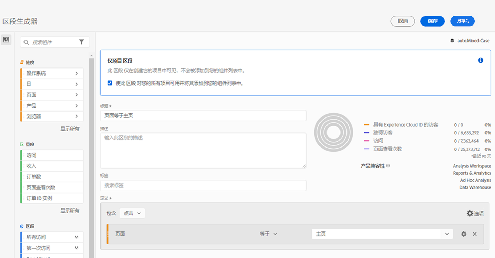

# 快速区段

可在项目中创建快速区段以规避完整版[区段生成器](/help/components/segmentation/segmentation-workflow/seg-build.md)的复杂操作。快速区段

* 仅应用于创建了这些项目的项目（您可以更改此设置）。
* 允许有最多 3 条规则.
* 不容纳嵌套容器或顺序规则。
* 在包含多个报表包的项目中工作。

要比较快速区段与完整的组件列表区段的作用，请转到[此处](/help/analyze/analysis-workspace/components/segments/t-freeform-project-segment.md)。

>[!IMPORTANT]
> 快速区段目前处于有限测试阶段，通常于2021年10月21日提供。

## 先决条件

任何人都可以创建 [!UICONTROL 快速区段]. 但是，您需要 [!UICONTROL 区段创建] 权限 [Adobe Admin Console](https://experienceleague.adobe.com/docs/analytics/admin/admin-console/permissions/summary-tables.html?lang=zh-Hans#analytics-tools) 以保存快速区段，或在 [!UICONTROL 区段生成器].

## 创建快速区段

在自由格式表中，单击面板标题中的筛选条件+ 图标：

从此白板配置快速区段：

| 设置 | 描述 |
| --- | --- |
| 名称 | 区段的默认名称是区段中规则名称的组合。 您可以重命名区段。 |
| 包括/排除 | 您可以在区段定义中包含或排除组件，但不能同时包含和排除组件。 |
| “点击”/“访问”/“访客”容器 | 快速区段包括一个 [区段容器](https://experienceleague.adobe.com/docs/analytics/components/segmentation/seg-overview.html?lang=zh-Hans#section_AF2A28BE92474DB386AE85743C71B2D6) 仅允许您在区段中（或从中排除）包含维度/量度/日期范围。 [!UICONTROL 访客]包含访客在不同的访问和页面查看间专属的总体数据。通过[!UICONTROL 访问]容器可设置规则以根据访问划分访客的数据，而通过[!UICONTROL 点击]容器可根据个别页面查看划分访客信息。默认容器为[!UICONTROL 点击]。 |
| 组件（维度/指标/日期范围） | 通过添加组件（维度和/或量度和/或日期范围）及其值，最多定义3个规则。 有 3 种方法可以找到正确的组件：<ul><li>开始键入内容和 [!UICONTROL 快速区段] 生成器会自动查找相应的组件。</li><li>使用下拉列表查找组件。</li><li>从左边栏中拖放组件。</li></ul> |
| 运算符 | 使用下拉菜单查找标准运算符和[!UICONTROL 非重复计数]运算符。[了解详情](https://experienceleague.adobe.com/docs/analytics/components/segmentation/segment-reference/seg-operators.html?lang=en) |
| 加号 (+) | 添加另一条规则 |
| AND/OR 限定符 | 可将“AND”或“OR”限定符添加到规则，但不得在单个区段定义中混用“AND”和“OR”。 |
| 应用 | 将此区段应用到面板。 如果区段不包含数据，则系统将询问您是否要继续。 |
| 打开生成器 | 打开区段生成器。 在区段生成器中保存或应用该区段后，该区段不再被视为“快速区段”。 它将成为组件列表区段库的一部分。 |
| 取消 | 取消此快速区段 — 请勿应用该区段。 |
| 日期范围 | 该验证器使用面板日期范围执行其数据查找。但是，在快速区段中应用的任何日期范围都会覆盖面板顶部的面板日期范围。 |
| 预览（右上角） | 用于查看您是否拥有有效的区段以及区段的广泛程度。 表示在应用此区段时，您预计会看到的数据集的划分。 您可能会收到一条通知，指示此区段没有数据。 如果出现这种情况，您可以继续或更改区段定义。 |

兼有维度和指标的区段的示例如下：

该区段显示在顶部。请注意其蓝色条纹边栏，而不是左侧区段库中组件级别区段的蓝色边栏。

## 编辑快速区段

1. 将光标悬停在快速区段上并选择铅笔图标。
1. 编辑区段定义和/或区段名称。
1. 单击[!UICONTROL 应用]。

## 保存快速区段

>[!IMPORTANT]
>保存或应用区段后，在快速区段生成器中就无法再编辑它，而只能在常规的区段生成器中编辑它。

1. 应用快速区段后，将鼠标悬停在该区段上，然后选择信息(“i”)图标。

   

1. 单击&#x200B;**[!UICONTROL 使其对所有项目都可用，并将它添加到组件列表]**。
1. （可选）重命名区段。
1. 单击&#x200B;**[!UICONTROL 保存]**。

请注意区段的侧栏如何从蓝色条带变为蓝色。 它现在显示在左边栏中的组件列表中。

## 仅用于项目的区段是什么？

仅用于项目的区段或者是快速区段，或者是临时工作区项目区段。在 [!UICONTROL 区段生成器]，则会显示“仅限项目”框。 如果在生成器中应用快速区段，但未选中“可用”框，则它仍是一个仅限项目的区段，但无法再在 [!UICONTROL 快速区段生成器].

如果选中该复选框，则单击 **[!UICONTROL 保存]**，它现在是组件列表区段。

