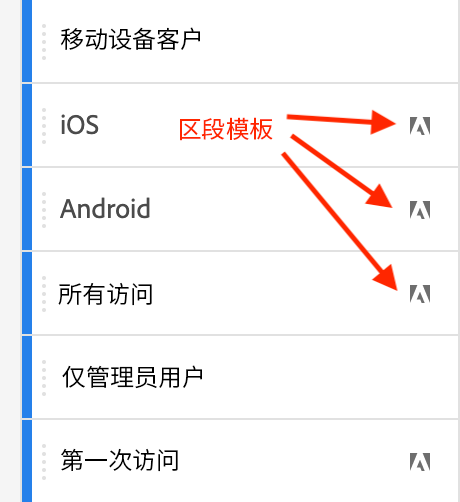

# 区段 {#topic_DC2917A2E8FD4B62816572F3F6EDA58A}

您可以在工作区中创建不同类型的区段，具体取决于区段的复杂程度、区段是否应仅应用于此项目等。 以下是区段类型的摘要：

| 区段类型 | 创建位置？ | 适用位置？ | 使用时间 |
| --- | --- | --- | --- |
| 组件列表区段 | [区段生成器](/help/components/segmentation/segmentation-workflow/seg-build.md) | 全球/公共 | 对于复杂区段，顺序区段 |
| 快速区段 | [快速区段生成器](/help/analyze/analysis-workspace/components/segments/quick-segments.md) | 项目级别，但可以公开 | 灵活且可控地添加/编辑规则、名称和多个规则 |
| 临时区段： |  |  |  |
| - Ad hoc Workspace项目区段 | [将拖放到项目中的区段拖放区域](/help/analyze/analysis-workspace/components/segments/ad-hoc-segments.md) | 项目级别，但可以公开 | 对于默认的单规则区段 |
|  — 基于计算量度的区段 | [计算量度生成器](https://experienceleague.adobe.com/docs/analytics/components/calculated-metrics/calcmetric-workflow/metrics-with-segments.html) | 到单个计算量度 | 在量度定义中应用区段 |
|  — 基于VRS的区段 | [虚拟报表包生成器](https://experienceleague.adobe.com/docs/analytics/components/virtual-report-suites/vrs-workflow/vrs-create.html) | 到单个虚拟报表包 | 在VRS定义中应用区段 |

有关Adobe Analytics中分段的深入讨论，请前往[此处](/help/components/segmentation/seg-overview.md)。

## 创建区段 {#section_693CFADA668B4542B982446C2B4CF0F5}

您可以在Analysis Workspace中创建不同类型的区段：

* [快速区段](/help/analyze/analysis-workspace/components/segments/quick-segments.md)
* [临时区段](/help/analyze/analysis-workspace/components/segments/ad-hoc-segments.md)
* 常规组件列出最终出现在区段库中的区段（请参阅下文）

### 创建组件列表区段 {#section_3B07D458C43E42FDAF242BB3ACAF3E90}

“组件”菜单下方的区段边栏会同时显示区段和区段模板，由以下图标指示：

[在 Analysis Workspace 中使用区段](https://experienceleague.adobe.com/docs/analytics-learn/tutorials/analysis-workspace/applying-segments/using-segments-in-analysis-workspace.html?lang=zh-Hans)（6 分 46 秒）

### 应用区段的其他方法 {#section_10FF2E309BA84618990EA5B473015894}

>[!VIDEO](https://video.tv.adobe.com/v/30994/?quality=12)

还有其他一些方法也可以将区段应用到自由格式项目中。

| 操作 | 描述 |
|--- |--- |
| 从选定范围中创建区段 | 创建内联区段。该区段只适用于打开的项目并且不能另存为 Analytics 区段。1. 选择行。2. 右键单击选定的内容。3. 单击&#x200B;*从选定范围中创建区段*。 |
| 组件 > 新建区段 | 屏幕上会显示“区段生成器”。有关区段划分的更多信息，请参阅[区段生成器](https://experienceleague.adobe.com/docs/analytics/components/segmentation/segmentation-workflow/seg-build.html?lang=zh-Hans)。 |
| “共享”>“共享项目”或“共享”>“策划项目数据” | 在[组织并共享](https://experienceleague.adobe.com/docs/analytics/analyze/analysis-workspace/curate-share/curate.html?lang=zh-Hans#concept_4A9726927E7C44AFA260E2BB2721AFC6)中，了解应用到项目中的区段如何用于为收件人提供的共享分析报表。 |
| 使用区段作为维度 | 视频：[在 Analysis Workspace 中使用区段作为维度](https://experienceleague.adobe.com/docs/analytics-learn/tutorials/analysis-workspace/applying-segments/using-segments-as-dimensions-in-analysis-workspace.html?lang=en) |

