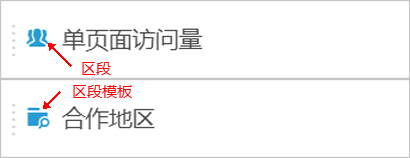
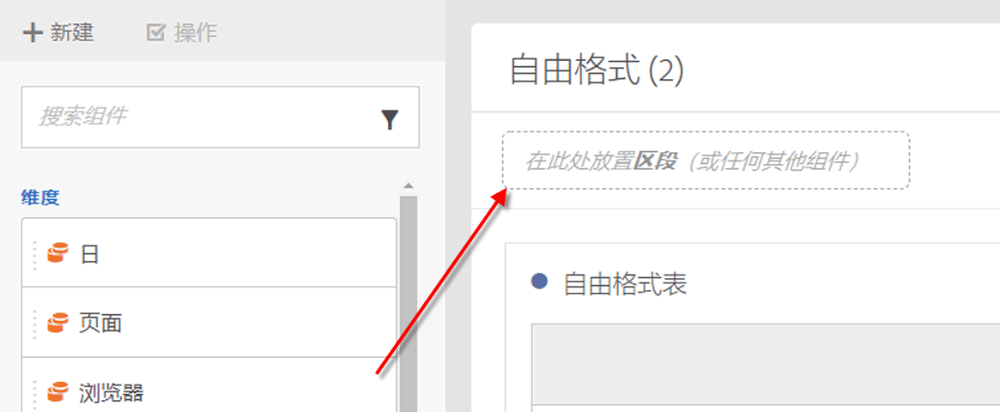
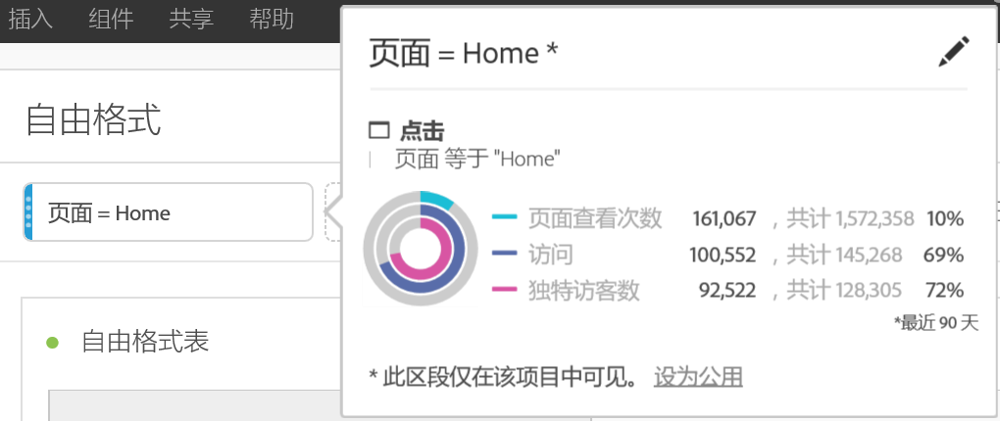

# 区段 {#topic_DC2917A2E8FD4B62816572F3F6EDA58A}

## Segment rail {#section_3B07D458C43E42FDAF242BB3ACAF3E90}

“组件”菜单下方的区段边栏会同时显示区段和区段模板，由以下图标指示：

[使用YouTube上Analysis Workspace中的区段](https://www.youtube.com/watch?v=QlUCdQDnni4)(6：46)

## Create segments {#section_693CFADA668B4542B982446C2B4CF0F5}

将任意组件类型（维度、维度项目、事件、量度、区段、区段模板和日期范围）放入面板顶部的区段拖放区域中，即可创建即时区段。

组件类型将被自动转换为区段。或者，您还可以单击“添加区段”下拉框中的“+”号。

请记住以下事项：

* 您&#x200B;**不能**&#x200B;将以下组件类型放入区段区域：不能从中生成区段的量度和维度/量度。
* 对于完整的维度和事件，Analysis Workspace 将创建“存在”点击区段。示例：“在 eVar1 存在的地方点击”或“在 event1 存在的地方点击”。
* 如果区段拖放区中丢弃“未指定”或“无”，则会自动将其转换为“不存在”区段，以便在分段中正确处理。

>[!NOTE]
>
>以这种方式创建的区段是项目内部的。

您可以选择按照以下步骤操作，将这些区段设为公用（全局）区段：

1. 在拖放区域中将光标悬停区段上，然后单击“i”图标。
1. In the information panel that displays, click **[!UICONTROL Make public]**.

   

## Other methods for applying segments {#section_10FF2E309BA84618990EA5B473015894}

还有其他一些方法也可以将区段应用到自由格式项目中。

<table id="table_45B3839D70674430AF3AC5AA3134F825"> 
 <thead> 
  <tr> 
   <th colname="col1" class="entry"> 操作 </th> 
   <th colname="col2" class="entry"> 描述 </th> 
  </tr> 
 </thead>
 <tbody> 
  <tr> 
   <td colname="col1"> 
根据选定的内容创建区段 
 </td> 
   <td colname="col2"> 
创建内联区段。选择行，接着右键单击选定的内容，然后创建内联区段。该区段只适用于打开的项目并且不能另存为 Analytics 区段。 
 
 
     <ol id="ol_1D1E661387354EBF992CC150915F642E"> 
      <li id="li_B96666FD426F4AEE8EAB61B2C00A07FB">选择行 </li> 
      <li id="li_C2245B3EA81F4FAC88A33647922535AF">右键单击选定的内容 </li> 
      <li id="li_AB4F8988B9A84920ABA06A91094625F6">单击根据选定的内容创建区段。 </li> 
     </ol> 
 </td> 
  </tr> 
  <tr> 
   <td colname="col1">  组件 &gt; 新建区段 </td> 
   <td colname="col2"> 
屏幕上会显示“区段生成器”。有关区段划分的更多信息，请参阅<a href="https://marketing.adobe.com/resources/help/en_US/analytics/segment/seg_build.html" format="https" scope="external">生成区段</a>。 
 </td> 
  </tr> 
  <tr> 
   <td colname="col1"> 
 共享 &gt; 共享项目或 
 
 共享 &gt; 组织项目数据 
 </td> 
   <td colname="col2"> 
<a href="../../../analyze/analysis-workspace/curate-share/curate.md#concept_4A9726927E7C44AFA260E2BB2721AFC6" format="dita" scope="local"> 在“特选和共享</a>”中，您对该项目应用的区段在收件人共享分析中可用。 
 </td> 
  </tr> 
  <tr> 
   <td colname="col1"> 
使用区段作为维度 
 </td> 
   <td colname="col2"> 
视频：<a href="https://www.youtube.com/watch?v=WmSdReKTWto&amp;list=PL2tCx83mn7GuNnQdYGOtlyCu0V5mEZ8sS&amp;index=39" format="https" scope="external">在 Analysis Workspace 中使用区段作为维度</a> 
 </td> 
  </tr> 
 </tbody> 
</table>

