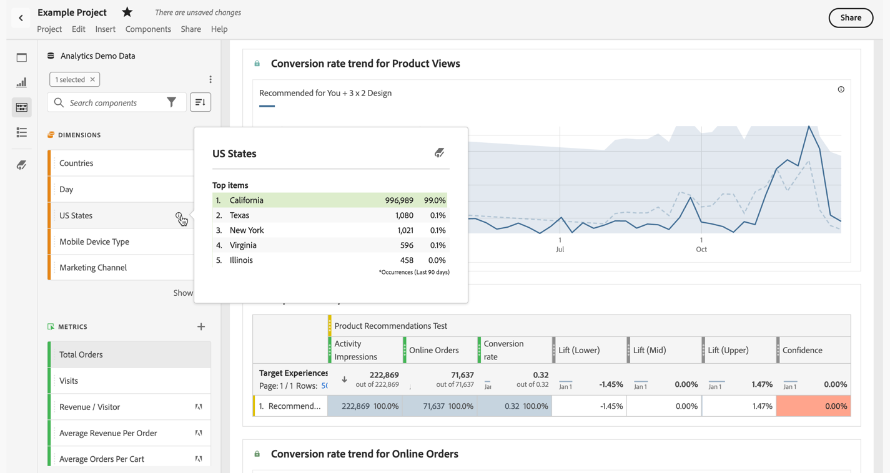

# 使用 Analysis Workspace 中的组件

组件构成了 Analysis Workspace 中任何项目的实际数据。组件由维度、量度、区段和日期范围组成。要在项目中添加组件，您可以将其拖放到可视化图表或面板中。

请参阅[组件概述](/help/analyze/analysis-workspace/components/analysis-workspace-components.md)，了解有关可添加的组件类型的更多信息。

>[!TIP]
>
>请参阅  了解有关每个组件的信息。请参阅[组件信息](#component-info)了解更多信息

## 在项目中添加组件

1. [在 Analysis Workspace 中创建项目](/help/analyze/analysis-workspace/build-workspace-project/create-projects.md)。

1. 给 Analysis Workspace 中的项目[添加面板](/help/analyze/analysis-workspace/c-panels/panels.md#create-a-panel)或者[添加可视化图表](/help/analyze/analysis-workspace/visualizations/freeform-analysis-visualizations.md#add-visualizations-to-a-panel)。如果您将组件添加到一个空白项目，就会创建一个自由格式表可视化图表。

1. 从按钮面板选择 **[!UICONTROL 组件]**。您可以在左侧面板中看到所有可用的组件。请参阅[界面](/help/analyze/analysis-workspace/home.md#interface)了解更多详细信息。

1. 滚动到或搜索要添加的组件，然后将其拖放到项目中的面板或可视化图表中。

1. 您可以选择将某个组件拖放到面板标题中的区段放置区。此拖放操作将该组件定义为一个区段，并将该区段应用于该面板内的所有内容。
有关如何使用面板上的区段放置区域对面板进行分段的信息，请参阅[面板概述](/help/analyze/analysis-workspace/c-panels/panels.md#drop-zone)中的[放置区域](/help/analyze/analysis-workspace/c-panels/panels.md)。

1. 有关更多详细信息，请参阅以下部分：

   * [在项目中添加维度](#add-dimensions-to-a-project)

   * [在项目中添加量度](#add-metrics-to-a-project)

   * [在项目中添加区段](#add-segments-to-a-project)

   * [在项目中添加日期范围](#add-date-ranges-to-a-project)

### 在项目中添加维度

[维度](/help/components/dimensions/overview.md)是Adobe Analytics中通常包含字符串值的变量。 相反，[量度](/help/components/c-calcmetrics/cm-overview.md)包含与维度相关的数字值。基本报告根据数值列（量度）显示字符串值的行（维度）。

1. 如[在项目中添加组件](#add-components-to-a-project)中所述，开始在 Analysis Workspace 的项目中添加维度。

1. 选择以下方法之一来添加维度，并确定要分析的数据类型：

   

   * 将维度拖放到 Analysis Workspace 中的某个可视化图表（例如自由格式表）中。

   * 将左侧面板中的一个或多个维度拖放到区段放置区，以创建快速区段，如[在项目中添加区段](#add-filters-to-a-project)中所述。

1. 您可以选择通过其他组件来细分 Analysis Workspace 中的维度和维度项。请参阅[细分 Workspace 中的维度](/help/analyze/analysis-workspace/components/dimensions/t-breakdown-fa.md)了解更多信息。

有关如何在 Analysis Workspace 中使用维度的更多信息，请参阅[预览维度](/help/analyze/analysis-workspace/components/dimensions/view-dimensions.md)、[细分维度](/help/analyze/analysis-workspace/components/dimensions/t-breakdown-fa.md)和[时间划分维度](/help/analyze/analysis-workspace/components/dimensions/time-parting-dimensions.md)。

### 在项目中添加量度

量度允许您量化 Analysis Workspace 中的数据点。它们最常用作可视化中的列，并与维度相关联。

要在 Analysis Workspace 的项目中添加量度：

1. 开始将量度添加到Analysis Workspace中的项目，如[将组件添加到项目](#add-components-to-a-project)中所述。

1. 选择以下方法之一在 Analysis Workspace 中添加量度：

   

   * 将一个量度拖放到一个空的自由格式表中的量度放置区，以查看该量度在该项目的日期范围内的趋势。

   * 有维度存在时拖动一个量度，可为每个维度项查看该量度。

   * 将量度拖到某个现有量度标题的顶部，可将其替换。

   * 将量度拖到某个现有量度标题的左侧或右侧附近，可添加新量度。

   * 将量度拖到某个现有量度标题的上方或下方，可创建量度重叠。

请参阅[量度](/help/analyze/analysis-workspace/components/apply-create-metrics.md)了解有关量度的更多信息。

### 在项目中添加区段

[区段](/help/components/segmentation/seg-overview.md)允许您根据相关特征或特定交互来识别人员、会话或事件的子集。

您可以通过以下任一方法在 Analysis Workspace 中使用区段：

* 在面板中添加区段：
在面板中添加区段后，这些区段会应用于该面板内的所有内容。
有关如何使用面板上的区段放置区域对面板进行分段的信息，请参阅[面板概述](/help/analyze/analysis-workspace/c-panels/panels.md#drop-zone)中的[放置区域](/help/analyze/analysis-workspace/c-panels/panels.md)。

* 在可视化图表中添加区段：
在自由格式表的一列中添加区段后，这些区段就会应用于该表列内的所有内容。您还可以添加区段作为流失可视化图表的一部分。

* 在组件中使用区段
当您定义诸如[计算量度](/help/components/c-calcmetrics/c-workflow/cm-workflow/c-build-metrics/metrics-with-segments.md)、[注释](/help/analyze/analysis-workspace/components/annotations/create-annotations.md#annotation-builder)甚至[区段](/help/components/segmentation/segmentation-workflow/seg-build.md)之类的组件时，可以将区段用作定义的一部分。

### 在项目中添加日期范围

[日期范围](/help/analyze/analysis-workspace/components/calendar-date-ranges/calendar.md)决定Analysis Workspace中的报表时间范围。 可以将数据范围应用于项目中的面板以及一些可视化图表（如自由格式表）。

每个面板在默认情况下包含一个日期范围。有多种方法可以更新面板的日期范围。更新 Analysis Workspace 中面板日期范围的一种方法是从左侧面板拖动一个日期范围组件：

1. 或者，也可以如[在项目中添加组件](#add-components-to-a-project)中所述，在 Analysis Workspace 中给项目添加日期范围。

1. 将日期范围从左侧面板拖放到上：

   * 当前日期范围，以更改面板的日期范围。

     

   * 自由格式表可视化图表中的量度或维度。请参阅[使用日期范围](/help/analyze/analysis-workspace/components/calendar-date-ranges/calendar.md#use-date-ranges)了解更多信息。

有关如何在 Analysis Workspace 中使用和管理日期范围的更多信息，请参阅[日期范围概述](/help/analyze/analysis-workspace/components/calendar-date-ranges/calendar.md)。

## 组件信息

您可以将鼠标悬停在任何组件上以显示。选择时，将显示一个弹出窗口，其中包含有关该组件的其他信息。

根据您的访问控制，您可以：

* 访问组件的 [!UICONTROL 数据字典]定义。
* 访问定义了该组件的组件生成器。

<!--
# Use components in Analysis Workspace

Components make up the actual data of any project in Analysis Workspace. Components consist of dimensions, metrics, segments, and date ranges. You can add components to a project by dragging them into visualizations or panels.

For overview information about the types of components you can add, see [Components overview](/help/analyze/analysis-workspace/components/analysis-workspace-components.md).

>[!TIP]
>
>For information about each component, select the Info icon next to a component's name in the left rail of Analysis Workspace, or see the [Analytics Components Guide](/help/components/home.md).

## Begin adding components to a project

1. [Create a project in Analysis Workspace](/help/analyze/analysis-workspace/build-workspace-project/create-projects.md) if you haven't already.

1. [Add a panel](/help/analyze/analysis-workspace/c-panels/panels.md) or [add a visualization](/help/analyze/analysis-workspace/visualizations/freeform-analysis-visualizations.md#add-visualizations-to-a-panel) to the project in Analysis Workspace. 

   If you add a component to a blank project, a freeform table visualization is automatically created.

1. Select the **[!UICONTROL Components]** icon in the left rail.

   

1. Scroll to or search for the component you want to add, then drag it to a panel or visualization within your project. 

1. (Optional) Drag a component to the segment drop zone in a panel header. 

   Segments apply to all content within the panel.

   For information about how you can use the segment drop zone on a panel to filter your panel, see [Drop zone](/help/analyze/analysis-workspace/c-panels/panels.md#drop-zone) in [Panels overview](/help/analyze/analysis-workspace/c-panels/panels.md).

   

1. For more detailed information, continue with one of the following sections, depending on the component type you are adding:

   * [Add dimensions to a project](#add-dimensions-to-a-project)

   * [Add metrics to a project](#add-metrics-to-a-project)

   * [Add segments to a project](#add-segments-to-a-project)

   * [Add date ranges to a project](#add-date-ranges-to-a-project)

## Add dimensions to a project

[Dimensions](/help/components/dimensions/overview.md) are variables in Adobe Analytics that typically contain string values. Common dimensions include [Page](/help/components/dimensions/page.md), [Referring domain](/help/components/dimensions/referring-domain.md), or an [eVar](/help/components/dimensions/evar.md). In contrast, [metrics](/help/components/metrics/overview.md) contain numeric values that tie to a dimension. A basic report shows rows of string values (dimension), against a column of numeric values (metric).

1. Start adding a dimension to your project in Analysis Workspace, as described in [Begin adding components to a project](#begin-adding-components-to-a-project).

1. Choose one of the following methods to add dimensions and determine the type of data you want to analyze:

   * Drag a dimension to a visualization (such as a freeform table) in Analysis Workspace.

     
   
   * Drag one or more dimensions from the left rail onto the segment drop zone to create an ad hoc segment, as described in [Add segments to a project](#add-segments-to-a-project).

     

1. (Optional) You can break down dimensions and dimension items in Analysis Workspace with other components. 

   For more information, see [Break down dimensions](/help/analyze/analysis-workspace/components/dimensions/t-breakdown-fa.md).

For more information about how to use dimensions in Analysis Workspace, see [Preview dimensions](/help/analyze/analysis-workspace/components/dimensions/view-dimensions.md), [Break down dimensions](/help/analyze/analysis-workspace/components/dimensions/t-breakdown-fa.md), and [Time-parting dimensions](/help/analyze/analysis-workspace/components/dimensions/time-parting-dimensions.md).

## Add metrics to a project

[Metrics](/help/analyze/analysis-workspace/components/apply-create-metrics.md) allow you to quantify data points in Analysis Workspace. They are most commonly used as columns in a visualization and tied to dimensions.

To add a metric to a project in Analysis Workspace:

1. Start adding a metric to your project in Analysis Workspace, as described in [Begin adding components to a project](#begin-adding-components-to-a-project).

1. Choose one of the following methods to add a metric in Analysis Workspace:

   * Drag a metric to the metric drop zone in an empty Freeform table to see that metric trended over the project's date period. 

     

   * Drag a metric when a dimension is present to see that metric compared to each dimension item. 

   * Drag a metric on top of an existing metric header to replace it.

   * Drag a metric next to a header to see both metrics side-by-side.

For more information about how to use metrics in Analysis Workspace, see [Metrics](/help/analyze/analysis-workspace/components/apply-create-metrics.md).

## Add segments to a project

[Segments](/help/components/segmentation/seg-overview.md) allow you to identify subsets of visitors based on characteristics or specific interactions.

You can use segments in Analysis Workspace in any of the following ways:

### Add segments to a panel

When you add segments to a panel, the segments apply to all content within the panel.

For information about how you can use the segment drop zone on a panel to filter your panel, see [Drop zone](/help/analyze/analysis-workspace/c-panels/panels.md#drop-zone) in [Panels overview](/help/analyze/analysis-workspace/c-panels/panels.md).

### Add segments to a column in a freeform table

When you add segments to a column in a freeform table, the segments apply to all content within the table column.

### Use segments when creating calculated metrics

In the Calculated metric builder, you can apply segments within your metric definition. 

For more information, see [Segmented metrics](/help/components/c-calcmetrics/c-workflow/cm-workflow/c-build-metrics/metrics-with-segments.md).

## Add date ranges to a project

[Date ranges](/help/analyze/analysis-workspace/components/calendar-date-ranges/custom-date-ranges.md) determine the reporting time frame in Analysis Workspace, and can be applied to one or more panels within a project.

Each panel includes a date range by default. There are multiple ways to update a date range for a panel. One way to update a date range for a panel in Analysis Workspace is to drag a date range component from the left rail:

1. Start adding a date range to your project in Analysis Workspace, as described in [Begin adding components to a project](#begin-adding-components-to-a-project).

1. Drag a date range from the left rail onto the current date range in the upper-right portion of the panel.

     

For more information about how to use calendars and date ranges in Analysis Workspace, see [Calendar and date ranges overview](/help/analyze/analysis-workspace/components/calendar-date-ranges/calendar.md).

-->