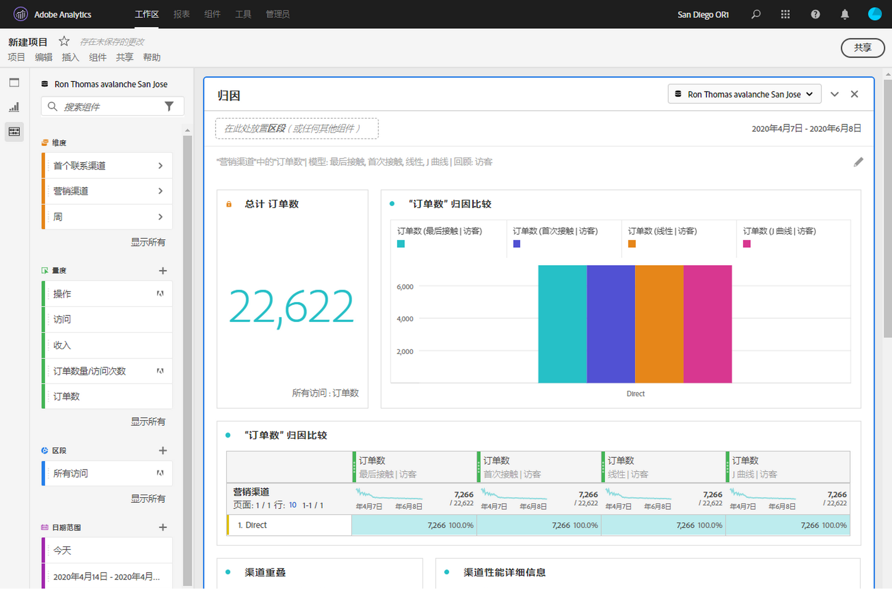

# 特选工作区项目

通过特选，您可以在共享项目之前限制组件（维度、量度、区段、日期范围）。 当收件人打开项目时，他们将看到您为其特选的有限组件集。 在共享项目之前，特选是一个可选的但建议的步骤。

>[!NOTE]
> 产品配置文件是控制用户可以查看哪些组件的主要机制。它们通过Adobe Experience Cloud管理控制台进行管理。 “策划”是一个次级过滤器。

## 应用项目特选

1. Click **[!UICONTROL Share]** > **[!UICONTROL Curate Project Data]**.
项目中使用的组件将自动添加。
   **注意**: 如果一个项目有多个报表包，您将在项目中看到每个报表包的特选字段。
1. （可选）要添加更多组件，请将要共享的组件从左边栏拖到“特 [!UICONTROL 选组件] ”字段。
1. 单击&#x200B;**[!UICONTROL 完成]**。

也可以通过单击“特选”和“共 [!UICONTROL 享”] ，从“共 **[!UICONTROL 享”菜单应用特选]**。 此选项会自动将项目归档到项目中使用的组件。 您可以按照上述步骤添加其他组件。

## 精选项目视图

当收件人打开特选项目时，他们将只看到您定义的特选组件集：

## 删除项目特选

要删除项目特选并恢复左边栏中的完整组件集，请执行以下操作：
1. Click **[!UICONTROL Share]** > **[!UICONTROL Curate Project Data]**.
1. 单击“ **[!UICONTROL 删除特选]**”。
1. 单击&#x200B;**[!UICONTROL 完成]**。

## 虚拟报告套件(VRS)特选

要在报表包级别应用特选，以便同时将其应用于许多项目，您可 [以在虚拟报表包(VRS)中特选组件](https://docs.adobe.com/content/help/zh-Hans/analytics/components/virtual-report-suites/vrs-components.html)。

>[!NOTE]
> 始终先应用 VRS 策划，再应用项目策划。这意味着即使您的策划项目包含某些组件，但是如果策划 VRS 不包含这些组件，系统也会将这些组件滤除。

## 显示所有组件选项

在精选的项目或VRS中，收件人将显示左边栏中 **[!UICONTROL 的“显示]** 所有组件”选项。 [!UICONTROL “显示全部] ”显示不同的组件集，具体取决于：

* 用户的权限级别（管理员或非管理员）
* 项目角色（所有者／编辑者或不是）
* 应用的特选类型（VRS或项目）

| 策划类型 | 管理员 | 非管理员项目所有者或编辑角色 | 非管理员重复或视图角色 |
|---|---|---|---|
| 策划的 VRS | 所有非策划的 VRS 组件 | 此角色拥有或与其共享的非策划的 VRS 组件 | 此角色拥有或与其共享的非策划的 VRS 组件 |
| 策划的项目 | 所有非策划的项目组件 | 所有非策划的项目组件 | 此角色拥有或与其共享的非策划的项目组件 |
| 策划的 VRS 中的策划项目 | 所有非策划的项目，如下所示 **[!UICONTROL 非策划的项目组件]**&#x200B;与 **[!UICONTROL 非策划的 VRS 组件]** | 此角色拥有或与其共享的所有非策划项目组件以及非策划 VRS 组件 | 此角色拥有或与其共享的非策划的 VRS 和项目组件 |
