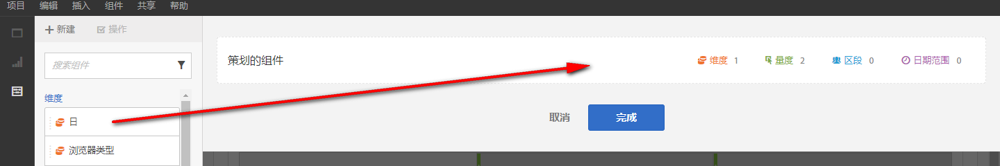
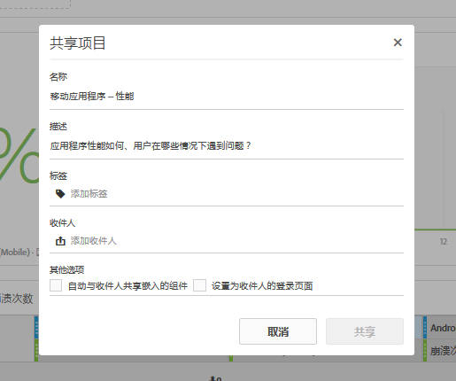

# 组织/共享概述

“组织”让您可在共享项目前限制组件。您可以将项目及其组件与业务中涉及的营销人员及其他非分析人员共享。在项目中批注并应用标记。

**视频概述**

>[!VIDEO](https://www.youtube.com/watch?v=LJJRskdmlOg&index=79&t=0s&list=PL2tCx83mn7GuNnQdYGOtlyCu0V5mEZ8sS)

**[!UICONTROL 工作区]** &gt;共 **[!UICONTROL 享]**&gt;管 **[!UICONTROL 理项目数据]**

## 管理项目数据

1. 指定创建和组织项目的权限。

   Before creating or curating an Analysis Workspace project, administrators must add you to a [group](https://marketing.adobe.com/resources/help/en_US/reference/?f=groups) with the **[!UICONTROL Analysis Workspace Access]** permission enabled, or to the **[!UICONTROL All Report Access]** user group. ( **[!UICONTROL Admin]** &gt; **[!UICONTROL User Management]** &gt; **[!UICONTROL Groups]**).

1. [创建并保存项目](../../../analyze/analysis-workspace/build-workspace-project/t-freeform-project.md#task_C2C698ACC7954062A28E4784911E6CF2) ，然后单击“共 **[!UICONTROL 享]** ”&gt;“ **[!UICONTROL 创建项目数据”]**。
1. 将您要从左侧可拖动组件堆叠中共享的组件拖到&#x200B;**[!UICONTROL 策划的组件]字段。**

   

   >[!IMPORTANT]
   >
   >共享项目不需要创建组件。 您可以共享包含所有可用、默认组件的项目，或者共享包含选定组件的项目。To preserve all of the default components in a project, a best practice is to create a copy of a project for yourself (using **[!UICONTROL Save As]**) prior to curating components. 一旦您在项目中组织了组件，其他组件将不能继续用于该项目。

1. 单击&#x200B;**[!UICONTROL 完成]**。

生成的项目与 Analysis Workspace 中的典型项目类似，不过，您只能从中选取特定的组件。

## 共享组织后的项目

共享可以使此项目供您的组织内的其他 Analysis Workspace 用户使用。当其他人使用此项目时，您完成的任何组织工作都会得到反映。

1. After you curate the components of a report, click **[!UICONTROL Share]** &gt; **[!UICONTROL Share Project]**.

   

1. 添加接收人。
1. （可选）您也可以将嵌入的项目组件（区段、计算量度和日期范围）与所有接收人共享。共享后，这些组件将显示在接收人工作区的组件下拉菜单中。

   >[!IMPORTANT]
   >
   >此设置不会持续存在——共享时这是一个单一操作。

1. 或者，您也可以将此页面设置为接收人的登录页面。

   >[!IMPORTANT]
   >
   >此设置不会持续存在——共享时这是一个单一操作。

1. 单击&#x200B;**[!UICONTROL 共享]**。

<!-- 

 <b>Annotate and tag a project</b> 
 

An alternative way to collaborate on a project is to use the Information panel. This panel will be re-introduced in an upcoming release. 
 

 
 
<ul id="ul_EFD045FD9F3B4BF8A70637B00EE0BC9C"> 
 <li id="li_EC6C5EAF9C234E76BDA7FF0226B82083">Tag reports for sharing. </li> 
 <li id="li_CF6A438C55F847F8890F8CB674CAA4F7">Specify the recipient (filter by permission group or user name), the storage folder. In-product notifications let users know that they have a shared report waiting. </li> 
 <li id="li_C8E088DA43024277908705CB0F3A142A">Write messages or report descriptions for recipients. </li> 
 <li id="li_342EB4758C344B859757E23691068FA3"> Select the dimensions, metrics, and segments to recommend to a non-analyst colleague, who can view the report you are curating and sharing. Curating the component gives the recipient access to those components, based on their permission settings. </li> 
 <li id="li_6487500F9315481599B7F3897998879F"> Add suggested items to a previously configured report. These new items exist as recommended selectable options. </li> 
</ul>

 -->

