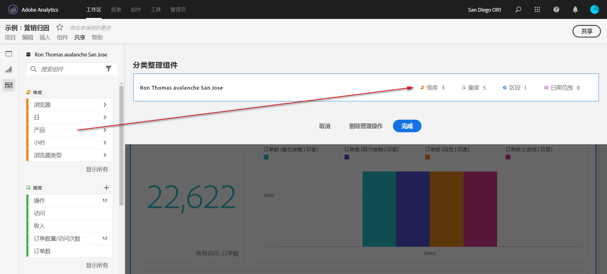

# 策划项目

策划功能可让您在共享项目之前，限制可用的组件（维度、量度、区段和日期范围）。 当接收者打开项目时，他们将仅看到您为其策划的限定组件集。 策划虽然是一个可选步骤，但建议在共享项目前执行此步骤。

>[!NOTE]
> 产品配置文件是控制用户可以查看哪些组件的主要机制。 此类配置文件通过 Adobe Experience Cloud Admin Console 进行管理。 “策划”是一个次级过滤器。

>[!BEGINSHADEBOX]

观看演示视频，请参阅 [策划项目](https://video.tv.adobe.com/v/24711?quality=12&learn=on){target="_blank"}。

>[!ENDSHADEBOX]

## 应用项目策划

1. 选择&#x200B;**[!UICONTROL 共享]** > **[!UICONTROL 策划项目数据]**。
项目中使用的组件将会自动添加。
如果一个项目有多个报表包，您会在项目中看到每个报表包都有一个策划放置目标。
1. （可选）要添加更多组件，请将要共享的组件从左侧面板拖至报表包的&#x200B;**[!UICONTROL 策划组件]**&#x200B;拖放区域。
1. 选择&#x200B;**[!UICONTROL 完成]**。

当收件人打开经过策划的项目时，他们将只看到您在策划时定义的组件集：

## 删除项目策划

要删除项目策划并恢复左边栏中的完整组件集，请执行以下操作：

1. 选择&#x200B;**[!UICONTROL 共享]** > **[!UICONTROL 策划项目数据]**。
1. 选择&#x200B;**[!UICONTROL 移除策划]**。
1. 选择&#x200B;**[!UICONTROL 完成]**。

## 虚拟报告包策划

要在报告包级别应用策划，以使其同时适用于多个项目，可[在虚拟报告包中策划组件](/help/components/vrs/vrs-components.md)。

>[!NOTE]
>
> 始终在项目策划之前应用虚拟报告包策划。 即使您的策划项目包含某些组件，但是如果策划的虚拟报表包不包含这些组件，系统也会过滤掉这些组件。
> 

## 组件策划选项

在策划的项目或虚拟报表包中，收件人将看到左边栏中显示的选项&#x200B;**[!UICONTROL 显示所有]**&#x200B;组件。 [!UICONTROL 显示所有组件]根据以下各项显示不同的组件集：

* 用户的权限级别（管理员或非管理员）
* 项目角色（所有者/编辑者或非所有者/编辑者）
* 所应用的策划类型（虚拟报告包或项目）
* 由用户拥有或者共享给用户的组件。 拥有/共享的组件包括区段、计算量度和日期范围。 它们不包括已实施的组件，如eVar、prop和自定义事件。

注意：非管理员视图角色没有对项目中左边栏的访问权限，因此在下表中已忽略。

| 策划类型 | 管理员 | 非管理员项目所有者或编辑角色 | 非管理员重复角色 |
|---|---|---|---|
| **策划的虚拟报表包** | 所有非策划的虚拟报告包组件 | 此角色拥有或与其共享的非策划的虚拟报告包组件 | 此角色拥有或与其共享的非策划的虚拟报告包组件 |
| **策划的项目** | 所有非策划的项目组件 | 所有非策划的项目组件 | 此角色拥有或已与其共享的非策划项目组件 |
| **已监管虚拟报表包中的已监管项目** | 所有非策划的组件，如&#x200B;**[!UICONTROL 非策划的项目组件]**&#x200B;和&#x200B;**[!UICONTROL 非策划的虚拟报告包组件]**&#x200B;下所示 | 此角色拥有或与其共享的所有非策划的项目组件和非策划的虚拟报告包组件 | 此角色拥有或与其共享的非策划的虚拟报告包和项目组件 |
