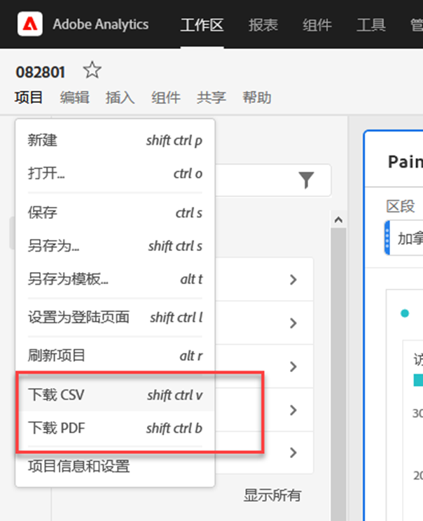
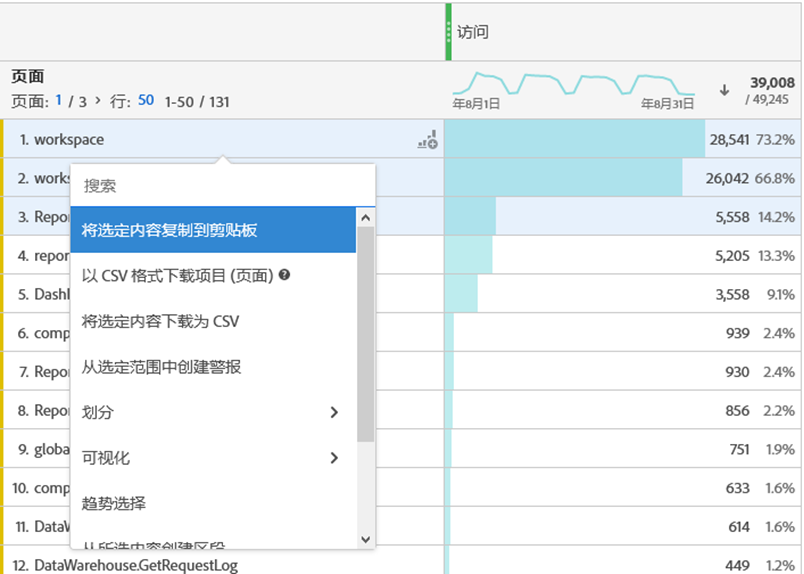
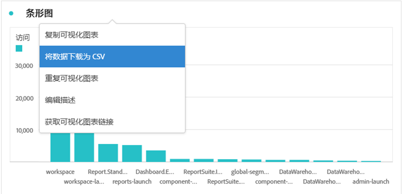
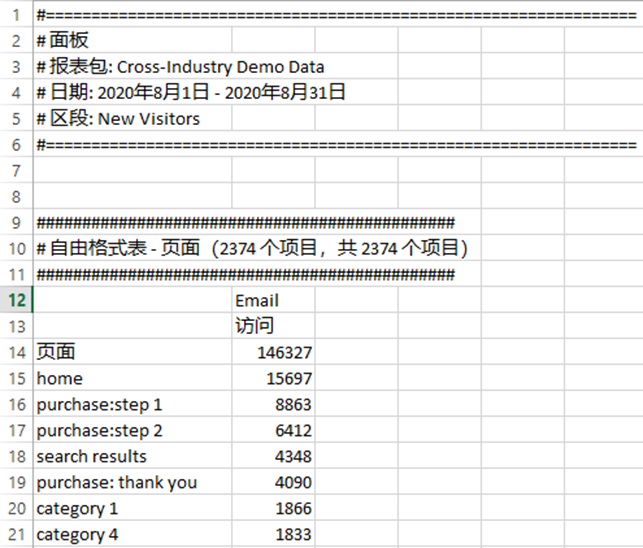

# 下载 PDF 或 CSV 文件

有若干方法可从 Analysis Workspace 导出数据。您选择的方法取决于要分析哪组数据以及谁需要访问它。

导出的数据可采用复制的数据、CSV 或 PDF 形式。如果要在文件中包括可视化，则一般首选 PDF。如果只想要文本数据，则首选 CSV 和复制的数据。

## 以 CSV 或 PDF 格式下载项目 {#download-project}

下载项目时，请考虑以下事项：

* 当以CSV或PDF格式下载项目时，可以在请求项目下载时保存或取消保存项目。 但是，只能[计划](/help/analyze/analysis-workspace/curate-share/t-schedule-report.md)保存的项目。

* 将项目下载为PDF时：
   * 导出下载可能需要几分钟的时间，因为项目在以PDF格式呈现之前会在Adobe服务器上重新运行。 我们建议在浏览器中下载 PDF 之前不要离开项目。但是，在等待过程中，您仍可以继续对项目进行更改。如果 PDF 的呈现时间超过 5 分钟，则系统将提示您改为通过电子邮件发送。
   * 下载内容呈现为单个页面，未应用分页。
   * PDF渲染包含Workspace中页面上显示的内容。 如果项目具有自定义大小的可视化和面板，则需要将它们更改为自动调整大小（右上角的按钮），以便内容将不会被截断。
   * 任何存在于自由格式表中的[超链接](/help/analyze/analysis-workspace/visualizations/freeform-table/freeform-table-hyperlinks.md)在下载的PDF中都无法正常工作。

要将项目下载为CSV或PDF文件，请执行以下操作：

1. 根据要以其下载该项目的格式，执行以下任一操作：

   * **PDF：**&#x200B;选择&#x200B;**[!UICONTROL 项目]** > **[!UICONTROL 下载 PDF]**。

     如果想让下载的文件包含项目中所有显示（可见）的表和可视化，请选择此选项。

   * **CSV：**&#x200B;选择&#x200B;**[!UICONTROL 项目]** > **[!UICONTROL 下载 CSV]**。

     如果想要纯文本数据，请选择此选项。

   

1. （视情况而定）如果您选择下载 PDF，则在准备好下载项目后显示一条消息。单击&#x200B;[!UICONTROL **下载**]。
1. 单击&#x200B;**[!UICONTROL 下载此文件]**&#x200B;图标并将文件保存到您选择的文件夹中。

## 将数据复制到剪贴板（热键：Ctrl+C） {#copy-data}

通过右键单击选项&#x200B;**[!UICONTROL 复制到剪贴板]**，可从 Workspace 快速地复制数据并将其粘贴到第三方工具中。

* 如果要复制所显示的表，请右键单击表标题并选择&#x200B;**将数据复制到剪贴板**。
* 如果要复制数据的子集，请在表中作出选择，然后单击右键并选择&#x200B;**将所选内容复制到剪贴板**。

>[!TIP]
>
>可使用热键 `Ctrl+C` 将您选择的内容复制到剪贴板，然后使用 `Ctrl+V` 将它粘贴到第三方工具中。

## 以 CSV 格式下载数据 {#download-data}

通过右键单击选项&#x200B;**[!UICONTROL 以 CSV 格式下载数据]**，可以 CSV 格式下载数据表或任何可视化的数据源。

* 从任何表或可视化的标题中，单击右键并选择&#x200B;**[!UICONTROL 以 CSV 格式下载数据]**。这样可将表中显示的数据或可视化的基础数据源下载为 CSV 格式。

  >[!NOTE]
  >
  >  注意：“地图”可视化不支持此选项。

* 在表中单击右键并选择&#x200B;**[!UICONTROL 将所选内容下载为 CSV]**。通过此选项仅下载所选内容，而非整个显示的表。

## 以 CSV 格式下载项目 {#download-items}

如果要分析的数据不止在表中可见的 400 行数据，请右键单击该表标题或任意行，然后选择&#x200B;**以 CSV 格式下载项（_维度名称_）**。此选项到处所选维度的最多 50,000 个维度项（根据表排序方式），并应用过滤器和区段。如果从表格顶部选择此选项，将导出表格中的第一个维度。虽然在自由格式表中没有强制执行任何限制，但建议在少于 20 列的表中使用“下载项目”选项以确保达到最佳性能。

>[!TIP]
>
> 如果您的维度超过 50,000 个项目，请下载应用了其他排序量度的文件或应用过滤器。例如，在一次下载中按访问量降序排序，然后在第二次下载中按访问量升序排序。此提示可以帮助您检索较长尾项。

您可以在项目中执行多项任务，甚至可以在下载过程中导航到同一选项卡中的新 Workspace 项目。如果打开新的浏览器标签页，则下载暂停。如果完全离开 Workspace 或关闭浏览器标签页，则取消下载。

### 下载的项目文件

表格功能将按如下方式应用于下载的文件：

* 以过滤器形式应用所有区段。
* 在每列上方以过滤器形式应用表格中所选维度&#x200B;**上面**&#x200B;的细分。
* 删除表格中所选维度&#x200B;**下面**&#x200B;的细分。

在上面的示例中，以过滤器形式应用了面板区段（新访客客户）及其上面的组件（营销渠道 = 电子邮件），从而下载了页面项目，并且从下载的 CSV 中删除了下面的组件（移动设备类型）。

### 下载通知

下载文件时，您将看到带有进度的信息通知。您可以随时单击&#x200B;**[!UICONTROL 取消下载]**&#x200B;来取消下载。 关闭 toast **将不**&#x200B;会取消下载。

文件完成后，您将看到完成通知，文件将下载到您的浏览器。

如果您同时请求多个下载，您将收到一条通知，说明每个额外的下载都将排队等待，直到前面的下载完成为止。

## 常见问题解答 {#faq}

| 问题 | 回答 |
| --- | --- |
| 为什么我下载的 PDF 是一页？ | Workspace 目前不会对下载的 PDF 进行分页。 |
| 能否使用“以 CSV 格式下载项”选项导出超过 50,000 项？ | 虽然每次下载最多可包含 50,000 个维度项目，但您可以更改表格排序以检索较长尾项，或应用过滤器以下载更具体的项目。 |
| **[!UICONTROL 复制可视化图表]**&#x200B;有什么用？ | 与&#x200B;[!UICONTROL **将数据复制到剪贴板**]&#x200B;或&#x200B;[!UICONTROL **将所选内容复制到剪贴板**]&#x200B;不同，**[!UICONTROL 复制可视化]**&#x200B;右键单击选项不是导出选项。它允许您将可视化图表或面板从 Workspace 中的一个位置复制到另一个位置。例如，从同一项目中的一个面板复制到另一个面板，或从一个项目复制到另一个项目。[内联视频](https://experienceleague.adobe.com/docs/analytics-learn/tutorials/analysis-workspace/visualizations/intra-linking-in-analysis-workspace.html?lang=zh-Hans) |
